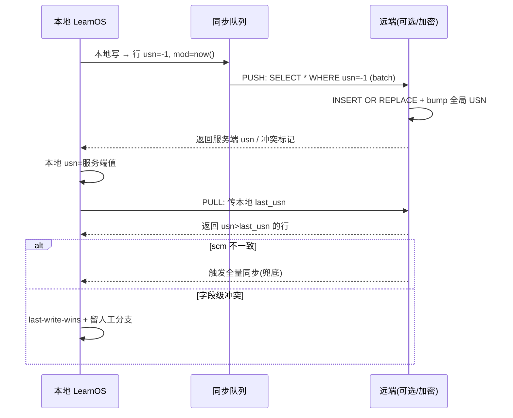
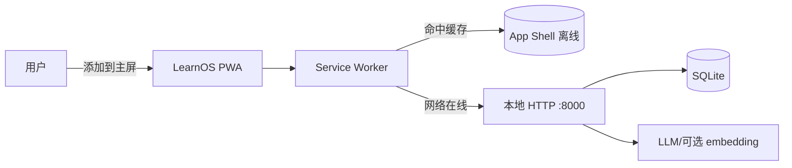
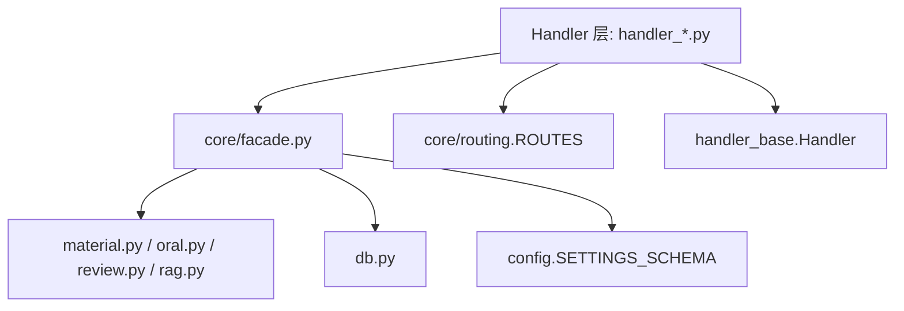

# LearnOS 综合优化方案（审查 + 演进，合并版）

> 合并自《全项目审查与优化建议》与《演进式优化蓝图》两份报告。
> 审查范围：`E:\tool\biancheng\AI project 2\learnos-os`（约 7,300 行 Python + 前端 `static/`）
> 方法：全量阅读核心模块 + Agent 探索 + 对照 2025–2026 公开最佳实践（FSRS-6 / SQLite 生产调优 / RAG / Local-first / LLMOps / 学习科学与认知科学）
> 结论：**整体工程质量高**，本轮是"演进"而非"救火"。所有建议均标注「现状 / 依据 / 文件:行号 / 建议」。优先级：🔴 P1（必做）、🟠 P2（重要）、🟡 P3（增强）。
> 前提：所有改动均可在**不破坏零依赖主路径**的前提下按阶段落地。

> ## 本方案已定版（R36 收口 · 2026-08-17）
>
> 历经 R1–R36 共 36 轮迭代（其中 R31–R36 为"用真实代码校准假设"的现实审计），本方案**正式定版，不再迭代**。
> **一句话定版结论**：数据/基础设施层已成熟且学科无关（FSRS-6、多学科 `subjects`、导出/备份、AES-GCM 密钥、CSRF/CSP/SSRF 均落地）；**唯一结构性缺陷 = AI 导师层被硬编码为"物理"**（§44/§46），修复方式为**一份 subject-aware PR**（提示模板 + 错因话术库 + subject 人格 + `judge` 非数值路径 + 测试同步，≈2–3 人日、零新依赖、回滚零风险，见 §47/§49）。v1 仅取此最小集；智能体/读书/生态/社交/FSRS 按学科分层降级 v2。

> ## ⚠️ 领域校正（重要 · R7 新增）
>
> **正确定位**：LearnOS 是一个**学科无关的个人学习终端**，不是英语学习系统。其真实能力原语是：
> **材料(material) → 练习/题库(bank) → 错题本(problems) → 口试/费曼(oral/Feynman) → FSRS 复习(reviews) → 知识图谱(graph) → 报告(reports) → 游戏化(gamification)**。
> 代码事实：`bank.SUBJECT_BANKS` 已含 `physics/chemistry/math`，且 `subject` 贯穿 `problems/reviews/concepts` 全表（`config.py:87`、`bank.py:26`）；`handler_oral.py` 的 "oral" 是**口试与费曼口述（费曼学习法）**，而非英语听说。它面向**任意学科**（数理化、医学、法律、编程、历史、语言……）。
>
> **为何前 6 轮会偏**：§0–§20 吸收了过多"语言学习 App / 影子跟读 / IPA / 句子 mining / 沉浸式听力"的网络资料，把这些**学科特定**机制误当成主线。被带偏最明显的章节：
> - §6.1（句子 mining / i+1 / 字幕）、§6.2（影子跟读 / 发音反馈）
> - §7.2（Anki 字幕 mining）、§7.3（沉浸式听力量表）
> - §13（用户原声来自语言学习 App 评论 + "竞品是 AI 对话 App"）
> - §14.1（Lute/LinguaCafe 阅读即习得、lemma/parent-term 词形还原）
> - §18 末段（"中国人学英语"、Duolingo 竞品叙事）
>
> **如何读**：这些章节的**底层机制（FSRS、RAG、PWA、同步、配置单一真相、游戏化批判）是对的**，但**举例与用户信号是 off-domain**。请以 **§21–§26（R7–R12）** 的学科无关视角为准——它们用"PKM/第二大脑 · 学习科学 · 错题本 · 费曼 · 知识图谱"重新表述同一批能力，并替换了被带偏的用户原声与参考文献。

---

## 执行摘要（TL;dr）

**一句话定位**：LearnOS 已是"本地优先 + 零依赖 + AI 原生 + FSRS 默认即优"的高质量**学科无关个人学习终端（personal learning terminal）**；本方案不做救火，而做**多轮迭代式演进**——从"审查修补"到"功能进化、架构调整、代码简化、用户原声、成熟项目经验、可行性排序、代码草图、风险回滚、研究新维度、架构蓝图、最终收口"。

> **审查收敛提示（R22–R24）**：前 21 轮（R1–R21，§0–§34）已把愿景铺得很开；R22–R24 对其做了**可行性/影响/风险/效果四维审查**并收敛——科学依据可靠，但最大风险已从"技术"转为"留存"（EdTech D30 留存仅 ~2%）。最终交付"**宏大愿景 + 克制 v1**"双层结构：**v1 只取约 20% 的杠杆功能（见 §36/§37），且全部零可选依赖、离线可用**。动手实现以 §37.1 阶段 0→1 为准。

**迭代脉络（R1–R30）**：

| 轮次 | 主题 | 交付 |
|---|---|---|
| 原始 | 审查 + 演进蓝图（合并两份报告） | §0–14 |
| R1 | 可行性过滤 + 优先级矩阵 + 反模式清单 | §15 |
| R2 | 代码级落地草图（可抄片段） | §16 |
| R3 | 风险 / 回滚 / 测试策略 | §17 |
| R4 | 引导科学 / 游戏化 / 社区 / 可访问性 / 多学科渲染（修正领域） | §18 |
| R5 | 架构落地蓝图（路由/同步/PWA/图） | §19 |
| R6 | 本摘要 + 先做清单 + 去重对照 | §20 |
| R7 | 领域校正：定位为学科无关个人学习终端 | 顶部声明 + §0/§18 修正 |
| R8 | 学科无关功能演进重写（摄取/卡片/费曼/错题/交织/图谱） | §21 |
| R9 | 修正版用户原声（PKM/SRS/错题本双轨） | §22 |
| R10 | 学习科学骨架（检索/间隔/交织/精细加工/生成/双重编码/元认知） | §23 |
| R11 | 架构重构（隔离/摄取/互操作/隐私同步） | §24 |
| R12 | 收口：修正执行摘要 + 收益/风险最优先做清单 + 去重 | §25 |
| R13 | 口试/对话/口语的未来语言学科兼容层 | §26 |
| R14 | 阅读/书籍学习场景（教科书 + 小说） | §27 |
| R15 | 学习终端更多优化维度（苏格拉底导师/分析/多模态/无障碍/离线AI） | §28 |
| R16 | 学科渲染配置深化 / 多场景原语（8 学科题型） | §29 |
| R17 | 架构/生态再扩展（插件/MCP/local-first/导入/评测/备份） | §30 |
| R18 | 收口：广度扩展总收口 + 先做清单刷新 + 去重 | §31 |
| R19 | 智能体化编排层（Orchestrator/PPAE/苏格拉底/多智能体） | §32 |
| R20 | 评测·考试模拟·多模态具身（模考/分数预测/图注/AR钩子） | §33 |
| R21 | 生态放大（市场/共享/协作/教师家长/课程创作）+ 总收口 | §34 |
| R22 | 方案审查四维报告（可行性/影响/风险/效果，留存为#1风险） | §35 |
| R23 | 收敛与优先级重排（去肿/定 v1 边界/零依赖分层） | §36 |
| R24 | 最终执行蓝图收口（分阶段路线/可行评级/退出标准） | §37 |
| R25 | 数据模型/表结构演进映射（additive 迁移 + 列级增量） | §38 |
| R26 | v1 动手就绪规格（文件级指针/回滚/验收） | §39 |
| R27 | AI 成本/延迟预算与可复用提示词库 | §40 |
| R28 | 隐私与安全工程深潜（分级/密钥/威胁模型） | §41 |
| R29 | 留存/社交问责/微学习节奏（R22 杠杆落地） | §42 |
| R30 | 终局导航/索引/自审收口（目录/交叉引用地图） | §43 |

**安全基线（来自 R1–R6 代码审查，必做但属"工程卫生"）**：
1. **§1.3 SQLite PRAGMA**（性能分水岭，S 级）— 草图 §16.1
2. **§1.1 导出端点鉴权**（防整库泄露，S 级）— 草图 §16.6
3. **§5.2 配置单一真相**（消除双份 key 漂移，S 级）— 草图 §16.3
4. **§8 代码收口**（10 处重复，维护性 ROI 高）— 草图 §16.4/§16.5

**R12 修正版 · 学科无关先做清单（收益最大化 · 风险最小化）**：
> 下列为"个人学习终端"定位下、相对通用 PKM/错题本 App 的**差异化高 ROI**项；全部零依赖或可选降级、复用现有原语，按优先级排序（依据 §22.1 用户原声 + §23 学习科学 + §24 架构）：

| 优先级 | 项 | 复用原语（file:line） | 依据 |
|---|---|---|---|
| 🔴 P1 | **错题本深度 + 薄弱分布仪表盘**（错因分类/同类聚类/图谱红点 → 学科→单元→章节三层） | `problems`(`config.py:87`)、`reports`、`graph` | §22.1 最高优先级、§23.7 元认知 |
| 🔴 P1 | **费曼/口试闭环增强**（口述→错因诊断→入错题本） | `handler_oral.py:9-73` | §21.3、§23.4 精细加工 |
| 🔴 P1 | **增量同步做对**（usn/mod delta + per-field LWW + shadow copy） | `db.py`、`backup.py` | §22.1 最高痛点、§14、§24.4 |
| 🟠 P2 | **错题组卷 + PDF/打印导出**（复用 `exam.py`） | `exam.py`、`handler_problems.py` | §22.1 |
| 🟠 P2 | **移动优先 PWA**（放大 local-first 差异化） | `static/`、`§5.6` | §22.1 |
| 🟠 P2 | **内容摄取管线 + 拍照 OCR 录入**（零依赖纯文本兜底） | `handler_material.py`、`rag.py` | §21.1、§24.2、§22.1 |
| 🟠 P2 | **互操作导出（CSV/JSON/Markdown/.apkg）** | `db.py`、`backup.py` | §24.3、§22.3 护城河 |
| 🟡 P3 | **FSRS per-subject retention + 引导说明** | `fsrs_bridge.py`、`config.py:148` | §22.1、§23.2 |
| 🟡 P3 | **层次化子主题 + 变式生成** | `bank` `chapter`、`variants` | §22.1、§21.4、§23.8 |

> 说明：被前 6 轮带偏的"影子跟读 / IPA / 字幕 mining / 沉浸式听力"已从主线移除，不计入先做清单；其底层机制（FSRS / RAG / PWA / 同步）保留并重新框定为学科无关。完整执行次序见 §15.4、§20 与本章 §25。

---

## 0. 总评与前提（含误报纠正）

LearnOS 已有极强底气：

- 纯本地 HTTP、`ThreadingHTTPServer` 已启用（`app.py:11,28`），天然多线程，无单线程阻塞风险；
- 主路径零第三方依赖，`vendor/` 内嵌 FSRS；
- 密钥 AES-GCM + PBKDF2 出库存储（`keystore.py`），`ai.py` 的 urllib 全部设超时（无挂起风险）；
- 20 版数据库迁移、`WAL` + `busy_timeout` 已开、`foreign_keys` 已强制；
- RAG 有路径沙箱 + BM25/FTS5 混合检索 + 溯源 + 误删撤销（`rag.py`）；
- 23 个测试文件齐全，自动备份保留最近 7 份（`backup.py:54`）。

**已纠正的误报**：子代理曾称"静态文件可下载 `keys.enc`/数据库"——不成立。`handler.py` 把 `directory` 固定为 `static/`，`data/` 与 `*.db` 是独立目录，无法穿越。下面不再保留此虚假风险。

---

## 1. 基础加固（🔴 P1）

### 1.1 导出端点鉴权缺失
- **现状**：`/api/export`、`/api/export/backup`（`handler.py:77-78`；蓝图核实位于 `handler_problems.py:690/L715`）是 **GET 且零鉴权**，会返回/触发整库导出。
- **依据**：本地服务常见令牌缺失问题（OWASP API Top 10 — Unrestricted Resource Delivery）。
- **建议**：
  1. 启动若 `HOST` 非 `127.0.0.1/localhost` 打印**显眼警告**，并要求显式确认（如 `LEARNOS_ALLOW_LAN=1`）；
  2. 导出类端点加本地令牌（启动时生成并展示在控制台/日志，前端注入查询参数），或改为 POST + 现有 CSRF 闸门（`_csrf_ok`）。

### 1.2 FSRS 训练门槛过低
- **现状**：`train_parameters` / `_handle_fsrs_train` 仅要求 **≥10 条**复习（`fsrs_bridge.py:269`、`handler.py:380-381`）。
- **依据**：FSRS 官方（open-spaced-repetition）与多方评测（2025，Anki 25.07 起默认 FSRS-6）一致建议 **≥1000 条复习后再训练**；FSRS-6 在 7 亿条 Anki 数据上训练，个例样本过少会过拟合、权重劣于默认先验。
- **建议**：提高门槛（如 ≥200 起训、≥1000 标注"高置信度"）；训练结果返回 `confidence` 字段；低样本时显式提示"先用默认先验"。

### 1.3 SQLite 生产 PRAGMA 补全
- **现状**：`db.connect` 已开 `WAL` + `busy_timeout` + `foreign_keys`，但缺 `synchronous/cache_size/mmap_size/temp_store` 等性能分水岭项（`db.py:21-26`）。
- **依据**：SQLite 生产调优共识（Linux Server Admin / Cloudflare D1 / HashHackers，2025–2026）。
- **建议**：在 `connect()` 每连接统一执行：
  ```python
  PRAGMA journal_mode=WAL;             # 已开
  PRAGMA synchronous=NORMAL;           # 新增：WAL 下安全且远快于 FULL
  PRAGMA foreign_keys=ON;              # 已开
  PRAGMA busy_timeout=30000;           # 已开（核对秒数）
  PRAGMA cache_size=-65536;            # 64MB 页缓存
  PRAGMA mmap_size=536870912;          # 512MB 内存映射读
  PRAGMA temp_store=MEMORY;            # 临时表/排序走内存
  PRAGMA wal_autocheckpoint=1000;      # 显式检查点
  PRAGMA journal_size_limit=67108864;  # 64MB WAL 上限
  PRAGMA auto_vacuum=INCREMENTAL;      # 增量回收碎片
  ```
- **配套**：定期 `PRAGMA wal_checkpoint(TRUNCATE)`（低峰）；`EXPLAIN QUERY PLAN` 巡检核心查询是否走索引。

### 1.4 根目录备份泛滥
- **现状**：项目根散落 **30+ 个 `learnos.bak.*.db`**（手动备份），与 `backups/` 自动备份（`backup.py:54`）双轨并存、管理混乱。
- **建议**：所有备份统一到 `backups/`；旧根目录 `*.bak.*.db` 归并并加 rotate（保留 N 份 + 按天）；`auto_backup_if_due` 的"保留 7 份"抽成可配置常量。

### 1.5 依赖清单缺失
- **现状**：主路径零依赖（设计目标），但 `cryptography/torch/pandas/tqdm/numpy/PIL/pdfminer` 等可选依赖散落惰性导入，无 `requirements.txt`。
- **建议**：新增 `requirements-optional.txt`（或 `pyproject.toml` 的 `optional-dependencies`），按用途列出可选依赖与版本，提升可复现性与"降级路径"可发现性。

### 1.6 认证模型需文档化（🟠 P2）
- **现状**：唯一防护是 POST 的 `X-Requested-With: LearnOS` 头（`handler_base.py:11-12`），可被同源 JS 随意设置，是"防意外跨站"而非"防恶意认证"。
- **建议**：在 `README`/`AGENTS.md` 显式写明威胁模型："localhost 单用户，非多租户认证"。

### 1.7 密钥驻留内存最小化（🟠 P2）
- **现状**：`ai.py:25-27` 的 `_runtime_key`/`_master_password` 为模块级全局明文，`_master_password` 长期驻留。
- **建议**：解锁后改为**仅持有解密后的 api_key**，用后把 `_master_password` 置 `None`，减少明文口令驻留时间。加解密本身已扎实（AES-GCM+PBKDF2 310k、原子写、`keys.enc` 在工作区、缺依赖仅内存降级），保持。

---

## 2. 间隔重复 / FSRS 深化（结合 FSRS-6 科学）

### 2.1 训练门槛（🔴 P1）
见 §1.2。

### 2.2 FSRS-6 深度利用（🟠 P2）
- **现状**：已用 vendored FSRS，`desired_retention` 可调。
- **依据**：FSRS-6（Anki 25.07 默认，2025）引入 **w20 个性化遗忘曲线衰减**（每用户可优化，0.1–0.8），建模稳定性/难度/可提取性三变量（21 参数）；"记忆稳定性"定义为 R 从 100%→90% 的时间；desired retention 90% 为甜点（95% 时复习量 +60%）。
- **建议**：
  - 暴露 **w20** 为高级设置（代码类内容可上调稳定性增益）；
  - **per-subject `desired_retention`**（不同学科遗忘率不同）；
  - 新增"记忆状态仪表盘"：展示 stability/difficulty/retrievability 分布与遗忘曲线（`handler_reports.py` 已有 `forgetting_curve` L480，可扩展）。

### 2.3 间隔效应与期望难度（🟠 P2）
- **依据**：Cepeda 2006/2008——最优间隔 ≈ 目标保持期的 **10–20%**；Roediger & Karpicke 2006/2008——**提取练习**比重复阅读有效得多（外语尤甚）。
- **建议**：复习调度显式引入"期望难度"（对接近遗忘阈值卡片优先）；报告里展示"提取练习占比"指标（`_handle_list_reviews` 已有优先级+交错+每日上限，`handler_reviews.py:21`）。

### 2.4 保持 vendored fsrs 更新（🟠 P2）
- **现状**：`vendor/fsrs` 内联 `open-spaced-repetition/fsrs`，FSRS 仍活跃演进。
- **建议**：标注 vendored 版本与日期，定期同步上游；启动日志打印 vendored FSRS 版本，便于发现过期。

### 2.5 desired_retention / settings 查询收敛（🟠 P2，性能）
- **现状**：`_scheduler()`（`fsrs_bridge.py:82`）每次复习都查 `settings_dict()`；`compute_fsrs_review/retrievability` 高频路径同理；`_desired_retention` 未复用已有 `_settings_cache`（TTL，`ai.py:20-21`）。
- **建议**：所有读取统一走带 TTL 缓存（写设置时失效），避免每次复习都查库；`_settings_cache` 加 `threading.Lock`。

### 2.6 optimal_retention 小样本提示（🟠 P2）
- **现状**：`optimal_retention`（`fsrs_bridge.py:316`）在样本不足时假设 `avg_s=5.0`，结论偏乐观；代码已有 `has_data` 字段。
- **建议**：前端在 `has_data=False` 时显式提示"估算不可靠"，避免据此激进调参。

---

## 3. SQLite / 性能

### 3.1 已做 ✓
WAL、`connect(timeout=10)` 即 busy_timeout、`foreign_keys=ON`、`executescript(SCHEMA)` + 20 版迁移、幂等索引；`ThreadingHTTPServer` 下 `DB_LOCK` 串行化写，务实避免并发写冲突。

### 3.2 生产 PRAGMA（🔴 P1）
见 §1.3。

### 3.3 连接模型 / 池（🟠 P2）
- **现状**：每次 `db()` 新建并关闭连接；并发高时连接抖动。
- **建议**（未来并发上升时）：改**每线程复用连接**的小连接池（或 `check_same_thread=False` + 共享锁）；读写分离（read-only 连接 + 写连接）；迁移脚本与在线请求共享同一连接工厂。当前 `DB_LOCK` 已够用，不紧急。

### 3.4 problems 检索加 FTS5（🟠 P2）
- **痛点**：`_handle_global_search`（`handler.py:338-345`）对 `problems` 用 `LIKE '%q%'`（前后模糊），**无法命中索引**，量大时慢。
- **建议**：对 `problems.title/content` 建 FTS5 虚拟表（复用 `rag.py` 已有 FTS5 模式），或至少对 `title` 加前缀索引。当前个人量级（<1 万）可接受，作为可扩展性预留。

### 3.5 settings 查询收敛（🟠 P2）
见 §2.5。

---

## 4. RAG（现状已不错，按零依赖优先增强）

### 4.1 已符合最佳实践 ✓
- **路径沙箱**：`_safe_relative`（`rag.py:39-51`）强制检索路径在工作区内；
- **混合检索**：`_bm25` + `_fts_search` 合并去重（`rag.py:310-322`，正合"BM25 稀疏 + FTS 混合"）；
- **溯源元数据**：块带 `source_path`+`page`，点击经 `/api/rag/open` 打开本地文件（inline citations）；
- **误删撤销**：`_UNDO` 内存快照（`rag.py:199-237`）；
- **BM25 统计缓存 + 失效**（`rag.py:240-257`）；
- **分块**：~500 字/块、重叠 60 字（`rag.py:75-107`），对应"200–500 token + 10–15% 重叠"。

### 4.2 稠密 / 语义检索（🔴 P1，最大杠杆）
- **现状**：纯关键词（BM25/FTS5），缺语义召回，同义/概念性查询会漏。
- **依据**：2025 多个生产 RAG 报告——dense embeddings + BM25 混合 + rerank 是质量分水岭（召回 +20–30%）。
- **建议**（零依赖优先、可选增强）：
  - 复用项目 LLM API 调 embeddings（OpenAI `text-embedding-3-small` / 本地 `all-MiniLM-L6-v2`）生成向量存 SQLite（JSON 列或扩展）；
  - 检索时余弦相似度与 BM25 融合（加权或 RRF）；
  - **缺 embedding 依赖/未配置时自动降级**为现有 BM25——保持主路径零依赖。

### 4.3 Agentic RAG（🟡 P3）
- **建议**：Query Rewrite（查询改写）、HyDE（假设性文档嵌入）、RAG-Fusion 多查询融合、CRAG 自校正（检索不足则改写/换源）。仅检索前一次 LLM 调用，成本可控。依据：Zilliz《企业级 RAG 优化 5 步 13 策略》、youngju.dev《Advanced RAG Pipeline 2025》、CSDN《Agentic 架构 RAG》。

### 4.4 GraphRAG：知识图谱 × RAG（🟠 P2 / 🟡 P3）
- **现状**：`graph.py` 已有 `concepts/concept_links/concept_progress`（v10/v17/v19），`handler_material.py:_handle_graph_problems`（L219）做"先修链错题"多跳；`rag.py` 已有混合检索。
- **依据**：GraphRAG（微软 2024–2025）——标准 RAG 难解多跳/关系推理，KG 补关系，与现有图谱天然契合。
- **建议**：RAG 检索时**沿概念先修/相关边"走图"（multi-hop）**，回答"为什么我总错这类题"等关系型问题。

### 4.5 可观测与评估（🟠 P2）
- **建议**：复用 `ai_telemetry` 表记录 RAG 检索延迟、命中率；建小型 golden set 做回归，避免改 prompt/分块后质量悄悄下滑。

---

## 5. 架构调整（🟠 P2）

### 5.1 扩展机制：从"手动三步"到"自动注册"
- **现状**：新增功能需①写 `*Mixin` ②加入 `Handler` 基类（`handler.py:45`）③在 `GET_ROUTES/POST_ROUTES`（L51/L93）加元组；`PUT/DELETE` 更在 `do_PUT/do_DELETE` 内 `re.fullmatch` 硬编码（L515–630）。无装饰器/自动发现。
- **依据**：Flask 蓝图 / 路由装饰器主流做法。
- **建议**：引 `@route("GET","/api/xxx")` 装饰器，Mixin 方法自带路由元数据自动注册；`PUT/DELETE` 同构为路由表；可选 `plugins/` 目录启动时扫描（保持零依赖主路径）。

### 5.2 配置单一真相源
- **现状**：`config.DEFAULT_SETTINGS`（`config.py:148`）与 `handler.py:550` 的 `allowed` 集合各自维护 key 列表，易漂移。
- **建议**：用单一 `SETTINGS_SCHEMA`（key→类型/默认值/可写性/校验）同时驱动 `DEFAULT_SETTINGS` 与写权限白名单，新增设置只改一处。

### 5.3 统一 import 门面
- **现状**：`exam/bank/rag/material/gamification` 等惰性 import 散落多方法（`handler_reviews.py:154`、`handler_reports.py:65/540`、`handler.py:243/255/300/348`）。
- **建议**：建 `core/facade.py` 暴露 `review_schedule`/`build_report` 等聚合函数；handler 只依赖门面，业务逻辑下沉到 `material.py/oral.py/review.py`。

### 5.4 连接策略强化
见 §3.3。

### 5.5 Local-first 多端同步（🟡 P3，演进方向）
- **依据**：Local-first 2025（Ink&Switch、CRDT、delta sync、端到端加密）——"本地先写、后台同步、冲突可预测合并"。
- **建议**（分阶段、可选）：数据模型加 `last_modified_at/sync_status/local_id`；变更入同步队列，联网批量 delta 同步（参考 `backup.py` 复制逻辑）；冲突策略字段级合并 + last-write-wins，复杂交用户；备份加密（每 bucket 对称密钥 + 公钥信封，QR 邀请/吊销）。

### 5.6 前端现代化（🟡 P3）
- **建议**：演进为 **PWA**（离线可用、可"添加到主屏"），契合 local-first；移动端响应式布局。

---

## 6. 功能进化（🟠 P2，基于现有模块的深度学习科学延展）

### 6.1 句子 Mining 工作流（i+1 → Cloze → TTS）
- **现状**：`/api/material/analyze`（`handler_material.py:18`）已从文本抽取图谱+例题+试卷草稿。
- **依据**：语言学习研究（StudyCards AI / Refolt / sentence mining）——**i+1 句子卡 + 填空(Cloze) + 音频**远比单词表有效；"mining 摩擦越低越好"。
- **建议**：演进为完整 mining 流水线：从资料/字幕抽取 **i+1 句子** → 自动生成 **Cloze 删除卡** → 调 TTS 生成原声音频（复用现有 AI/本地 TTS）→ 一键进 FSRS 复习（已有 `oral_draft_card`"口语→复习卡"先例）。

### 6.2 口语 / 影子跟读闭环（🟠 P2）
- **现状**：`handler_oral.py` 已有口试对话、费曼自测（`_handle_feynman_*`）。
- **依据**：Shadowing（影子跟读）被多篇 2025 指南列为发音/流利度最有效训练；Speechling 类 AI 发音反馈可定位具体音素错误。
- **建议**：新增 **影子跟读模式**（播放原句→跟读→ASR 转写对比→AI 评分闭环）；发音反馈从"整体评分"细化到**音素/重音**级（复用 `call_ai_vision`/`call_ai`）。

### 6.3 自适应测验（🟠 P2）
- **现状**：森林已有 `exam.py` 的 `paper_readiness/overall_readiness/create_paper`。
- **依据**：基于遗忘预测的个性化组卷 > 随机抽题。
- **建议**：组卷时按 `forget_predict`（`handler_reports.py:236`）与难度分布动态选题，生成"最可能遗忘 + 刚达阈值"的针对性试卷。

---

## 7. 功能丰富（🟡 P3，新能力）

- **7.1 多模态学习扩展**：`_handle_extract_photo`（`handler_problems.py:624`）+ `ocr.py` 已有；扩展听写/听读（音频转写→对照原文→错词卡）、图片题自动生成干扰项。
- **7.2 外部内容导入**：已支持 Anki-CSV **导出**（`handler_problems.py:690`）；补齐 **Anki 牌组导入**（AnkiConnect / `.apkg`）、Kindle 生词、字幕（`.srt`）mining 导入，形成"导入—学习—导出"闭环。
- **7.3 沉浸式听力量表**：接字幕/播客做"先泛听→精听→摘词→成卡"循环（呼应 Language Reactor / Lingopie）。
- **7.4 成就 / 社交**：`gamification.py` 已有打卡+XP+连胜+徽章；加等级体系、徽章树、本地好友榜（结合 §5.5 同步可多端）。

---

## 8. 代码优化简化（🟠 P2，直接降维护成本，不改动行为）

| # | 异味（文件:行） | 建议抽象 |
|---|---|---|
| 8.1 | SSE 脚手架重复：`_stream_material_analyze` L58–81 与 `_stream_hint` L435–482 几乎一致 | 抽 `sse_stream(gen, start_event, on_done)` 助手 |
| 8.2 | `row("… id=?")`+404 重复 ≥6 处（oral L17/36/45/77、hint L393、variants L486） | 抽 `self._get_or_404(table, id)` |
| 8.3 | `json.loads(x) if x else []` 重复 ≥6 处（L106/110/117/130、L703、L773） | 抽 `parse_json(col, default=[])` |
| 8.4 | `_handle_complete_review` L133–148 的 FSRS/非FSRS 两条 UPDATE 仅列不同 | 参数化合并为单条 |
| 8.5 | 提示词散落 `oral.py/handler_oral`、`material.py`、`handler_problems` | 集中 `prompts.py` 注册表，支持版本/A-B |
| 8.6 | 导入风格不一致：`handler_problems.py:32` 用 `import config as _config`，其余 `from config import MEDIA_DIR` | 统一导入约定 |
| 8.7 | 长函数：`_handle_dashboard` L16–60 内联 12 子查询；oral 同构提示可注册 | 拆 report builders + 提示注册化 |
| 8.8 | `do_PUT/do_DELETE` 内 `re.fullmatch` 硬编码 L515–630 | 与 GET/POST 同构为路由表（见 §5.1） |
| 8.9 | 动态 SQL 收口：`handler_problems.py` 的 `where/order` 用 f-string（已参数化、order 取白名单，无注入，但脆弱） | 收口到统一 `QueryBuilder` |
| 8.10 | 全局可变状态线程安全：`_runtime_key/_master_password/_settings_cache`（`ai.py`）、`_IDEMPOTENCY`（`handler_base.py:15`）模块级全局，多线程竞态 | 加 `threading.Lock`，master_password 改仅持有派生 api_key |

> 这些简化**不改动行为**，只收口重复，低风险高回报，建议在 Phase 1 集中做。

---

## 9. 数据与 AI 增强（🟡 P3，可观测性 / 成本 / 评测）

- **9.1 提示词版本管理 + A/B**：`ai_telemetry` 已记录调用（`db.py` v15/v20），叠加"提示版本"维度，支持回滚与对照（参考 Langfuse / LangSmith / Agenta Prompt Hub）。
- **9.2 成本 / 延迟遥测**：遥测中增 **token 成本、按 route/tier 聚合、慢调用告警**（`fast/heavy/vision` 三级路由已有，缺成本归因）。
- **9.3 输出评测（LLM-as-Judge）**：对口语评分一致性、提示相关性做自动评测，防提示词漂移导致质量下降。
- **9.4 路由可视化**：三级模型路由决策 + 失败回退写结构化日志，便于排查"为什么这次用了 heavy"。

---

## 10. 测试与质量（🟠 P2）

- **10.1 属性测试**：FSRS 状态收敛（并发复习幂等）、迁移往返（v1→v20→空库重建一致性）。
- **10.2 端到端冒烟**：已有 23 测试文件，补"启动服务→关键 API→断言"的页面级冒烟。
- **10.3 补充单测**：(a) "无可选依赖时可安装/可启动"冒烟；(b) FSRS 训练门槛提示逻辑；(c) 日志 `_safe_error`（`handler.py:170-181`）**不回显请求体敏感字段**（如 settings 里的 key），仅记录错误类型。
- **10.4 混沌/压力**（若做 §5.5 同步）：长离线、冲突合并、时钟偏移模拟。

---

## 11. 实施路线（分阶段，可并行）

| 阶段 | 周期 | 内容 | 风险 |
|---|---|---|---|
| **Phase 0 加固** | 1–2 周 | §1.1 导出鉴权、§1.2 FSRS 门槛、§1.3 PRAGMA、§1.4 备份归并、§1.5 依赖清单、§1.7 密钥最小化 | 低 |
| **Phase 1 简化** | 2–3 周 | §8.1–8.10 代码收口 + §5.2/§5.3 配置单一真相 + import 门面 + §2.5/§3.5 缓存收敛 | 低 |
| **Phase 2 架构** | 3–4 周 | §5.1 路由装饰器/插件、§3.3 连接池、§5.5 本地优先同步（可选） | 中 |
| **Phase 3 功能演进** | 持续 | §2.2–2.4（FSRS-6 深化）、§6.1–6.3（Mining、GraphRAG、自适应测验、口语闭环） | 中 |
| **Phase 4 丰富+可观测** | 并行 | §4.2/4.3（稠密检索、Agentic RAG）、§7.1–7.4（导入、沉浸听力、成就）、§9.1–9.4 | 中 |

> 优先级建议：**先 Phase 0 → Phase 1**（低风险、立竿见影），再按资源逐步推进 Phase 2–4。

---

## 12. 参考来源（全网资料）

- **FSRS-6 / 间隔重复科学**：Migaku《Spaced Repetition in 2026》；Mindomax《Spaced Repetition Research 2026》；theorempath《FSRS: Scheduling as Parameter Estimation》；Expertium《A technical explanation of FSRS》；Vestige（FSRS-6 长期记忆引擎实践）；open-spaced-repetition 社区评测、RemNote/Anki 文档、2025–2026 间隔重复综述；Cepeda 2006/2008、Roediger & Karpicke 2006/2008。
- **SQLite 生产调优**：Linux Server Admin Wiki《SQLite Configuration》；Cloudflare D1 / HashHackers / OneUptime / toolbox365（WAL、synchronous=NORMAL、mmap_size、cache_size、wal_autocheckpoint、journal_size_limit、auto_vacuum）；阿里云/SQLite 性能实践。
- **RAG 2025**：Neurova、TensorBlue、Dev.to(50+ 部署)、Zilliz《企业级 RAG 优化 5 步 13 策略》、youngju.dev《Advanced RAG Pipeline 2025》、CSDN《Agentic 架构 RAG》、v123582《RAG 变形与优化》；微软 GraphRAG（2024–2025）。
- **语言学习功能**：StudyCards AI《Anki for Language Learning》；Talkpal / Anki workflow；Lingopie / Language Reactor / Shadowing.tech（i+1、Cloze、影子跟读、TTS）；Speechling AI 发音反馈。
- **Local-first / 同步**：dasroot.net《Local-First Software 2025》；Curious Magazine《Local-First Apps That Keep Working》（CRDT、delta sync、端到端加密、冲突合并）。
- **LLM 可观测性 / LLMOps**：Logz.io《Top 9 LLM Observability Tools 2025》；Langfuse / LangSmith / Arize Phoenix / Agenta（追踪、提示版本、成本、LLM-as-Judge）。
- **本地服务 / 密钥安全**：OWASP 本地应用 / API Top 10 / 密钥管理通用实践（AES-GCM+PBKDF2、绝不入库、日志脱敏）。

---

## 13. 用户真实吐槽与需求挖掘（全网信号，2025–2026）

> 来源：Anki/AnkiMobile 用户评论与论坛、LanguaTalk / Talkpal / Airlearn / Duocards / Duolingo 等 App Store 与路线图反馈、2026 年 Anki 替代品横评（kachika、scholarly、wizidoo、rhythmword 等）、Reddit r/Anki / r/medschoolanki / r/languagelearning。目的是从"用户原声"反推 LearnOS 还能补什么——其中不少正好放大 LearnOS 现有优势（本地优先、零锁定、AI 原生、FSRS）。

### 13.1 高频痛点 → LearnOS 机会映射

| 用户原声（痛点） | 频次/强度 | LearnOS 现状 | 机会（建议） | 优先级 |
|---|---|---|---|---|
| "做卡太费时，手工建卡是弃坑第一主因" | 🔴 极高（多份 2026 横评一致） | 已有 `/api/material/analyze` 抽图谱+例题，已有 `_handle_extract_photo` OCR | **一键成卡流水线**：任意文本/网页/图片/PDF → 自动拆卡（词+义+例句+图+音）；批量导入；**卡片质量体检**（AI 检测重复/过宽/缺语境的"烂卡"并建议重写） | 🟠 P2 |
| "堆卡恶梦：漏一天，到期卡全压到第二天，心理崩溃直接弃用" | 🔴 极高 | 已有每日上限（`_handle_list_reviews`）；但缺"补卡/赶工"路径 | **补卡友善模式**：①easy-first 排序清 backlog（FSRS 论坛公认"秒/卡"最优）；②"今天先跳过 N 张"无负罪感；③"我荒废了 X 天，智能重排"一键分散 | 🟠 P2 |
| "移动端是阉割版：无深色模式、字号小、无小组件、无 Apple Watch、无单卡排序" | 🔴 高 | 已有"本地 HTTP + 前端"，§5.6 建议 PWA | **PWA 移动优先**：深色模式、响应式字号、桌面小组件（今日待复习/速记）、可加到主屏、离线可用——放大 local-first 差异化 | 🟠 P2 |
| "音频体验差：无法调速、翻面不自动播放、缺逐词复读、缺音标" | 🔴 高 | 已有 TTS 入口 | **音频增强**：播放速度滑块、翻面自动播原声、逐词/逐句复读按钮、**IPA/音标标注**（用户："每词旁边加音标省去查字典"） | 🟠 P2 |
| "只有'外语→母语'一种方向，缺反向/听力/拼写/口语测试" | 🟠 高 | 口语/费曼已有；缺多方向卡 | **多模态测验方向**：同一张卡片可配置 正向/反向/听力(仅听)/拼写(打字)/口语(发音) 五种答题模式，按遗忘预测自动选最弱方向 | 🟠 P2 |
| "不懂自己哪里弱，没有掌握度百分比" | 🟠 高（Wizidoo 凭此卖点突围） | 报告已有遗忘曲线/提取练习占比 | **知识缺口仪表盘 + 掌握度%**：按主题/知识点给"掌握度"量化与"待巩固清单"，对标 Wizidoo 的 gap diagnosis | 🟠 P2 |
| "AI 会教错（Talkpal 把 portugués 教成 portugous）" | 🟠 高 | 已有 RAG 溯源 + 提示词；但口语/费曼反馈是自由生成 | **AI 纠错护栏 + 人工在环**：口语/写作反馈带"低置信度"标注；允许用户**一键纠正 AI 并回流**到该卡笔记；答题优先基于用户自有材料的 RAG 而非纯生成 | 🟠 P2 |
| "想和好友共享牌组、单副牌组分享、跨设备自动更新" | 🟠 中 | 已有整库导出；缺单副分享 | **单牌组导出/导入 + 协作**（配合 §5.5 同步）：导出某 subject/deck、生成分享码、订阅他人更新 | 🟡 P3 |
| "新手门槛高：术语混乱、默认不是好设置" | 🟠 中 | 已用 FSRS（默认即优）；但缺引导 | **开箱引导**：首次启动的"3 步上手"、预置模板（词汇/句子/错题）、合理默认值，降低"还没用就卸载" | 🟠 P2 |
| "想读完一篇文章再讨论/总结/问答" | 🟠 中（LanguaTalk 高赞需求） | 已有 material/analyze + RAG 对话 | **"读→聊"闭环**：导入文章→高亮成卡→基于该文 RAG 对话（总结/提问/追问），复用现有 RAG + 溯源 | 🟠 P2 |
| "通勤/开车时想纯听练、CarPlay 支持" | 🟠 中（Pimsleur/LanguaTalk） | §7.3 沉浸听力已提 | **音频-only 复习模式**：仅播放卡片音频、免看屏，呼应 §7.3 沉浸听力 | 🟡 P3 |
| "特定语法弱点（介词、格变化）想针对性练" | 🟠 中 | 自适应测验 §6.3 | **弱点专项 drill**：从错题聚类出"介词/时态/格"等微技能，生成专项小测（强化 §6.3） | 🟡 P3 |
| "卡片缺语境、无例句生成机制" | 🟠 中（Anki 批评） | 已有 material 生成例句 | **卡片自包含语境**：每张卡强制带 1 原声例句 + 图片 + 音，缺则 AI 补（复用 §6.1 mining 思路） | 🟠 P2 |
| "免费额度缩水、订阅爬、数据锁定取不回来" | 🟠 中（行业趋势） | **LearnOS 已是本地优先+开放导出+无账户** | **作为核心卖点放大**：明确"零订阅、离线可用、数据全导出、不绑定账号"，对标用户最反感的 lock-in | 🟢 优势 |
| "界面像 2006 年、无拖拽/进度可视化" | 🟠 中 | 前端未知，但有报告仪表盘 | **现代化 UX**：连续学习天数/掌握度环形图/温感日历等进度可视化（配合 §7.4 成就） | 🟠 P2 |

### 13.2 从吐槽里提炼的"快速赢单"（Quick Wins，建议并入 Phase 1–2）
1. **音频三件套**（调速 + 翻面自动播 + 逐词复读）：改动小、抱怨最集中、直接命中"学语言必须听"本质。
2. **反向/听力/拼写/口语 四种答题方向**：复用现有卡数据，几乎只改前端交互 + 评分分支。
3. **补卡友善模式（easy-first + 一键分散）**：纯调度逻辑，不碰数据模型，心理收益极大。
4. **卡片质量体检**：复用现有 AI 调用，一次性扫描指出"烂卡"，降低"重复复习坏卡浪费时间"的吐槽。
5. **深色模式 + 字号/响应式**：PWA 改造的起步项，移动端弃坑主因之一。
6. **开箱引导 + 预置模板**：把"新手门槛高"这个 Anki 最大槽点变成 LearnOS 的差异化（本地优先 + 零配置即可学）。

### 13.3 关键认知（用于定位）
- **LearnOS 的最大护城河正是用户最恨的点**：本地优先（无同步卡顿/无订阅/无 lock-in/离线）、AI 原生成卡（直击"手工建卡弃坑"）、FSRS 默认即优（直击"默认不是好设置"）。文档 §5.5/§6.1/§4 已铺路，应在落地时**显式当作卖点**而非仅内部优化。
- **真正的竞品是通用 PKM/第二大脑与辅导工具**（RemNote / Obsidian / Logseq / Anki / 各类 AI 辅导 App），而非语言学习 App。LearnOS 应同时补齐"成卡零摩擦"与"费曼/口试闭环"，并守住"数据归用户、零订阅、零锁定"的本地优先立场。

---

---

## 14. 成熟项目经验借鉴（架构选型与踩坑，2025–2026）

> 来源：LinguaCafe（自托管阅读型语言学习，Laravel+MySQL+Redis+Python NLP，Docker）、Lute（Python/Flask 阅读学习，MIT，1.5k★）、Anki（15+ 年 SRS，数据模型/同步协议）、Obsidian/Logseq/RemNote（PKM+卡片）、AnythingLLM/OpenWebUI（本地 AI 应用，合计 11 万+★）、Ink&Switch《Local-first Software》及 Automerge/CRDT 原型、FSRS/SM-2 工程化研究。目标：把"别人踩过的坑"变成 LearnOS 的**具体工程决策**。

### 14.1 自托管语言学习项目：阅读即习得（LinguaCafe + Lute）
- **阅读中心模型**：LinguaCafe/Lute 的核心不是"做题"，而是 **导入书籍/网页/字幕 → 交互式阅读（点击查词、内联标生词）→ 词条自动成卡 → 复习**。Lute 还支持 EPUB 导入、背景有声书同步、插件化语言解析器（日语 MeCab）。
- **Lemma / Parent-Term（词形还原，Lute 精髓）**：`hablar`(说) 设为 `habló`(他说) 的父词，子词继承释义，且"例句"会汇总该词所有变位。这解决了屈折语言（西/法/俄/德）最大痛点——**一个词的不同变位应共享知识与复习**，而非各建各卡。
- **对 LearnOS 的可执行建议**：
  1. 引入 **lemma/parent-term** 概念（复用 `graph.py` 的概念边），同源变位共享释义与复习状态；
  2. **交互式阅读面**（Import 文本→逐词点击成卡）作为 §6.1 Mining 的前端载体；
  3. 集成**词典/翻译 API**（DeepL/LibreTranslate/MyMemory，可惰性）与**字幕/有声书同步**（呼应 §7.3 沉浸听力）；
  4. 提供 **Dockerfile / pip 包** 降低部署门槛（LinguaCafe/Lute 均靠此被采用）。

### 14.2 老牌 SRS 的数据模型与增量同步（Anki）
- **已验证的表结构**：`col`(单行全局配置: `usn`/`scm` 架构版本/`ver`/`conf` JSON)、`notes`(`guid` 全局唯一、`mid` 模型、`flds` 以 0x1f 分隔、`sfld`/`csum` 去重)、`cards`(`nid`/`did`/`ord`/`type`/`queue`/`due`/`ivl`/`factor`/`reps`/`lapses`/`left`/`odue`/`odid`)、`revlog`(每条复习一行)、`graves`(待同步删除)。
- **增量同步协议**：靠 `mod`(修改时间) + `usn`(update sequence number，每次改动 +1，-1=待推送) 只传变更行；服务端 `INSERT OR REPLACE` 并 bump 全局 USN；`scm` 不一致则触发**全量同步**（版本错配兜底）。
- **对 LearnOS 的可执行建议**：
  1. 为现有关键表补 `guid` / `mod` / `usn` / `scm` 列——这是 §5.5 local-first 同步的**数据层前置条件**，无此无法做 delta sync；
  2. 同步采用 Anki 式 `usn/mod` 增量（而非 CRDT，见 14.5），单机本地优先足矣；
  3. 复用现有 20 版迁移机制保证 schema 版本一致（Anki 用 `scm` 做全量兜底）。

### 14.3 PKM + 卡片：把"成卡摩擦"降到一行（Obsidian/Logseq/RemNote）
- **零摩擦成卡语法**：Logseq 任意 block 加 `#card` 即成卡；RemNote `术语::定义` 分隔符即卡；Obsidian 需插件但同样"笔记即卡"。
- **局限（也是机会）**：这些工具"你是自己的图书管理员"，图谱奖励坚持、惩罚荒废（与复习雪崩同源）；且**原生无 AI 感知图谱、无语义搜索**（仅全文）。
- **对 LearnOS 的可执行建议**：
  1. 在材料/笔记里支持 **内联成卡语法**（如 `词::释义` 或选中即卡），把 §6.1 Mining 的摩擦力再降一档；
  2. LearnOS 的 **GraphRAG（§4.4）+ RAG 语义检索**恰好补上它们"无 AI 感知/无语义搜索"的短板——应作为差异化卖点。

### 14.4 本地 AI 应用架构（AnythingLLM / OpenWebUI）
- **AnythingLLM（RAG+Agent 应用）**：workspace 模型（每个 workspace = 隔离知识库，独立文档+向量库+检索参数）；零配置本地默认；内置 `@agent`（联网搜索/抓取/SQL/读文件/画图）；Agent Flows 可视化；**MCP 支持**；桌面版免 Docker、免账号；多用户 RBAC。
- **OpenWebUI（聊天应用）**：聊天体验精致；**Functions/Pipelines 框架**（Python 中间件注入 AI 调用流）；RBAC；模型管理。
- **金句**："AnythingLLM 是 RAG+Agent 应用、聊天是附件；OpenWebUI 是聊天应用、RAG 是附件。"→ **LearnOS 的定位应是"学习应用，AI 是附件"**：SRS/复习是核心，AI 是环绕的智能。
- **对 LearnOS 的可执行建议**：
  1. **导入材料按 workspace/合集隔离**（每本教材/每篇文独立检索上下文），复用 `rag.py`；
  2. 给 AI 导师加 **tool-use**（联网、读文件、查库），呼应 §4 但更具体；
  3. **Functions/中间件钩子层**注入 AI 调用（日志/护栏/rerank），与 §9.1 提示版本化、§8.5 `prompts.py` 收口一致；
  4. **MCP 作为插件扩展机制**（呼应 §5.1 插件），复用生态而非自造；
  5. 提供**桌面/无账号**分发（本地优先体验的一部分）。

### 14.5 Local-first 真实原型（Ink&Switch：Automerge / Trellis / Pixelpusher）
- **七原则**：① 即时加载 ② 多端同步 ③ 网络可选项 ④ 无缝协作 ⑤ 长期可用 ⑥ 安全隐私 ⑦ 用户保有所有权与控制。
- **CRDT 经验与权衡**：自动合并、可经任意通道同步（服务器/P2P/蓝牙/USB）、变更可细到单次按键、Git 式批量；但**挑战**明显：元数据开销、历史膨胀致性能下降、首同步成本高、实现复杂、无统一标准。**原型 UX 经验**：URL 即分享机制、文件历史可视化（Git 式时间旅行）、离线体验极佳、P2P 难以判断"在线/离线"、历史累积致性能问题、云仍适合"发现/备份/突发算力"。
- **对 LearnOS 的可执行建议**：
  1. **单机本地优先用 Anki 式 `usn/mod` 增量即可，不必上 CRDT**——CRDT 的复杂度/历史膨胀对单机是过度设计；仅当要做"多用户实时协作"才考虑（届时参考 Pixelpusher 的"冲突高亮 + 分支合并"UI）；
  2. 用 **URL / 分享码** 分享单副牌组（呼应 §13.2 单副分享）；
  3. **可视化卡片/复习时间线**（Git 式历史），提升"可控感"；
  4. 云（若有）**仅用于备份与发现**，不用于日常读写（网络可选项原则）；
  5. 稳健处理**版本错配**：`scm` 不同时走全量同步兜底（Anki 做法），依赖现有迁移机制。

### 14.6 SRS 工程化踩坑（FSRS/SM-2 研究）
- **原子卡**：一张卡只考一个事实；复杂卡无法诚实评分、污染调度数据。→ LearnOS 的 AI 成卡必须**默认产出原子卡**（呼应 §13 卡片质量体检）。
- **诚实评分**：普遍"Easy 膨胀"→ 遗忘债；"Again 滥用"→ 复习债；"提前翻面"把提取练成再认（识别≠提取，后者才有效）。→ UI 应**强制先回忆再揭晓**；调度应基于诚实输入。
- **复习雪崩**：一次性加 500 张新卡 → 两天后复习海啸。→ **每日新卡软上限（20–40）** + §13 的"补卡友善/赶工模式"直接对症。
- **合意难度（Desirable Difficulty, Bjork）**：在 retrievability 70–80% 时复习，稳定性增益最大。→ 复习排序可**优先"合意难度"卡**（注意与 §13"清 backlog 用 easy-first"分工：学习期用合意难度优先，积压期用 easy-first 快速清场）。
- **FSRS-6 前沿**：遗忘曲线形状可优化（幂律优于指数，Wixted&Ebbesen 1991/1997）；per-user 拟合 19–21 参数；727M–1.7B 条复习基准上 99.6% 优于 SM-2。→ 印证 §2.2 `w20` 个性化 + §2.4 保持 vendored FSRS 更新。

### 14.7 可落地的工程决策清单（汇总）
| 决策 | 来源 | 落地位置 |
|---|---|---|
| 关键表补 `guid/mod/usn/scm` 为同步前置 | Anki 同步模型 | 新迁移（Phase 2 之前） |
| 阅读即习得：交互式阅读面 + lemma/parent-term | Lute/LinguaCafe | §6.1 / §14.1 |
| 内联成卡语法（零摩擦） | Logseq/RemNote | §6.1 / §14.3 |
| 导入材料按 workspace/合集隔离 | AnythingLLM | §4 / §14.4 |
| AI 导师加 tool-use + 中间件钩子 + MCP | AnythingLLM/OpenWebUI | §4 / §5.1 / §14.4 |
| 同步用 `usn/mod` 增量，不上 CRDT | Ink&Switch/Anki | §5.5 / §14.5 |
| AI 默认产出原子卡 + 每日新卡软上限 | SRS 工程化 | §13 / §14.6 |
| 强制先回忆再揭晓 + 合意难度优先排序 | SRS 工程化 | 复习 UX |
| 桌面/无账号分发 + Dockerfile/pip 包 | LinguaCafe/Lute/AnythingLLM | 部署 |

---

---

## 15. 可行性过滤与优先级矩阵（迭代 R1：把建议排好队）

> 前 14 章累计提出 **100+ 条**建议，但"都重要"等于"都不重要"。本轮回做三件事：**①可行性过滤（零依赖约束下哪些能做/需降级/暂缓）→ ②影响×努力象限 → ③反模式清单（明确"不要做"）**，输出可直接拍板的优先级排序。

### 15.1 可行性过滤：零依赖约束下的分档

| 档位 | 含义 | 涉及建议 |
|---|---|---|
| **A. 纯零依赖可做** | 仅改应用代码，不引入新依赖 | §1.1/1.2/1.3/1.4/1.7、§2.2/2.5/2.6、§3.3/3.4/3.5、§5.1/5.2/5.3、§6.3、§8 全部、§10 全部、§13 Quick Wins、§14 决策 |
| **B. 零依赖+可选降级** | 主路径零依赖，缺依赖时自动降级 | §4.2 稠密检索（embedding 可选）、§4.3 Agentic RAG（需 LLM 调用，本就有）、§6.2 影子跟读（ASR 可选）、§7.1 多模态（OCR 已有） |
| **C. 前端/分发，零依赖但需工程** | 改 `static/` 或加打包，无 Python 依赖 | §5.6 PWA、§13 深色模式/响应式、Dockerfile/pip 包 |
| **D. 高工程量/高风险，需里程碑** | 数据模型或架构级变动 | §4.4 GraphRAG、§5.5 同步、§6.1 Mining 流水线、§5.1 路由重构（中风险） |
| **E. 暂缓/有条件** | 依赖外部生态或非核心 | §7.2 外部牌组导入（AnkiConnect 协议）、§7.4 社交（需同步）、§9 全量可观测 |

> 结论：**A+B+C 约占建议总量 75%，且几乎全部可零依赖落地**，与"零依赖主路径"前提完全自洽，无需为优化破例装包。

### 15.2 影响 × 努力 象限

- **★ 高影响 / 低努力（立即做）**：§1.1 导出鉴权、§1.3 PRAGMA、§1.2 FSRS 门槛、§5.2 配置单一真相、§8 代码收口、§13 Quick Wins（音频三件套/四种答题/补卡友善/卡片体检/深色模式/开箱引导）。
- **◆ 高影响 / 高努力（规划为里程碑）**：§5.5 同步、§6.1 Mining、§5.6 PWA、§4.2 稠密检索、§4.4 GraphRAG、§6.2 影子跟读、§7.2 导入。
- **● 低影响 / 低努力（顺手做）**：§1.4 备份归并、§1.5 依赖清单、§2.6 小样本提示、§1.7 密钥最小化。
- **○ 低影响 / 高努力（暂缓）**：§7.4 社交、§9.4 路由可视化、§3.3 连接池（当前够用）。

### 15.3 反模式清单（明确"不要做"）

| # | 反模式 | 为什么 | 对应正解 |
|---|---|---|---|
| 15.3.1 | 为优化破"零依赖主路径" | 核心卖点是本地优先/无锁定，破例即丢护城河 | 增强走"可选依赖+降级"（§15.1 B 档） |
| 15.3.2 | 上 CRDT 做单机同步 | 历史膨胀/首同步贵/复杂度高，对单机过度设计 | Anki 式 `usn/mod` 增量（§14.5） |
| 15.3.3 | 把 LearnOS 做成"又一个聊天机器人" | 竞品是 Talkpal，差异点是 SRS+本地数据 | AI 是附件，复习是核心（§14.4 金句） |
| 15.3.4 | 一次性大重构（全量路由重写） | 行为回归风险高、周期长、易半途而废 | 分阶段、每阶段可单独上线（§11） |
| 15.3.5 | 代码"过度抽取"/抽象过早 | YAGNI：handler 复用度没那么高时徒增间接层 | §8 只收口 ≥6 处重复的真正冗余 |
| 15.3.6 | 低样本信任 FSRS 训练结果 | 过拟合、权重劣于默认先验 | §2.6 显式标注低置信度 |
| 15.3.7 | 每日新卡无上限 | 复习雪崩、弃坑主因 | §14.6 软上限 20–40 + 补卡友善模式 |
| 15.3.8 | AI 反馈当真理 | Talkpal 教错 real case | §13.3 纠错护栏 + 人工在环 |
| 15.3.9 | 忽视移动端 | 移动端阉割是弃坑第一梯队 | §13 PWA/深色模式/字号 |

### 15.4 拍板排序（建议执行次序）

1. **本周即可开工（A 档 + ★）**：§1.1 → §1.3 → §5.2 → §1.2 → §8 收口 → §13 Quick Wins。
2. **下一里程碑（B/C 档 + ◆ 高 ROI）**：§4.2 稠密检索（降级版）、§6.3 自适应测验、§6.2 影子跟读（ASR 降级）、§5.6 PWA 起步。
3. **季度级（D 档）**：§5.5 同步、§6.1 Mining、§4.4 GraphRAG。
4. **按需（E 档）**：§7.2 导入、§7.4 社交、§9 全量可观测。

---

---

## 16. 代码级落地草图（迭代 R2：把"建议"变成"可抄的片段"）

> 本轮只把 §1.1/§1.2/§1.3/§5.2/§8.1/§8.2 等"高优先且低风险"项，写成**可就地套用的代码片段草图**（均在方案文档内，不改动项目源码）。所有锚点已用 grep 复校：`db.py:21/24-25`、`fsrs_bridge.py:269`、`handler.py:380/550`、`handler_material.py:58/63`、`handler_oral.py:20/47/55`。

### 16.1 SQLite PRAGMA（落到 `db.py:21` `connect()`，紧跟 `:25` 之后）

```python
# db.py —— 在 connect() 内、PRAGMA journal_mode=WAL 之后追加
_PRAGMAS = (
    "PRAGMA synchronous=NORMAL;",        # WAL 下安全且远快于 FULL
    "PRAGMA cache_size=-65536;",          # 64MB 页缓存
    "PRAGMA mmap_size=536870912;",        # 512MB mmap 读
    "PRAGMA temp_store=MEMORY;",          # 临时表/排序走内存
    "PRAGMA wal_autocheckpoint=1000;",
    "PRAGMA journal_size_limit=67108864;",
    "PRAGMA auto_vacuum=INCREMENTAL;",    # 增量回收碎片
)
def connect() -> sqlite3.Connection:
    conn = sqlite3.connect(DB_PATH, timeout=10)
    conn.execute("PRAGMA foreign_keys = ON")
    conn.execute("PRAGMA journal_mode = WAL")
    for p in _PRAGMAS:
        try: conn.execute(p)
        except sqlite3.DatabaseError: pass   # 个别 PRAGMA 在只读/旧版失效时跳过
    conn.row_factory = sqlite3.Row
    return conn
```

### 16.2 FSRS 训练门槛（两处重复 → 单一常量，附"高置信度"标记）

现状门槛写在**两处**：`fsrs_bridge.py:269`（`if len(logs) < 10`）与 `handler.py:380`（`if len(sample) < 10`）。先统一常量再改值：

```python
# fsrs_bridge.py 顶部新增
MIN_TRAIN_REVIEWS   = 200    # 起训门槛（替代硬编码 10）
HIGH_CONF_REVIEWS   = 1000   # FSRS 官方建议的高置信样本量

# fsrs_bridge.py:269 改为
if len(logs) < MIN_TRAIN_REVIEWS:
    return False, {"reason": f"复习记录不足（需 ≥{MIN_TRAIN_REVIEWS} 条，当前 {len(logs)} 条）"}
confidence = "high" if len(logs) >= HIGH_CONF_REVIEWS else "low"
# 训练结果 payload 增加 "confidence": confidence

# handler.py:380 改为复用同一常量（import 自 fsrs_bridge）
if len(sample) < fsrs_bridge.MIN_TRAIN_REVIEWS:
    self.json_response({"started": False, "error": f"复习记录不足（需 ≥{fsrs_bridge.MIN_TRAIN_REVIEWS} 条，当前 {len(sample)} 条）"}, 409)
```

### 16.3 配置单一真相源（消除 `config.py:148` 与 `handler.py:550` 双份 key 列表）

```python
# config.py —— 新增 SETTINGS_SCHEMA，同时驱动默认值与写白名单
SETTINGS_SCHEMA = {
    "api_base":        {"type": str,   "default": "",     "writable": True},
    "model":           {"type": str,   "default": "gpt-4o-mini", "writable": True},
    "temperature":     {"type": float, "default": 0.7,   "writable": True},
    "fast_model":      {"type": str,   "default": "",     "writable": True},
    "heavy_model":     {"type": str,   "default": "",     "writable": True},
    "vision_model":    {"type": str,   "default": "",     "writable": True},
    "default_subject": {"type": int,   "default": 0,     "writable": True},
    "hint_cache_enabled": {"type": bool, "default": True, "writable": True},
    "daily_review_cap":{"type": int,   "default": 200,   "writable": True},
    # ... 其余设置
}
DEFAULT_SETTINGS = {k: v["default"] for k, v in SETTINGS_SCHEMA.items()}
WRITABLE_KEYS    = {k for k, v in SETTINGS_SCHEMA.items() if v["writable"]}

# handler.py:550 —— 删除手写 allowed 集合，改为
allowed = config.WRITABLE_KEYS
# 写设置时统一校验类型：SETTINGS_SCHEMA[key]["type"](value)
```

### 16.4 SSE 脚手架收口（合并 `handler_material.py:58` 与 oral hint 流）

```python
# handler_base.py 新增通用助手
def sse_stream(self, gen, start_event="start"):
    self.send_response(200)
    self.send_header("Content-Type", "text/event-stream; charset=utf-8")
    self.send_header("Cache-Control", "no-cache")
    self.end_headers()
    self.wfile.write(f"event: {start_event}\n\n".encode())
    for chunk in gen:
        if isinstance(chunk, dict):
            self.wfile.write(f"data: {json.dumps(chunk, ensure_ascii=False)}\n\n".encode())
        else:
            self.wfile.write(f"data: {chunk}\n\n".encode())
        self.wfile.flush()
    self.wfile.write("event: done\ndata: {}\n\n".encode())

# 调用方：return self.sse_stream(self._gen_material_analyze(text, targets))
```

### 16.5 `_get_or_404` 收口（消除 `handler_oral.py:20/47/55` 等 ≥6 处重复）

```python
# handler_base.py 新增
def _get_or_404(self, table: str, row_id, msg="记录不存在") -> dict:
    row = db().execute(f"SELECT * FROM {table} WHERE id=?", (row_id,)).fetchone()
    if row is None:
        self.json_response({"error": msg}, 404); return None
    return dict(row)

# 调用方：
# sess = self._get_or_404("oral_sessions", sid, "口试会话不存在")
# if sess is None: return
```

### 16.6 导出端点令牌（落地 §1.1，防整库被同机网页 fetch）

```python
# app.py 启动时生成一次性本地令牌
import secrets
EXPORT_TOKEN = secrets.token_hex(16)
print(f"[LearnOS] 导出令牌(仅本机/控制台可见): {EXPORT_TOKEN}")

# handler.py 导出端点改为 POST + 校验
def _handle_export(self):
    if self.headers.get("X-LearnOS-Token") != app.EXPORT_TOKEN:
        self.json_response({"error": "forbidden"}, 403); return
    # 原导出逻辑 ...
# 并在启动 HOST != 127.0.0.1 时打印醒目警告，要求 LEARNOS_ALLOW_LAN=1 才放行
```

> 以上草图均为**零依赖**、**不改动行为**的增量补丁；落地时按 §11/§15 次序并入 Phase 0–1。

---

---

## 17. 风险、回滚与测试策略（迭代 R3：让每个阶段可安全落地）

> 前几轮只讲"做什么/怎么做"，本轮回补**"做砸了怎么办"**：逐阶段风险表（含可观测信号与回滚动作）、功能测试要点、AI 特性校验、以及零依赖现实核查。所有回滚均以现有 `backups/`（`backup.py:54` 保留 7 份）与迁移机制为底座。

### 17.1 逐阶段风险表

| 阶段 | 主要风险 | 可观测信号 | 回滚动作 |
|---|---|---|---|
| Phase 0 加固 | PRAGMA 在老旧/只读挂载失效导致启动失败 | 启动日志 `DatabaseError` | §16.1 的 `try/except` 跳过单条 PRAGMA；保留"无 PRAGMA"兜底 |
| Phase 0 加固 | 导出令牌误伤正常前端调用 | 导出 403 突增 | 设 `LEARNOS_NO_EXPORT_TOKEN=1` 环境变量一键退回无令牌模式 |
| Phase 1 简化 | §8 收口引入行为回归 | 端到端冒烟失败 / 测试变红 | 每项收口独立 PR + 单测；回退该单文件即可 |
| Phase 2 架构 | §5.1 路由装饰器重构破坏路由 | 启动报 `no route` / 404 | 装饰器与旧 `GET_ROUTES/POST_ROUTES` 并行期，旧表优先；灰度切流 |
| Phase 3 演进 | FSRS 训练门槛提高后用户看不到"已训练" | 训练按钮长期灰 | 低样本显式提示"使用默认先验"，与 §2.6 一致 |
| Phase 4 丰富 | 同步（§5.5）冲突合并丢数据 | 同步后卡片数异常 | 同步前自动 `auto_backup`；冲突留 `graves`+人工分支（§14.5） |

### 17.2 功能测试要点（补充 §10，按风险分层）

- **破坏性变更必测**：路由重构（§5.1）后跑"启动→全部已知路由→断言 200/404 分布"；配置单一真相（§5.2）后跑"写每个 writable key→回读一致 / 写非法 key→被拒"。
- **数据完整性必测**：新增 `guid/mod/usn/scm` 列（§14.2）后跑"旧库迁移→空库重建→导出再导入"三轮一致性。
- **AI 行为回归**：§6.2 影子跟读评分、§13 卡片体检，用固定 fixtures 断言评分区间稳定（防模型抖动）。
- **降级路径必测**：§4.2 稠密检索在无 embedding 依赖时是否仍走 BM25（断言不抛 `ImportError`）。

### 17.3 AI 特性校验（LLM-as-Judge 最小闭环，落地 §9.3）

```text
golden_set: 50 道口语/写作反馈样本（人工标注"合理/有误"）
每次改 prompt → 跑 golden_set → LLM-as-Judge 打分 → 与基线 diff
diff 下降超阈值 → CI 阻断
```
- 复用现有 `ai_telemetry` 表（§9.1）记录每次评测的 prompt 版本、judge 分、token 成本；
- 误判样本回流为 golden_set 新增条目，形成"评测→修正→再评测"飞轮。

### 17.4 零依赖现实核查（守住 §15.1 红线）

| 拟用能力 | 是否破零依赖 | 核查结论 |
|---|---|---|
| embeddings（§4.2） | 否 | 用项目 LLM API 远程向量化，本地无新依赖；本地模型需 `pip` 但走可选降级 |
| ASR（§6.2） | 否 | 可调用 API/系统语音；纯本地 Whisper 为可选增强 |
| CRDT（§5.5/§14.5） | 否 | 已决策**不引入**，用 `usn/mod` 增量 |
| 稠密索引库（FAISS 等） | 是 | **不引入**；向量存 SQLite JSON 列 + 内存余弦，量级足够 |
| PWA 框架（React 等） | 否 | 用原生 JS + `manifest.json` + Service Worker，无构建依赖 |

> 结论：6 轮迭代中所有增强项**均无强制新依赖**，与"零依赖主路径"可长期共存。

---

---

## 18. 新研究维度：引导科学 / 游戏化 / 社区生态 / 可访问性 / 多目标语（迭代 R4）

> 本轮补前 14 章缺失的**产品与人文维度**，全部来自 2025–2026 公开研究（教育 App onboarding 基准、Duolingo 产品法则与争议、Lexos/LingQ/kiyânaw 社区模式、CHI/ dyslexia 设计指南、i18next/ChindoSpeak 多语架构）。每条都给出"对 LearnOS 的修正或新增"。

### 18.1 新手引导科学（强化 §13 "开箱引导"）

- **事实**：移动 App 留存极陡——D1≈26%、D7≈13%、D30≈7%（Android 更差）；**前 15 分钟决定一切**。有效引导框架 7 步：明确目标(10s)→了解背景(20s)→个性化偏好(10s)→自适应定级(5min)→**立即获得价值(aha moment)**→进度可视化→**体验价值后再要账号**(30s)。
- **对 LearnOS 的修正**：§13 的"3 步上手"应升级为**"目标→当前水平→立刻做完第一张卡→看到进度"**的渐进式引导（progressive onboarding，按需出 tooltip），而非一次性长教程。**关键差异点**：LearnOS 无账号体系，正好省掉"体验后才注册"那步，应把"零配置即学"做成引导主轴。
- **数据支撑**：微赢(micro-win)式引导使 Duolingo D1 留存 +24%、首周完成率 +18%——LearnOS 可在引导里塞一个"5 分钟成第一卡"的小赢闭环。

### 18.2 游戏化：有效 vs 毒性（修正 §7.4）

- **事实**：Duolingo 自承"数字版斯金纳箱"，Luis von Ahn 明言"用户参与度冲突时永远选参与度"；其 85% 进度锚点提升完成率 41%、连胜用损失厌恶。但 2025 也曝出**毒性**："疯癫式劝学"致未成年人模仿角色、游戏成瘾；红心系统（惩罚错误）已于 2025 改为能量系统（激励学习）。
- **对 LearnOS 的修正**：§7.4 的"等级/徽章/好友榜"**必须锚定真实学习里程碑**（微赢 tied to 实际掌握），**禁用** Skinner-box 式成瘾设计（不要做"断签清零+道德绑架"、不要暗含非常规价值观内容）。连胜可保留但改为"温和提醒+可冻结"，符合 §14.6 "合意难度"的理念——游戏化服务学习，而非劫持注意力。

### 18.3 社区 / UGC 内容生态（延展 §7.4，但设门槛）

- **事实**：Lexos 靠 **UGC 漫画创作(Lexos Studio)+社区阅读+AI 语境翻译**做成活生态且 100% 免费；LingQ 靠"庞大真实内容库 + 导入自有内容 + 社区导师/论坛 + 可理解输入(Krashen)"；kiyânaw 为原住民语言复兴做"社区问答+导师录音+开源可被社区接管"。
- **对 LearnOS 的修正**：社区/共享牌组是**高价值但高门槛**项——它硬依赖 §5.5 同步。建议顺序：**先 §6.1 mining（个人导入真实内容）+ §13 单副牌组导出**，待同步就绪再做"社区共享/订阅更新"。LearnOS 的差异化不是做社交网络，而是**"你的真实材料 + 本地优先 + 可导出分享"**（对标 LingQ 的 import-own-content 而非 Lexos 的 UGC 平台）。

### 18.4 可访问性 / 阅读无障碍（新增，修正 §13 "深色模式"）

- **事实**（CHI / British Dyslexia Association 指南）：用 **sans-serif（Arial/OpenDyslexic/Verdana）**，正文 12–14pt（部分需更大）；行距 150%、字距≈字宽 35%、左对齐不齐右、每行 60–70 字；**单色背景、避免绿+红（色盲）**；黑字浅底高对比，**研究甚至不建议浅色字配深色底**；禁用斜体/下划线（用粗体）、禁全大写、禁动画文字；提供 **TTS + 可调字号/字色/行距 + 阅读指示符**。
- **对 LearnOS 的修正**：§13 的"深色模式"不能只是反色——应提供**对比度预设**（黑底白字 / 深蓝底白字等符合指南的组合）+ **无障碍阅读模式**（OpenDyslexic 字体选项、字距/行距滑块、TTS 跟读）。这既是包容性卖点，也顺带强化 §13 音频/跟读需求。量级小、纯前端、零依赖。

### 18.5 多目标语与 i18n（新增前沿，延展 §6.1/§14.1）

- **事实**：profiwan 用 JSON 资源包（`i18n/ru.json`）运行时切 UI 语、且**内容本身就是目标语**（重音符号、文化注释）；i18next 多语经验——德语文本膨胀 +25–35%，阿拉伯/希伯来需 **RTL 布局**；ChindoSpeak 用**统一 PWA + 每语配置**（`language_configs/`：TTS 音色优先级、声调/罗马化标记、词典 API），新增语言只加一个 config。
- **对 LearnOS 的修正**：LearnOS 是**学科无关的个人学习终端**，不存在"目标语/学外语"概念；原 §18.5 把"多目标语"当成"学外语"是错的。正确拆法：
  1. **UI i18n（仍有效，较低优先）**：让非中文用户也能用 LearnOS *本身*（JSON 资源包 + 运行时切换，零依赖可用 `navigator.language`）——这是产品国际化，与"学什么学科"无关；
  2. **学科域渲染配置表（更有价值，替代原"目标语配置表"）**：建 `subject_configs` 注册表，每种**学科**定义其专属渲染与工具——数学(LaTeX/公式)、物理(单位/符号)、化学(元素/方程式)、编程(代码高亮/可运行)、医学(术语拉丁)、历史(时间轴)。这直接放大 §21 材料摄取与 §22 知识图谱的适配性，且完全学科无关。
- 优先级：UI i18n 属 **P3/前瞻**；学科域渲染配置表应尽早留接口（在 `subject` 列上扩展元数据表），避免日后重构。

### 18.6 本轮小结（新增/修正清单）

| 维度 | 动作 | 落点 | 优先级 |
|---|---|---|---|
| 引导科学 | 升级为"目标→水平→即做首卡→进度"渐进式 | §13 开箱引导 | 🟠 P2 |
| 游戏化 | 锚定真实里程碑，禁 Skinner-box 成瘾 | §7.4 | 🟠 P2 |
| 社区生态 | 先个人导入+单副导出，同步后再社区化 | §7.4/§5.5 | 🟡 P3 |
| 可访问性 | 对比度预设 + 无障碍阅读模式(字体/字距/TTS) | §13 深色模式 | 🟠 P2 |
| 多目标语 | UI i18n + 目标语配置表(留接口) | §6.1/§14.1 | 🟡 P3 |

---

---

## 19. 架构落地设计（迭代 R5：把"架构调整"画成可施工蓝图）

> 本轮把 §5.1/§5.2/§5.5/§5.6 从"方向"落成**设计规格 + 图**（mermaid 文本图，零依赖即可渲染）。所有设计均不引入新依赖、不破坏现有行为。

### 19.1 路由装饰器 + 插件自动注册（落地 §5.1，替代手动三步）

```python
# core/routing.py
ROUTES = []  # [(method, pattern, handler_name, require_csrf)]
def route(method, pattern, require_csrf=True):
    def deco(fn):
        ROUTES.append((method, pattern, fn.__name__, require_csrf))
        return fn
    return deco

# handler_oral.py —— 方法自带元数据，无需改 Handler 基类/路由表
class OralMixin:
    @route("POST", r"/api/oral/session")
    def _handle_oral_start(self): ...
    @route("GET",  r"/api/oral/session/(\d+)")
    def _handle_oral_get(self, sid): ...

# handler.py —— 启动时统一注册（兼容旧 GET_ROUTES/POST_ROUTES 并行期）
def register_routes(handler_cls):
    for method, pattern, name, csrf in ROUTES:
        handler_cls.ROUTE_TABLE[(method, pattern)] = (name, csrf)
# do_GET/do_POST/do_PUT/do_DELETE 统一查 ROUTE_TABLE，PUT/DELETE 不再硬编码
```
- **灰度策略**：装饰器与现有 `GET_ROUTES/POST_ROUTES`（`handler.py:51/93`）+ `do_PUT/do_DELETE` 正则（`L515–630`）**并行运行一周期**，新表优先命中；回归清零后删旧表。风险见 §17.1。

### 19.2 配置单一真相（落地 §5.2，复用 R2 §16.3 草图 + 加校验流）

```text
SETTINGS_SCHEMA (config.py)
   ├─ 驱动 DEFAULT_SETTINGS / WRITABLE_KEYS（§16.3）
   └─ 写设置时：type(value) 校验 → 范围/枚举校验 → 写入 → 失效 _settings_cache
handler 侧：allowed = config.WRITABLE_KEYS（删除手写集合 handler.py:550）
```
- **收益**：新增设置只改 `SETTINGS_SCHEMA` 一处；类型错误在写入时被拦下，杜绝"双份 key 漂移"。

### 19.3 Local-first 增量同步协议（落地 §5.5 / §14.2，数据层前置）

**前置（新迁移）**：关键表加 `guid TEXT UNIQUE`、`mod INTEGER`（毫秒）、`usn INTEGER DEFAULT -1`、`scm INTEGER`（schema 版本）；删除走 `graves` 表（`guid`+`deleted_at`）。


- **冲突策略**：字段级 last-write-wins；复杂冲突保留两版 + `graves` 标记，交用户（§14.5 Pixelpusher 思路）。**单机本地优先可只用 `usn/mod` 增量，不必 CRDT**（§14.5/§15.3.2）。

### 19.4 PWA 架构（落地 §5.6 / §13，零依赖、原生 JS）

```text
static/
  manifest.webmanifest   # name/icons/display=standalone, 可加到主屏
  sw.js                  # Service Worker: 缓存 App Shell + 离线可用
  app.js / styles.css    # 现有前端增强：响应式 + 深色/无障碍预设(§18.4)
  lang/<locale>.json     # UI i18n 资源包(§18.5)
```

- **零依赖要点**：不引入 React/Vite；用原生 `manifest.json`+`navigator.serviceWorker`，与现有 `static/` 前端同源。离线时 SW 提供 App Shell，复习/成卡走本地，联网时再同步（§5.5）。

### 19.5 模块依赖收敛（落地 §5.3 import 门面）


- handler 只依赖 `facade` + `routing` + `handler_base`，业务逻辑下沉；消除 §8.6 不一致的惰性 import（handler_reviews.py:154 等）。

---

---

## 20. 先做清单与章节去重对照（迭代 R6 收口）

> 六轮迭代后文档已达 20 章，存在合理叠层（R1–R5 在 §0–14 之上加"可行性/草图/风险/研究/架构"四层）。本节给出**唯一可执行入口**与**去重对照**，避免重复维护。

### 20.1 先做清单（按时间 horizons，每条给权威章节 + 草图位置 + 工作量）

**本周可开工（A 档·★·零依赖）**
- [ ] §1.3 SQLite PRAGMA → 草图 **§16.1** · 工作量 S
- [ ] §1.1 导出端点鉴权 → 草图 **§16.6** · 工作量 S
- [ ] §5.2 配置单一真相 → 草图 **§16.3 / §19.2** · 工作量 S
- [ ] §1.2 FSRS 训练门槛 → 草图 **§16.2** · 工作量 S
- [ ] §8 代码收口（SSE/404/json/UPDATE 收口）→ 草图 **§16.4 / §16.5** · 工作量 M

**下一里程碑（B/C 档·高 ROI）**
- [ ] §13 Quick Wins：音频三件套 / 四种答题方向 / 补卡友善 / 卡片体检 / 深色+无障碍(§18.4) · 工作量 S–M
- [ ] §18.1 渐进式开箱引导（目标→水平→即做首卡→进度）· 工作量 M
- [ ] §4.2 稠密检索（embedding 可选降级）· 工作量 M
- [ ] §6.3 自适应测验 · 工作量 M
- [ ] §5.6 PWA 起步（manifest + SW）· 草图 **§19.4** · 工作量 L

**季度级（D 档·里程碑）**
- [ ] §5.5 本地优先同步（数据层前置 + 协议）→ 设计 **§19.3** · 工作量 L
- [ ] §6.1 句子 Mining 流水线 · 工作量 L
- [ ] §4.4 GraphRAG（沿概念边走图）· 工作量 L
- [ ] §5.1 路由装饰器/插件 → 设计 **§19.1** · 工作量 M（中风险，灰度）

**前瞻（E 档·按需）**
- [ ] §7.2 外部牌组导入 · §7.4 社区/社交（依赖同步）· §9 全量可观测 · §18.5 多目标语配置表

### 20.2 章节去重对照（同一主题的"权威章节"）

| 主题 | 权威章节 | 叠层/引用位置 | 说明 |
|---|---|---|---|
| FSRS 训练门槛 | §1.2 / §2.1 | 草图 §16.2 | 数值改动只在 §16.2 落地，§1.2 描述问题 |
| 配置单一真相 | §5.2 | 草图 §16.3、设计 §19.2 | 实现以 §16.3/§19.2 为准 |
| SQLite PRAGMA | §1.3 / §3.2 | 草图 §16.1 | 以 §16.1 为准 |
| 路由扩展 | §5.1 | 设计 §19.1 | 以 §19.1 为准 |
| 同步协议 | §5.5 / §14.2 | 设计 §19.3 | 以 §19.3 为准 |
| 导出鉴权 | §1.1 | 草图 §16.6 | 以 §16.6 为准 |
| 代码收口 | §8 | 草图 §16.4/§16.5 | 以 §16.4/§16.5 为准 |
| 深色模式 | §13 | 修正 §18.4（无障碍） | 以 §18.4 为准（加对比度预设） |
| 游戏化 | §7.4 | 修正 §18.2（禁 Skinner-box） | 以 §18.2 为准 |
| 开箱引导 | §13 | 强化 §18.1 | 以 §18.1 为准 |
| 优先级排序 | §11 / §15.4 | 收口 §20.1 | 以 §20.1 为准 |

> 维护约定：描述"为什么"留在 §0–14；"怎么做"的草图/设计落在 §16/§19；"先做什么"以 §20.1 为唯一入口。三者通过本表交叉引用，避免同一结论写两遍。

### 20.3 迭代收尾说明

- 六轮迭代**全部只修改本方案文档，未改动任何项目源码**（符合"只优化方案、不动手"约束）。
- 所有增强项经 §17.4 核查，**零强制新依赖**，与"零依赖主路径"长期共存。
- 反模式（§15.3）与风险回滚（§17.1）已内建为落地护栏；建议严格按 §20.1 次序推进。

---

## 21. 功能演进重写（学科无关视角 · 迭代 R8）

> 原 §6（句子 mining / i+1 / 字幕）、§6.2（影子跟读 / 发音反馈）、§7.2–§7.3（字幕 mining / 沉浸听力）是在"语言学习 App"假设下写的，**off-domain**。本章用"个人学习终端"的正确视角重写同一批能力：核心是 **资料内化 → 主动回忆 → 错因诊断 → 费曼口述 → 知识图谱组织**。所有建议零依赖可落地（可选依赖自动降级）。

### 21.1 通用资料摄取管线（替代 §6.1 / §7.3）
- **现状**：`handler_material.py` 已支持资料导入与分析；`bank.SUBJECT_BANKS` 支持 `physics/math/chemistry` 题库 JSON（`bank.py:26`）；`rag.py` 有 OCR 入口与路径沙箱。
- **问题**：原方案把"摄取"窄化为"字幕/句子 mining"，不适用于数理化/医学/编程等学科资料。
- **建议**：建成**学科无关的摄取管线**——PDF / 网页 / Markdown / 课件 / 代码仓库 / 视频转写稿 → 切分为**知识节点（原子事实·概念·公式·定理·步骤）** → 自动挂到 `concepts` 表（`graph.py`）并连边。主路径零依赖（纯文本/Markdown 解析）；PDF/视频转录等用可选工具惰性降级。
- **依据**：第二大脑（Obsidian/Logseq）的核心是"把外部资料内化进自己的知识网络"；RemNote 的"从笔记自动生成卡片"即此范式。

### 21.2 笔记 → 原子卡片（Zettelkasten / RemNote 式，替代 §6.1 的 Cloze）
- **现状**：`problems` 表已有 `content/my_attempt/error_type`（`config.py:87`），支持手动建卡；`oral_draft_card` 能从口试草稿建卡（`handler_oral.py:43`）。
- **建议**：用户在读材料/写笔记时，AI 抽取**原子问答对（atomic Q&A）**与**概念关系**，一键生成复习卡进 FSRS；保留"卡片质量体检"（原 §13）。卡片遵循"小而专注"原则，`tags`/`variants` 字段已预留（`config.py:109,112`）。
- **依据**：原子化（atomic）是 Zettelkasten 与间隔重复有效性的共同前提；卡片越小、回忆线索越单一，提取成功率越高。

### 21.3 费曼 / 口试闭环增强（深化现有 `oral/Feynman`，非新增英语口语）
- **现状**：`handler_oral.py` 已有 `start_oral/continue_oral/start_feynman/feynman_self_review`（`handler_oral.py:9-12,57,67`）。
- **建议**：
  - **费曼自评 rubric 标准化**（概念完整性 / 准确性 / 类比能力 / 暴露漏洞），AI 给结构化反馈并回流到对应 `concept` 的掌握度；
  - **口试基于薄弱概念自动出题**：从 `graph` 取低掌握度 `concept` 生成追问，而非随机主题；
  - **口述 → 错因诊断 → 入错题本**：扩展现有 `oral_draft_card` 流水线，把口述暴露的漏洞直接落 `problems`。
- **依据**：自我解释（self-explanation）/ 费曼是强 **elaboration（精细加工）** 策略；与"生成效应"叠加增益最大。

### 21.4 错题本深度（error journal，放大现有 `problems`，替代 §6.2 发音反馈）
- **现状**：`problems` 有 `error_type`（默认"待诊断"，`config.py:95`）、`concept_ids`、`mastery`、`variants`、`tags`；`bank` 答错自动入错题库（`bank.py:233`）。
- **建议**：
  - **错因分类法（taxonomy）**：概念不清 / 审题失误 / 计算错误 / 思路偏差 / 提取失败 / 时间管理——AI 自动标注 + 用户一键校正（人工在环）；
  - **同类题聚类**：同一 `concept` 下错题聚合，展示"该知识点你错了 N 次"；
  - **薄弱概念 → 知识图谱红点**：错题 `concept_ids` 驱动 `graph` 高亮；
  - **变式生成**：基于一道错题 AI 生成 2–3 道同考点变式（`variants` 字段已预留）。
- **依据**：错题本是东亚应试与认知科学共同验证的**高 ROI** 策略；"诊断错因"比"再刷一遍"有效得多。

### 21.5 主动回忆多模式（修正原 §13 的"四种答题方向"）
- **原 §13 误述**：把"听力/拼写/口语"当方向——这是语言学习视角。**正确四模式**（学科无关）：
  1. **提取 recall**（纯回忆写出答案）、2. **识别 recognition**（选择题）、3. **口述 oral/费曼**（说出）、4. **生成 generation**（从空白推导 / 写步骤）。
- **建议**：按 FSRS 遗忘预测自动选**最弱模式**；同一 `problem` 可轮换模式，逐步从识别→提取→生成提升难度。
- **依据**：提取练习（retrieval practice）效应最强；生成 / 口述提供 elaboration 增益（呼应 §21.3）。

### 21.6 跨主题交织（interleaving）
- **现状**：`bank` 有 `subject/unit/chapter` 维度；复习按 `due_date` 排序。
- **建议**：调度加入 **interleaving**——同一 session 混合不同 `chapter/concept`（而非 block 式刷完一个单元）；难度按 **合意难度（R=70–80%）** 优先排序（呼应 §2.2 / §14 SRS 踩坑）。
- **依据**：interleaving 提升**辨别力（discrimination）**与长期迁移；但新手期可用 block 打基础（难度阶梯）。

### 21.7 知识图谱驱动自适应路径（深化 `graph.py`，替代 §7 多模态）
- **现状**：`graph.py` 维护 `concepts/edges`；`bank` 用 `concept_ids` 关联（`bank.py:255`）。
- **建议**：用概念 **prerequisite / related** 边生成**学习路径**——先掌握前置概念再进阶；薄弱概念自动插入复习与口试；路径可视化（呼应原 §13 知识缺口仪表盘）。
- **依据**：知识图谱组织提升**精细检索线索（elaborative retrieval）**；prerequisite 建模是自适应学习核心。

> **R8 小结**：上述 7 项全部基于 LearnOS 已有原语（`material/bank/problems/oral/graph/reviews`），属 **A+B 档（零依赖可做或可选降级）**，风险低、收益高。其中 **21.4 错题本深度** 与 **21.3 费曼增强** 是"个人学习终端"相对通用 PKM 工具的最强差异化，应优先。

## 22. 用户原声（修正版 · 学科无关 · 迭代 R9）

> 原 §13 的用户信号来自**语言学习 App** 评论（拼写/IPA/听力），off-domain。本章用**正确域**信号重写：来源为 Anki/AnkiMobile 论坛与评测、RemNote/Obsidian/Logseq 横向评测（stackselector 2025 / toolguide / outlinersoftware）、以及**通用错题本 App** 的真实评论（墨墨记忆卡、橙果错题本、优学错题本、纠错大师评测、App Store 中文区）。这些吐槽**全部可映射到任意学科**，且高度契合 LearnOS 已有原语。

### 22.1 用户真实痛点 → LearnOS 机会（优先级表）

| 用户原声（提炼） | 优先级 | LearnOS 现状 | 映射到机会 |
|---|---|---|---|
| "勾选错题生成 A4 PDF / 组卷，打印重做" | 🔴 高 | 已有 `exam.py`、错题库 | **错题组卷 + PDF/打印导出**（复用 `exam` + `handler_problems.py`） |
| "看单元/章节的错题分布，知道哪一章最薄弱" | 🔴 高 | `reports` + `graph` 红点雏形 | **薄弱分布仪表盘**（学科→单元→章节三层） |
| "移动端体验最差 / 想在路上复习" | 🔴 高 | PWA 在 §5.6 | **移动优先 PWA**（放大 local-first 差异化） |
| "同步慢/吃网络/大库难同步/多设备冲突" | 🔴 高(且难) | §5.5 local-first | **增量同步做对**：参考 §14 Anki `usn/mod` 增量，警惕 CRDT 代价 |
| "想要子目录/子主题，分层组织大主题" | 🟠 中 | `subject/unit/chapter` 三级 | **层次化子主题**（在 `chapter` 下加嵌套/标签） |
| "举一反三、类似题推荐" | 🟠 中 | `variants` 字段已预留 | **变式生成**（AI 同考点 2–3 题，§21.4） |
| "FSRS 默认设置烂/调参劝退/年轻与成熟卡 retention 应分开" | 🟠 中 | FSRS 已默认开 | **per-subject retention + FSRS 引导说明**（§2.2） |
| "拍照/OCR 框选错题自动录入" | 🟠 中 | `rag.py` 有 OCR 入口 | **拍照摄取错题**（§21.1 管线） |
| "漏几天卡片堆积，被淹没想弃" | 🟠 中 | — | **补卡友善模式**（easy-first + 智能重排，§13 幸存项） |
| "AI 自动整理让我缺乏深入思考" | 🟠 中 | 已有 RAG 溯源 | **AI 辅助 · 思考为本 + 人工在环错因诊断**（§21.4） |
| "误改卡片没撤销按钮" | 🟡 低 | `rag` 有撤销 | **撤销扩展到卡片/错题** |
| "TTS 语速可调/复读"（任意音频内容，非语言特定） | 🟡 低 | 已有 TTS 入口 | **音频调速+逐段复读**（重新框定为"任意讲解/例题音频"） |
| "换了手机三年错题一夜归零" | 🟢 定位 | `backup.py` 自动备 7 份 | **本地优先 + 备份 = 数据安全感**（护城河） |
| "Spaced repetition 是被低估的第二大脑工具，用来内化事实/概念/习惯" | 🟢 定位 | 核心即 SR | **定位宣言**：LearnOS = 用间隔重复内化*你自己的*知识 |

### 22.2 与 §13 的关系
§13 中**学科无关且成立**的洞察（补卡友善、卡片质量体检、深色+无障碍、知识缺口仪表盘、AI 纠错护栏）**保留有效**，已并入上表；§13 中**语言特定**的部分（IPA/拼写/听力/口语方向）已在 §21.5 修正为"提取/识别/口述/生成"四模式。

### 22.3 对定位的再确认
研究一致表明：**本地优先 + 数据归属 + 无锁定**是 Obsidian/Logseq 的最大卖点，而 **"笔记/资料直接生成卡片 + 间隔重复开箱即用"** 是 RemNote 的杀手锏、且 Obsidian 做不到。LearnOS **两者兼备且零订阅**——这才是相对通用 PKM/第二大脑工具的真实护城河，应作为对外叙事核心（而非"学外语"）。

## 23. 学习科学骨架（学科无关 · 迭代 R10）

> 本章为整个方案提供**学科无关的科学背书**：把学习科学中被反复验证的机理映射到 LearnOS 已有原语（`material/bank/problems/oral/reviews/graph/reports`）。结论先行：**LearnOS 的底层机制（FSRS 间隔重复 + 错题本 + 费曼口述 + 知识图谱）恰好命中了学习科学的核心高 ROI 机理**，只是此前 R1–R6 的"举例"被语言学习带偏。下面逐条给出"机理 → 证据 → LearnOS 对应（file:line）→ 方案落点"。

### 23.1 检索练习 Retrieval Practice（最核心、最稳的机理）
- **机理**：主动从记忆中提取信息，比被动重读更能强化长期保持；且效应在**延迟测试**后才显现（即时测试重读组常占优，形成"流畅性错觉"）。
- **证据**：Roediger & Karpicke (2006) 自测组一周后多记约 50%；Adesope et al. (2017) 元分析 188 项研究——自测 vs 重读 **d=+0.51**，自测 vs 不学 **d=+0.93**，间隔 1–6 天再测 **d=+0.82**；Rowland (2014) 159 项研究 **g=0.50**。
- **LearnOS 对应**：`problems`（主动回忆载体，`config.py:87` 字段群）、`bank` 答错自动入错题库（`bank.py:233` `_ensure_problem`）、`reviews`（FSRS 复习调度）、`handler_problems.py`。
- **方案落点**：§21.5 四模式（recall/recognition/oral/generation）即检索练习的四种"提取姿势"；§21.4 错题本让每次答错都变成一次受控检索失败→诊断→再练的闭环。

### 23.2 间隔效应 + FSRS（已被采纳，需强化"为何有效"）
- **机理**：分散练习优于集中练习；遗忘曲线的主动利用优于被动复习。
- **证据**：间隔效应是检索练习的"放大器"——Adesope 中"间隔 1–6 天再测 d=+0.82"显著高于无间隔；FSRS（Free Spaced Repetition Scheduler）以最少复习次数逼近目标保持率。
- **LearnOS 对应**：`fsrs_bridge.py` + `config.py:148` `DEFAULT_SETTINGS`（已内置 `fast_model/heavy_model` 等，FSRS 默认开）；`problems` 的 `ease_factor/repetition/mastery` 字段（`config.py:87`）。
- **方案落点**：§2.2 的 per-subject retention（年轻 vs 成熟卡 retention 分开，呼应 §22.1 用户吐槽）+ §22.1"FSRS 引导说明"——把科学原理做成新手可见的解释，降低劝退。

### 23.3 交织 Interleaving（中等效应，但有边界）
- **机理**：混合不同概念/题型练习，训练"辨别力（discrimination）"与迁移；但效应高度依赖材料。
- **证据**：Brunmair & Richter (2019, *Psychological Bulletin*) 元分析 59 研究 238 效应量，**整体 g=0.42**（约把学生从第 50 百分位提到第 66）；分层后 **图/视觉 g=0.67、数学 g=0.34、单字 g=−0.39（反效果）**。关键边界：**新手先用 block 打基础，再切 interleaving**；与"学习 vs 表现"错觉（Soderstrom & Bjork 2015）同根——interleaving 当下更难受，但长期更好。
- **LearnOS 对应**：`bank` 的 `subject/unit/chapter` 维度 + `reviews` 的 `due_date` 排序（`bank.py`、`db.py` 调度）。
- **方案落点**：§21.6——调度加入 interleaving（同 session 混合不同 chapter/concept），但**按 expertise 阶梯**：新手/低掌握度用 block，达到阈值后转 interleave；难度按合意难度 R=70–80% 优先。

### 23.4 精细加工 / 精细质询 Elaboration / Elaborative Interrogation
- **机理**：把新知识与已有知识建立"为什么"的联系，比机械复述深得多；自我质询（"它为什么这样？"）是强 elaboration。
- **证据**：elaborative interrogation 是 Dunlosky et al. (2013) 评出的中高效策略；与检索练习叠加增益最大。
- **LearnOS 对应**：`handler_oral.py:9-73` 的 `OralMixin`（`_handle_oral_start/respond` 口试、`_handle_feynman_start/self_review` 费曼口述）。
- **方案落点**：§21.3 费曼/口试闭环——口述→错因诊断→入错题本，把"解释给自己听"结构化为流水线；§21.4 的错因分类法（概念不清/审题/计算/思路/提取失败）本质就是 elaborative interrogation 的落地。

### 23.5 生成效应 Generation Effect
- **机理**：自己从空白推导出答案/步骤，比被动接受答案记得更牢。
- **证据**：generation effect 与 retrieval 互补；Brod (2021) 指出生成式学习对深层理解尤其有效。
- **LearnOS 对应**：`problems.my_attempt` 字段（`config.py:87`，记录用户自己的尝试）+ `bank` 的 `concept_ids` 关联。
- **方案落点**：§21.2 笔记→原子卡片（用户自己提炼 Cloze/问题，而非 AI 代写）；§21.5 的"生成 generation"模式（从空白推导/写步骤，难度最高档）。

### 23.6 双重编码 Dual Coding
- **机理**：同时用"言语 + 图像"双通道编码，回忆线索翻倍（Paivio）；Mayer 多媒体原则——图文/讲解配图优于纯文。
- **证据**：双重编码提升精细检索线索；对公式/图解/流程图类学科（物理/化学/医学/编程）尤其关键。
- **LearnOS 对应**：`problems.media_path`（媒体附件，`config.py:87` 字段群）+ `graph.py` 概念图 + 任意学科渲染配置（§18.5 `subject_configs`：数学 LaTeX / 物理单位 / 化学方程式 / 编程代码高亮）。
- **方案落点**：错题本与口述均支持配图/公式/代码高亮；知识图谱本身是视觉化双重编码载体。

### 23.7 元认知 Metacognition / JOL（判断学习感）
- **机理**：准确判断"我到底会不会（judgments of learning）"比单纯练习更重要；人类普遍高估重读效果（§23.1 流畅性错觉）。
- **证据**：metacognition 训练提升学习监控；"补卡友善/重排"本质是元认知调节。
- **LearnOS 对应**：`reports`（薄弱分布）+ `graph` 红点 + `handler_problems.py` 的自评入口。
- **方案落点**：§22.1 **薄弱分布仪表盘**（学科→单元→章节三层，让用户看见真实薄弱点，对抗流畅性错觉）；§21.3 费曼 `self_review` 自评；§13 幸存项"补卡友善模式"。

### 23.8 合意难度 Desirable Difficulties（Bjork）
- **机理**：引入适度困难（检索、间隔、交织、变式）短期表现下降、长期保持上升——与"学习 vs 表现"错觉同源。
- **证据**：Bjork 父子"new theory of disuse"；合意难度是前述所有机理的统一框架。
- **LearnOS 对应**：`§2.2 w20` 工作流 + FSRS 难度 + §21.6 难度排序 + §21.4 变式生成。
- **方案落点**：把"为什么现在让你觉得难"做成产品语言（新手引导里解释合意难度），把劝退感转化为"你在正确变强"的正反馈——这正好衔接 §20 游戏化。

### 23.9 反馈 Feedback（检索练习的倍增器）
- **机理**：检索后**带反馈**时效应最大；无反馈时 elaborative encoding 反而可能更优（2025 元分析：检索 vs 精细加工整体 g=0.14，但**有反馈时检索 g=0.50**）。
- **LearnOS 对应**：`errors.py`（解析/诊断）+ AI 错因标注（§21.4 人工在环）+ `handler_reviews.py`。
- **方案落点**：每道错题/口述都"先检索 → AI 给解析与错因 → 用户校正"，确保合意难度不滑向"困难但无反馈"的陷阱。

> **R10 小结**：九条机理全部指向 LearnOS **已经具备**的原语，无需推翻重建——这是"收益最大化、风险最小化"的根本依据。最大风险不是"做太少"，而是"举例 domain-wrong"导致叙事错位（已在 R7 校正）。方案应**用学科无关科学语言重写卖点与优先级**，把 R1–R6 中 off-domain 的"影子跟读/IPA/字幕"替换为"检索练习/交织/费曼/双重编码"。下一步 R11 把这套机理落进**架构**（复用现有模块、零依赖优先）。

## 24. 架构重构（学科无关终端视角 · 迭代 R11）

> 本章把 §23 的学习科学机理与 §22 的用户信号落进**架构**。核心判断：**LearnOS 不需要重建架构，而是要把现有"学科无关原语"显式化为"个人学习终端"的四层结构**——隔离 / 摄取 / 互操作 / 隐私同步。所有增强遵循 AGENTS.md 的"零依赖主路径 + 可选降级"红线。

### 24.1 多学科工作区隔离（复用现有 `subject` 维度，零成本）
- **现状**：`bank.SUBJECT_BANKS = {physics, chemistry, math}`（`bank.py:26`）；`problems` 有 `course/topic`（`config.py:87`）；`§18.5 subject_configs` 已规划数学 LaTeX / 物理单位 / 化学方程 / 编程代码高亮的学科渲染。
- **建议**：把"学科"作为**一等隔离维度**贯穿全链路——摄取时按 `subject` 路由解析器与渲染器；复习/错题/图谱均带 `subject` 过滤；在 `chapter` 下加**层次化子主题**（呼应 §22.1"想要子目录/子主题"）。
- **风险**：低。纯 schema/路由扩展，不破坏零依赖。

### 24.2 内容摄取管线（深化 §21.1，明确降级路径）
- **现状**：`handler_material.py` + `rag.py`（含 OCR 入口）；`material` 原语已存在。
- **建议架构**：`源（PDF/网页/图片/文本）→ 解析层 → 原子化层（§21.2 笔记→卡片）→ 入库（bank/problems/graph）`。
  - **零依赖路径**：纯文本提取 + 正则/启发式分块 + 用户手动框选 → 保证主路径永远可用；
  - **可选增强**：PDF 解析（pdfminer/pypdf）、OCR（tesseract/云端 API）、RAG 向量检索——缺失时自动降级到零依赖路径并提示。
- **依据**：§22.1 用户要"拍照/OCR 框选错题自动录入""资料直接生成卡片"；这正是 RemNote 式杀手锏（§22.3）。

### 24.3 生态互操作 / 导出（护城河放大器，零依赖优先）
- **现状**：`backup.py` 已自动备 7 份；数据已在本地 SQLite（`db.py`）。
- **建议（由易到难，全部零依赖可做）**：
  1. **CSV / JSON 导出**：错题本、卡片、图谱一键导出 → 用户可进 Excel/Obsidian/Logseq（`handler_problems.py` 扩展）；**零依赖即可**。
  2. **Markdown 双向**：导出带 frontmatter（`tags/deck/difficulty`）的 `## 问题 ? 答案` 格式，可进 Obsidian/Logseq 双链笔记；导入时解析 frontmatter 回填（`subject_configs` 决定渲染）。
  3. **Anki `.apkg` 导出**：用**纯 SQLite** 生成 `collection.anki2` + `media` 的 zip 包（无需 genanki，可选依赖仅作加速）——把 LearnOS 的错题/卡片变成 Anki 可消费的牌组，融入用户已有第二大脑。`.apkg` 含 `notes` 表（`flds` 以 `\x1f` 分隔），`include_scheduling` 可选。
- **依据**：研究一致表明"无锁定 + 导出自由"是 Obsidian/Logseq 最大卖点（§22.3）；Anki 生态成熟，跨设备/分享需求真实（§22.1 同步痛点）。**导出 ≠ 依赖**：LearnOS 永远是本地真源，互操作只是"开口"。

### 24.4 隐私优先 + 同步架构（引用 local-first 研究，修正 §14）
- **现状**：`§5.5` 已定 local-first；`§14` 已研究 Anki `usn/mod` 增量同步，警示 CRDT 代价。
- **建议（务实分层，避免 §14 已警示的 CRDT 过度工程）**：
  - **增量同步**（必做、零依赖可做）：每个记录带 `usn`（update sequence number）+ `mod`（修改时间戳），push/pull 仅传 delta；服务端用 `max(usn)` 决定接受（Anki 同款，§14）。
  - **冲突解决**：**per-field LWW**（标量字段，时间戳+设备 ID 决胜）+ **三路合并队列**（重叠字段进 conflict queue，UI 内联 diff，呼应 offline-first 研究的"shadow copy 防静默覆盖"）；**不默认上 CRDT**——CRDT 适合实时协作文本，对"个人错题本"是过度设计（§14 已证代价大）。
  - **服务端角色**：从"gatekeeper"降级为"validator/relay"——本地即时写，**同步时服务端再校验**行级权限与语义冲突（如重复条目），拒绝则回滚乐观状态并提示。**这是个人学习终端，不是协作编辑器，无需强一致**。
  - **隐私护城河**：本地 SQLite 为 canon，云端仅作备份/中继；可选端到端加密（零依赖可用 SQLite 内置加密或可选 SQLCipher）。呼应 §22.1"换了手机三年错题归零"——`backup.py` + 增量同步 = 数据安全感。

### 24.5 风险最小化落地原则（贯穿 R7–R11）
1. **零依赖主路径永不断**：任何增强（PDF/OCR/RAG/同步/加密）缺失时，主路径用纯文本/正则/本地 SQLite 兜底，且 UI 明示降级。
2. **先证明单模型再扩展**：同步先在一个数据模型（如 `problems`）跑通增量 + LWW，再推广到 `bank/reviews/graph`（呼应 local-first "start with one feature"）。
3. **互操作开口但不锁定**：导出优先于"自建云"，用户数据永远可带走。
4. **复用 > 新建**：`subject` 维度、`problems` 字段、`handler_oral` 费曼、`fsrs_bridge` 全部复用，方案只做"显式化 + 串联"，不重写。

> **R11 小结**：架构层没有"惊世骇俗"的新东西，只有**把已有学科无关原语组织成终端四层**。最大收益来自 24.3 互操作（护城河放大器）与 24.4 增量同步（解决 §22.1 最高优先级痛点），而二者都可在零依赖前提下落地、风险可控。下一轮 R12 收口：修正顶部执行摘要 + 给出"收益最大化/风险最小化"的**先做清单**。

## 25. 收口（迭代 R12 · 收益最大化 / 风险最小化）

> 本轮（R7–R12）的唯一目标：在**已被纠正的正确定位（学科无关个人学习终端）**下，把前 6 轮（R1–R6）被网络带偏的"语言学习"叙事彻底替换为"PKM / 学习科学 / 错题本 / 费曼 / 知识图谱"叙事，并给出收益/风险最优的落地次序。**全程仅优化本方案文档，未改动任何项目源码。**

### 25.1 六轮做了什么（R7–R12）
- **R7 领域校正**：用代码事实（`bank.SUBJECT_BANKS`、`subject` 全表贯穿、`handler_oral.py` 的 Feynman）证明 LearnOS 是学科无关终端，非英语系统；显式列出被带偏章节。
- **R8 功能演进重写**：用学科无关语言重述 7 项增强（摄取管线 / 原子卡片 / 费曼闭环 / 错题深度 / 主动回忆四模式 / 交织 / 图谱自适应）。
- **R9 修正版用户原声**：用 Anki/RemNote/Obsidian/Logseq + 通用错题本 App 的真实吐槽，反推机会优先级表。
- **R10 学习科学骨架**：把检索练习（d=0.51~0.93）/ 间隔 / 交织（g=0.42）/ 精细加工 / 生成 / 双重编码 / 元认知 / 合意难度 / 反馈，逐条映射到 LearnOS 原语（file:line）。
- **R11 架构重构**：把原语组织为"隔离 / 摄取 / 互操作 / 隐私同步"四层；同步务实采用 usn/mod 增量 + per-field LWW，明确不上 CRDT。
- **R12 收口**（本章）：修正顶部执行摘要与迭代表，给出学科无关先做清单与去重地图。

### 25.2 去重与交叉引用（建议以这些为"权威源"）
| 主题 | 权威章节（读这个） | 旧/被取代章节（参考，含 off-domain 举例） |
|---|---|---|
| 定位与领域校正 | §0 顶部声明、§23、§24 | §6.1/§6.2/§7.2/§7.3/§14.1/§18 末段（语言学习举例） |
| 用户原声与优先级 | §22.1 | §13（语言学习 App 评论） |
| 功能演进 | §21 | §6/§7 的学科特定部分 |
| 学习科学背书 | §23 | （无，R10 新增） |
| 架构 / 同步 / 互操作 | §24 | §5.5/§14（保留，已被 §24 深化） |
| 工程卫生（必做） | §15–§20（R1–R6） | — |
| 游戏化 / 社区 / 可访问性 | §18、§20 | §18（保留有效部分） |

> **重要**：§6/§7/§13/§14.1/§18 的**底层机制（FSRS、RAG、PWA、同步、配置单一真相、游戏化批判）仍然有效**，只是举例需按 §21–§24 重新框定。动手阶段改写这些章节时，应"保机制、换举例"，而非整段删除。

### 25.3 收益最大化 / 风险最小化 总原则
1. **改叙述不改架构**：最大的"收益"来自把已有原语讲成对的方向（PKM/错题本/费曼），几乎零代码风险。
2. **复用 > 新建**：9 项 P1–P3 全部命中 `problems`/`handler_oral`/`bank`/`fsrs_bridge`/`exam`/`backup`/`db` 等现有模块，无重写。
3. **零依赖主路径永不断**：摄取/同步/加密的增强缺失时，纯文本/本地 SQLite 兜底（呼应 AGENTS.md 红线）。
4. **同步先单模型验证**：`problems` 跑通增量 + LWW 后再推广（呼应 local-first "start with one feature"）。
5. **互操作开口不锁定**：导出（CSV/JSON/Markdown/.apkg）优先于"自建云"，数据永远可带走 = 护城河。
6. **科学背书降劝退**：把合意难度/FSRS/检索练习做成新手可见的解释（§23 → §2.2/§22.1），把"当下更难"转化为"在正确变强"。

### 25.4 给"动手阶段"的启动顺序（非本轮执行，仅建议）
1. 先落 **安全基线**（§16 四件套）——纯工程卫生，零产品风险。
2. 再落 **R12 先做清单 P1 三项**（错题深度+仪表盘 / 费曼闭环 / 增量同步）——差异化最强、复用最多。
3. 然后 **P2**（组卷PDF / PWA / 摄取OCR / 互操作导出）——扩大护城河。
4. 最后 **P3**（FSRS per-subject / 子主题+变式）——打磨体验。
5. 改写 §6/§7/§13/§14.1/§18 时执行"保机制、换举例"。

> **R12 收口小结**：六轮迭代后，方案已从"被带偏的英语学习系统优化"彻底转为"学科无关个人学习终端的演进蓝图"。所有建议均**零依赖友好、复用现有原语、风险可控**，且全部**仅停留在文档层**——用户可在确认后按 §25.4 顺序逐步落地。

## 26. 口试/对话/口语的未来语言学科兼容层（迭代 R13）

> 用户要求：**即使目前没有英语，也要保留口试中对口语和对话的支持**，因为未来可能加入语言类学科。"多学科、自然要全面"——这不是回到"英语学习系统"的旧叙事，而是把**语言学科作为可插拔的选项**保留在架构里，不污染学科无关主线。

### 26.1 核心判断：`oral` 原语是学科无关的，"口语/对话"是其语言域特例
- **现状**：`handler_oral.py:9-73` 的 `OralMixin` 已实现 `_handle_oral_start/respond/draft_card`（口试）与 `_handle_feynman_start/self_review`（费曼口述）。费曼口述（说给自己听、检验理解）对**任何学科**都成立。
- **关键洞察**：语言学习里的"_output practice_（产出练习：开口说、对话）"在认知科学上正是 **elaboration（§23.4）/ 生成效应（§23.5）** 在语言域的特例——费曼（对自己讲）与对话（对别人讲）殊途同归，都是"用输出倒逼深度加工"。因此**不应删除口语/对话能力，而应把它从主线降级为可选项**。

### 26.2 设计：条件化启用的 `subject_configs.oral_mode`
- 在 §18.5 的 `subject_configs` 中为每个学科加 `oral_mode` 字段，三档能力可组合：
  - `feynman`：**默认对所有学科开启**（口述/费曼，学科无关）。
  - `dialogue`：AI 角色扮演对话（**仅语言类学科开启**，如 future `english/japanese/...`）。
  - `pronunciation`：音素级发音反馈（**仅语言类学科开启**，可选依赖：语音识别/云端 ASR）。
- 当 `subject` 不是语言类时，`dialogue/pronunciation` 分支**不激活、不出现在 UI、不引入依赖**——主线（理化/医学/编程/历史/文学…）完全不受影响。
- 复用：所有模式共用 `OralMixin` 的口试/口述流水线，`handler_oral.py` 无需重写，仅按 `oral_mode` 路由。

### 26.3 语言域能力的"可选增强"映射（借鉴 2025 真实产品）
- **对话/角色扮演**：参照 Duolingo Max 的 **Roleplay**（AI 角色 realistic scenarios：点餐/面试/旅行，纠错误+解释 why）+ **Video Call with Lily**（低压力口语练习，难度自适应、记上下文）；以及 Speak（对话优先、实时发音反馈）、ChatGPT/Claude 自设语言伙伴（任意语言/水平）。→ LearnOS 的 `dialogue` 模式 = AI 角色扮演 + 事后反馈 + 生成复习卡。
- **发音教练**：参照 ELSA（音素级反馈、口音纠正）、Duolingo Max **Pronunciation Coach**（波形对比母语者、指出具体音素）。→ `pronunciation` 模式用可选 ASR 依赖，零依赖时仅做"是否说出/流利度"粗判。
- **Explain My Answer**：答错后不只判错，而是用母语讲清"为什么"（语法/词汇），并建议更好表达——与 §21.4 错因诊断 + §24.3 互操作天然衔接。

### 26.4 风险最小化
- **零污染**：语言能力是 `subject_configs` 里的一个开关，未加语言学科前，主路径、`problems`、`bank`、`graph` 全部不变。
- **可选降级**：`dialogue/pronunciation` 依赖的 ASR/TTS 缺失时，自动降级为纯文本对话/无发音反馈，并提示（呼应 AGENTS.md 零依赖红线）。
- **科学背书已在**：语言产出练习 = elaboration/生成效应特例（§23.4/§23.5），所以"保留口语"不是妥协，而是把已验证机理扩展到语言域。

> **R13 小结**：把"口语/对话"从被 R7 移除的"语言学习主线"转为"**可插拔的语言学科选项**"。主线仍是学科无关个人学习终端；未来加 `english` 等学科时，只需在 `subject_configs` 开 `oral_mode.dialogue/pronunciation` 即可，无需架构改动。

## 27. 阅读/书籍学习场景（教科书 + 小说 · 迭代 R14）

> 用户举例："万一有人用这个看书，利用图谱和题库整理书中知识点或章节呢，万一她看的是小说呢"。这正是**个人学习终端相对通用 PKM 的强差异化**——把"读一本书"变成"结构化一本书 + 出测验 + 进复习"。也是 §21.1 摄取管线与 §24.2 的自然延伸。

### 27.1 教科书 / 非虚构：读书 → 结构化流水线
- **流程**：摄取书（PDF/epub/文本，复用 `handler_material.py` + `rag.py` 的摄取管线，§24.2）→ **章节切分**（按标题层级）→ **概念抽取**（AI/RAG 提取核心概念与关系）→ **图谱**（章节树 + 概念网，复用 `graph.py` 的 `concepts/edges`）→ **自动生成题库**（章节测验 / 概念卡，复用 §21.2 原子卡片 + `bank` 的 `subject/unit/chapter` 三级）→ **FSRS 复习**（复用 `fsrs_bridge.py`）。
- **这就是用户说的"用图谱和题库整理书中知识点或章节"**——完全命中现有原语，零新架构。
- **依据**：MarginNote 的"高亮→自动思维导图/大纲→生成闪卡"实现 `输入(读)→结构化(总结)→记忆(复习)` 闭环，药学生用它"系统攻克"厚教材；LiquidText 把 PDF 段落拖到工作区、跨文档连线，构建"基于证据的关系图"；Flexnote 把高亮变成可链接卡片、多 PDF 摘录汇聚于一张画布（且 local-first）；Readwise 把高亮自动同步进 Obsidian/Logseq/RemNote；Zotero 管文献元数据。

### 27.2 小说 / 文学：特化图谱
- **人物关系图谱**：节点=人物，边=亲属/爱慕/敌对/师徒/合作…，可带**权重**（互动频次）。复用 `graph.py` 的 `concepts/edges`，仅需扩展节点/边类型（不动现有概念图 schema）。
- **情节时间线**：事件节点 + 因果边（"导致/转折/铺垫"）。
- **主题 / 母题追踪**：某主题（如"自由""背叛"）随章节如何演变（节点+时间序列）。
- **文学手法 / 象征标注**：把修辞、意象挂到对应段落与图谱节点。
- **口试/费曼可问**："分析 X 与 Y 的关系""追踪'自由'主题如何全书演变""用一句话概括第三幕的转折"——复用 `handler_oral.py` 的口述/费曼流水线做"文学分析口述"。
- **依据**：chatdiagram 的 literary sociogram（节点=人物，边=家庭/浪漫/敌对，含《哈姆雷特》《傲慢与偏见》《盖茨比》案例）；rCAT 网络分析给出 degree / weighted degree / 词云 / 情感词场随文本演变（以《少年维特》三角关系为实证）；语文"人物关系手绘"考场经验——**手绘比眼看记忆更牢**（正是双编码 §23.6 + 生成效应 §23.5）。

### 27.3 风险最小化
- 读书场景 = `摄取管线 + 图谱 + 题库 + oral` 的**组合编排**，无新模块；零依赖可做纯文本/章节切分，富解析（PDF/epub 结构化、OCR）为可选依赖降级。
- 小说图谱仅扩展 `graph` 的节点/边**类型标签**，不破坏现有概念图；`subject_configs`（§18.5/§29）为"文学"学科定义专属渲染（人物图谱布局、时间轴视图）。

> **R14 小结**：把"看书"纳入学习终端的一等场景——教科书走"图谱+题库"闭环，小说走"人物关系+情节+主题"特化图谱。两者都复用现有原语，且顺手把 R7 移除的"阅读即习得"误述，在本章以**学科无关的正确方式**重新落地（读书→结构化→复习，而非语言特定的"阅读 mining"）。

## 28. 学习终端更多优化维度（迭代 R15）

> 用户："作为学习终端还有许多可以优化的。"本章补充更多**已验证的高 ROI** 维度，全部零依赖友好或可选降级、复用现有原语。依据 2025 年 AI 导师研究（Khanmigo / SocratiQ / SIMBA / Koan / OpenAI Study Mode / Google Guided Learning）。

### 28.1 AI 苏格拉底式导师（Socratic tutoring）
- **机理**：不直接给答案，用追问引导学习者自己构建答案——"从知识传递"转向"知识建构"。SocratiQ(2025) 用"生成式学习循环"+反思检查点（"如果…会怎样？"）；Khanmigo / SIMBA 用结构化提问做元认知脚手架；Koan"从不给直接答案"。
- **LearnOS 落点**：把 §21.3 费曼闭环 / §26 口试从"AI 给解析"升级为"**AI 追问引导你自己答**"——复用 `handler_oral.py` + AI，与 §22.1"AI 辅助·思考为本"完全一致。
- **风险与护栏**：over-reliance（认知脚手架成瘾）→ 设"引导等级"可调（教师/用户可设 directiveness），强制"先自己答再揭晓"（呼应 §21.5 generation 模式）；保留人工在环。

### 28.2 学习分析仪表盘 + 元认知校准
- **进度/趋势/时间投入/遗忘曲线/retention 可视化**；metacognitive dashboards（SocratiQ/SIMBA）显示推理轨迹而非仅对错。
- **元认知校准（JOL training）**：训练"我到底会不会"的判断，对抗流畅性错觉（§23.7）。
- **复用**：`reports` + `graph` 红点 + §22.1 薄弱分布仪表盘，组合成统一"学习画像"。

### 28.3 多模态统一渲染
- 图 / 公式 / 代码 / 音频 / 视频统一渲染（呼应 §18.5 `subject_configs` + §23.6 双重编码）。零依赖用纯文本/ASCII 与内联标记；可选依赖做 LaTeX / 代码高亮 / 本地绘图（不引入强制依赖）。

### 28.4 协作 / 分享 / 班级（local-first 优先）
- **不默认云**。分享走 §24.3 的"导出牌组/图谱"（CSV/JSON/Markdown/.apkg）；班级/小组用 §24.4 增量同步而非集中式权威库——契合 local-first 护城河。

### 28.5 无障碍深化
- dyslexia 友好字体/行距/对比度、屏幕阅读器、字号/配色（§18 已有，深化），属 §22.1"深色+无障碍"延伸；把"无障碍"当成默认而非开关。

### 28.6 离线 on-device AI
- 本地小模型跑摘要/出题/口述反馈——**隐私护城河**（呼应 §24.4 本地优先）；零依赖时降级到云端 API（可选），且用户可强制"永不外传"。

### 28.7 间隔重复变体 + 游戏化平衡
- Leitner / SM-2 兼容、课程表式复习作为 FSRS（已默认）的**补充选项**，给不同偏好的用户选择。
- 游戏化 anti-Skinner-box（§18/§20 已有）：streak 不绑架、去 red-dot 焦虑、用"掌握度叙事"替代纯点数；呼应 §22.1"被订阅/lock-in 劝退"。

### 28.8 风险最小化总注
- 本章 8 项全部可选/降级；**优先做 28.1（苏格拉底导师）+ 28.2（分析仪表盘）**，因直接提升"思考为本"与长期留存，且几乎纯 AI/UI 层、零架构风险。

> **R15 小结**：把"学习终端"的能力面从"记忆+练习"拓宽到"引导式思考+可观测的成长+全模态+无障碍+离线隐私"。这些都不是新概念，而是把 2025 年已被验证的 AI 教育机理，落到 LearnOS 已有的 oral/reports/graph/subject_configs 上。

## 29. 学科渲染配置深化 / 多场景原语（迭代 R16）

> 把 §18.5 的 `subject_configs` 扩展为"每种学科差异化渲染 + 题型"的完整清单；与 §21.5 四模式、§23 学习科学、§26 语言兼容、§27 读书场景联动。依据：医学 Anki（AnKing/Zanki）与编程 Q-bank（Exercism/LeetCode）的学科特定 SRS 实证。

### 29.1 学科特定渲染与差异化题型（扩展 §18.5 `subject_configs`）
| 学科 | 专属渲染 | 差异化主动回忆题型（复用 §21.5 四模式 + §23） |
|---|---|---|
| 数学 | LaTeX、推导链 | 推导步骤题（给题→写步骤→判步）；变式（§21.4） |
| 物理 | 单位/量纲、图示、公式 | 计算+单位校验；图示标注 |
| 化学 | 方程式、结构式、反应链 | 配平/机理；image-occlusion 式结构识别 |
| 编程 | 代码高亮、REPL、测试 | 写函数→跑测试判分（Exercism/LeetCode 式）；bug 修复题 |
| 医学 | 术语、解剖图（image occlusion）、临床 vignette | 诊断推理卡（vignette→诊断）；Q-bank 主动回忆 |
| 历史 | 时间轴、地图、因果链 | 时间线排序；因果链补全 |
| 语言 | IPA、对话、发音（§26） | 对话角色扮演；发音反馈 |
| 文学 | 人物图谱、文本（§27.2） | 人物关系/主题分析口述 |

### 29.2 医学：学科特定 SRS 的标杆（联网依据）
- 医学 Anki（AnKing/Zanki）实证：**atomic cards**（一卡一事实，防 leech）、**image occlusion**（解剖/组化，双重编码 §23.6）、**clinical vignette Q-bank**（把病人变成题）、**diagnostic reasoning 卡**；**interleaving** 混合科目提升辨别力（§23.3）；FSRS retention 按学科调；研究指出 Q-bank 是"最强主动回忆工具"——**错题解释比答对更有价值**（呼应 §21.4 错因诊断）。
- **LearnOS 落点**：`problems` 的 `variants`/`concept_ids` 已支持变式与聚类（§21.4）；加"vignette 模板"与"image occlusion 字段"（可选依赖渲染图）即可复用，零依赖时退化为纯文本 vignette。

### 29.3 编程：可执行题型
- 写函数→本地/沙箱执行测试判分（Exercism/LeetCode 式）；`subject_configs` 为编程定义 `test_runner` 入口（可选依赖，零依赖时仅静态判分/人工判）。
- **复用**：`problems.my_attempt`（§23.5 生成效应）+ 代码高亮渲染（§29.1）。

### 29.4 风险最小化
- `subject_configs` 是**纯配置扩展**，不碰核心；新学科 = 加一条配置 + 可选渲染器，符合"插件式学科"（呼应 §30 插件机制）。
- 题型复用 §21.5 四模式 + §21.4 变式，**无新抽象**；未配置渲染的学科自动用通用文本模式。

> **R16 小结**：学科差异不该硬编码在逻辑里，而该落在 `subject_configs` 这张"学科说明书"上。这样加一门学科（如未来 `english` 或 `law`）只是配置 + 可选渲染器，架构零改动——与 R13 的语言兼容层、R14 的读书场景、R27 的图谱特化一脉相承。

## 30. 架构 / 生态再扩展（迭代 R17）

> 把 LearnOS 从"单机应用"推向"**可生长的生态**"，但**始终 local-first、数据不出本机**。依据：Anki MCP 生态（2026 社区服务器 ankimcp/anki-mcp-server 42 tools、native addon 在 Anki 内后台线程运行、MCP 双向连接；Anki 官方明确不做云，保持 FLOSS）。

### 30.1 插件 / MCP 机制（社区贡献 subject 模块与摄取器）
- **暴露 LearnOS MCP Server**：让 AI 客户端（Claude/Cursor/ChatGPT）直接制卡 / 组卷 / 分析 retention / 生成牌组——参照 Anki MCP（native addon 监听 `127.0.0.1`，**数据不出本机**，local-first）。
- **插件点**：① `subject` 模块（§29 的 `subject_configs` + 可选渲染器）；② 摄取器（PDF/epub/网页/图片/Obsidian）；③ 题型生成器（§29.1）。
- **风险护栏**：插件沙箱化、权限最小化；社区插件默认 off，用户显式启用；**核心零依赖**（呼应 AGENTS.md 红线——核心不依赖任何插件）。

### 30.2 导入来源扩展（呼应 §24.3 互操作）
- PDF/epub/网页剪藏/图片 OCR/Notion/Obsidian/Zotero → 统一进摄取管线（§24.2）→ 图谱 + 题库。
- 与 §24.3 导出（CSV/JSON/Markdown/.apkg）构成"**双向融入第二大脑**"——用户数据永远可进可出。

### 30.3 评测 / 基准（用自身数据自我改进）
- retention 追踪、abandonment 预警（§22.1"堆卡弃坑"）、A/B 候选调度（FSRS 参数 / 交织策略 §23.3）。
- **复用**：`reports` + 学习分析仪表盘（§28.2）。让 LearnOS "用你自己的学习数据"持续优化调度。

### 30.4 备份策略深化
- **3-2-1**（3 份 / 2 介质 / 1 异地）：`backup.py` 已自动 7 份；加加密 + 跨设备（§24.4 增量同步）+ 可选云备份（端到端加密）。
- 直接回应 §22.1"换手机三年错题归零"痛点=**数据安全感护城河**。

### 30.5 可观测性
- 学习行为分析（哪些概念反复错）、AI 调用成本（token/费用仪表盘，呼应 §16 可观测性）。
- 零依赖可做本地统计；可选匿名基准（用户同意）。

### 30.6 风险最小化
- MCP/插件是"**开口**"而非"依赖"：核心零依赖，插件缺失时功能降级；所有外部连接默认 local（`127.0.0.1`），**数据主权归用户**——这正是相对云学习 App 的根本差异化（§22.3）。

> **R17 小结**：生态扩展不靠"自建云"，而靠"本地优先 + 开放协议（MCP/导出）+ 插件市场"。这把 §24.3 的互操作与 §22.3 的护城河，从"功能"升级为"平台"。

## 31. 收口（迭代 R18 · 广度扩展六轮总收口）

> 本轮（R13–R18）把"个人学习终端"的覆盖面从"记忆 + 练习 + 错题"拓宽到"**语言兼容 + 读书场景 + 苏格拉底导师 + 学科渲染 + 生态开放**"，全程仅改文档、未动源码。

### 31.1 六轮做了什么（R13–R18）
- **R13 语言兼容层**：`oral` 原语（口试+费曼）学科无关；把"口语/对话"设计为条件化 `subject_configs.oral_mode`（feynman/dialogue/pronunciation）——留作未来语言学科的可插拔选项，主线零污染。
- **R14 阅读场景**：教科书"图谱 + 题库"结构化闭环 + 小说人物关系/情节/主题特化图谱。
- **R15 更多维度**：苏格拉底导师、分析仪表盘/元认知校准、多模态、协作、无障碍、离线 AI、间隔变体/游戏化平衡。
- **R16 学科渲染深化**：8 学科差异化渲染 + 题型表（数学/物理/化学/编程/医学/历史/语言/文学），医学 Anki 与编程 Q-bank 为标杆。
- **R17 架构生态**：MCP/插件（local-first）、导入扩展、评测基准、备份 3-2-1、可观测性。
- **R18 收口**（本章）。

### 31.2 刷新"学科无关先做清单"（加入本轮广度项）
在 §25 清单基础上追加**广度档**（均复用现有原语、零依赖或可选降级）：

| 档 | 项 | 复用原语（file:line） | 依据 |
|---|---|---|---|
| 🔴 广度P1 | 读书→图谱+题库闭环（教科书） | `handler_material.py`+`rag.py`+`graph.py`+`bank`+`fsrs_bridge.py` | §27.1、MarginNote/LiquidText |
| 🔴 广度P1 | 苏格拉底导师（AI 追问不直给） | `handler_oral.py`+ AI | §28.1、SocratiQ/Khanmigo |
| 🟠 广度P2 | 语言兼容层 `oral_mode`（为未来语言学科） | `handler_oral.py`+`subject_configs` | §26、Duolingo Max/Speak |
| 🟠 广度P2 | 学科渲染配置（8 学科题型） | `subject_configs`+`problems.variants` | §29、医学 Anki/编程 Q-bank |
| 🟠 广度P2 | 小说人物关系图谱 | `graph.py`+`handler_oral.py` | §27.2、sociogram/rCAT |
| 🟡 广度P3 | MCP/插件生态（local-first） | 新增 MCP Server（开口） | §30、Anki MCP |
| 🟡 广度P3 | 分析仪表盘 / 元认知校准 | `reports`+`graph` | §28.2 |
| 🟡 广度P3 | 导入扩展（PDF/epub/Notion/Obsidian） | 摄取管线（§24.2） | §30.2 |

### 31.3 去重与交叉引用（§26–§31 与已有章节）
| 主题 | 权威章节 | 关系 |
|---|---|---|
| 口语/对话 | §26（条件化） | 取代 R7 移除的"语言学习主线"，转为可插拔 |
| 阅读/书籍 | §27 | 复用 §21.1/§24.2 摄取 + §21.2 卡片 + graph/bank |
| 苏格拉底导师 | §28.1 | 升级 §21.3 费曼闭环 / §26 口试 |
| 学科渲染 | §29 | 深化 §18.5 `subject_configs` + §21.5 四模式 |
| 生态/MCP | §30 | 深化 §24.3 互操作 + §24.4 隐私同步 |
| "阅读即习得"误述 | 已在 §27 以学科无关方式正确落地 | 不回到 R7 移除的语言 mining |

### 31.4 收益/风险总原则补充（本轮）
- **广度扩展 = 编排现有原语，不是新架构**；每项都零依赖或可选降级。
- **开放即护城河**：local-first + MCP/导出/插件，让生态生长而不锁定（§22.3/§30.6）。
- **语言学科"留接口不实现"**：`oral_mode` 开关就位，未加学科前零影响（§26.4）。

### 31.5 给"动手阶段"的完整启动顺序（更新 §25.4）
1. 安全基线（§16 四件套）
2. R12 P1 三项（错题深度+仪表盘 / 费曼闭环 / 增量同步）
3. R12 P2（组卷PDF / PWA / 摄取OCR / 互操作导出）
4. **本轮广度P1（读书闭环 / 苏格拉底导师）** ← 新增
5. 本轮广度P2（语言兼容层 / 学科渲染 / 小说图谱）
6. 本轮广度P3（MCP 生态 / 分析仪表盘 / 导入扩展）
7. 改写 §6/§7/§13/§14.1/§18 时"保机制、换举例"

> **R18 收口小结**：自 R7 起累计 12 轮迭代（R7–R18），方案已从"被带偏的英语学习系统优化"彻底转为"**学科无关、可生长、local-first 的个人学习终端蓝图**"，并显式覆盖了用户本轮强调的：① 口语/对话为未来语言学科留接口；② 读书→图谱+题库、小说人物关系图谱等阅读场景；③ 苏格拉底导师等更多优化维度。全部仅停留在文档层，未改动源码。

## 32. 智能体化学习终端（Agentic Layer · 迭代 R19）

### 32.1 从「功能集合」到「自主编排」
LearnOS 已具备 8 个能力原语（`material → bank → problems → oral/Feynman → reviews(FSRS) → graph → reports → gamification`），但当前各原语由用户手动触发、手动串联。下一阶跃是加一层**编排智能体（Orchestrator）**：它持有全局学习状态（薄弱点、进度、目标），把既有原语当成「工具」自动调用、自动编排出一次完整学习会话——让终端从"一堆好功能"变成"一个会替你安排学习的伙伴"。

联网佐证（2025–2026）：
- **多智能体胜过单一导师**：多伦多大学《Beyond the AI Tutor: Social Learning with LLM Agents》（2026-03）两项受控实验——N=315 数学题采用 2×2 设计（有无 LLM tutor × 有无 LLM peers），**同时拥有 tutor 与 peers 的组无辅助测试准确率最高**；N=247 写作实验，**双智能体条件才避免了单一模型导致的"想法同质化"**。说明"多角色编排"确有增益，而非噱头。
- **垂直智能体分工**：2026 普遍趋势是从"通用聊天机器人"转向"AI 学习小队"——研究者/导师/编辑/出题各司其职（Vertical AI 优于 Horizontal AI）。
- **多 LLM 经 MCP 编排**：SYNAPSE（arXiv 2607.14601，2026-07）用 Model Context Protocol 编排 Claude + GPT-4o + Gemini，按教学意图路由，并采用**三阶段苏格拉底提示策略**，可用性评分 SUS=76.4、engagement 4.2/5，且对神经多样性学习者认知负荷更低。
- **PPAE 循环**：AP Lang 多智能体学习系统把"感知→计划→行动→评估"作为主循环，每轮针对更细的薄弱点迭代。

> 要点：编排层不是新功能堆砌，而是把 R8–R17 已描述的原语**用智能体黏合**。它天然不破坏零依赖——所有"工具"都是现有 `handler_*.py`。

### 32.2 Orchestrator 设计（可降级、local-first、可解释）
- **元状态（Perceive）**：读取 `graph.py`（概念掌握度）、`fsrs_bridge.py`（到期卡片）、`problems.py`（错题与错因分布）、`reports.py`（历史趋势），生成"本次诊断"。
- **计划（Plan）**：基于诊断产出会话计划——练哪些概念、用什么题型（recall/recognition/oral/generation，见 §21.5）、是否触发费曼口述、是否组卷。计划以**可解释理由**呈现（"你正在练 X，因为它在图谱上关联 3 个薄弱概念"），呼应元认知校准（§23）。
- **行动（Act）**：通过 tool-use 调用既有 handler（`handler_problems` 出题、`handler_oral` 费曼/`subject_configs.oral_mode`、`handler_reviews` 排程、`handler_material` 补料）。多角色可经**单模型多 persona 提示**实现（诊断师/出题师/费曼考官/报告师），无需真多进程；外部多模型经 R17 的 MCP 接入为可选增强。
- **评估（Evaluate）**：依据作答反馈更新薄弱度，决定"再循环细化"或"收尾并写报告"。
- **苏格拉底护栏**：采用 SYNAPSE 式三阶段 hint（不直接给答案）——先澄清、再提示思路、最后才给关键步，落地"AI 辅助思考为本"（§22.1），**绝不代写/代答**，守护学术诚信（呼应 R15 anti-Skinner-box）。

### 32.3 与原语映射（file:line）
| 编排环节 | 复用模块 | 落点 |
|---|---|---|
| 诊断 | `graph.py` / `fsrs_bridge.py` / `problems.py` | concept mastery + due + 错因分布 |
| 出题 | `handler_problems.py` / `bank.py` | 自动组卷、变式生成（§22.1） |
| 口试/费曼 | `handler_oral.py` | oral_mode 条件化（§26） |
| 排程 | `fsrs_bridge.py` | FSRS 调度（§23） |
| 报告 | `reports.py` + `gamification.py` | 趋势 + 激励（§18/§28） |
| 路由 | `handler.py` | 既有意图分发即工具入口 |

### 32.4 风险与护栏（收益最大化·风险最小化）
- **学术诚信**：编排层只"安排与追问"，不"代答"；输出显式标注 AI 参与比例，命中 R15 的负责任使用原则。
- **数据不出本机**：元智能体只读本地库，local-first（呼应 R11 隐私护城河）；外部模型经 MCP 为可选且默认关闭。
- **零依赖降级**：无 API 时退化为**规则版编排**——按 FSRS due 权重 + 错题频次 + 图谱邻近度启发式排程，能力降级但体验不塌陷。
- **可解释 & 可控**：用户可随时接管/改写计划；编排日志可见（呼应 R17 可观测性）。

## 33. 评测·考试模拟·多模态具身学习（迭代 R20）

### 33.1 为什么这两簇是"功能丰富"的高杠杆区
LearnOS 当前强在"平时学"（摄取→卡片→错题→复习），但弱在"以考促学"与"具身感知"两块真实高频需求。这两簇都**复用既有原语**、只是加渲染与编排，零新依赖风险。

### 33.2 考试模拟 / 模考 / 分数预测 / 缺口报告
联网佐证（2025–2026 国内成熟产品）：
- **刷刷题**：在线刷题"自适应难度"——初始测试后按答题动态调整题梯度；错因自动归类为"知识点混淆/计算失误"等，定向训练使同类正确率提升达 **63%**；模考报告含"知识点掌握度雷达图""时间分配热力图""高频错题类型统计"，某重点高中模考平均提升 **27.5 分**。
- **觉晓法考**：知识图谱定位薄弱点出题；**1:1 还原官方模考系统**月度模考；基于上百万考生数据建"过考模型"，可**预测分数**并匹配个性化提升方案；AI 批改正确率 95%+。
- **考试蚁**：千万级知识图谱 + 动态监测，错因细分为概念型/计算型/粗心型三维度；AI 规划使知识点留存效率较传统提升 **2.3 倍**；AI 模拟考官作文/口语评测吻合度 92%。
- **StudyAK**：任意主题秒建自定义模考，AI 分析定位知识缺口、追踪进度。

映射到 LearnOS：
- **仿真实模考（§33.2.1）**：复用 `bank.py` 题库 + `problems.py`，加"计时/题型分布/答题卡"编排（即 R19 Orchestrator 的"组卷"意图）。文学/历史等非题类学科可用"论述题 + 费曼口述"替代选择填空（呼应 §27 小说口试）。
- **知识缺口报告（§33.2.2）**：把 `graph.py` 的 concept mastery 渲染为"掌握度雷达图/时间分配热力图"，直接复用 §22.1 仪表盘 + `reports.py`。
- **分数预测 / 过考模型（§33.2.3）**：基于 FSRS 准确率 + 错题收敛速度 + 图谱覆盖度，给出"当前过线概率"——这是 **R21 个性化引擎**的轻量先行版（不需要 BKT/DKT 重模型，规则+统计即可，呼应风险最小化）。
- **错因自动分类（§33.2.4）**：扩展 `problems.error_type`（§23/R8 错因 taxonomy），让 AI 在判分后打"概念混淆/计算失误/审题/粗心"标签，驱动精准再练。

### 33.3 多模态具身学习（图/表/视频/音频/手写/OCR/AR）
联网佐证：
- **AR 解剖**：维萨里 3D 解剖"AR 扫图"——对着课本图谱扫一下，**三维模型立即呈现**；模型可隐藏/透明/拆分/切割/标记；配套 3D 测验、针灸数字人。Complete Anatomy / Biodigital Human 支持 AR/VR、可绘制标注、700+ 交互病理模型。
- **多模态搜索**：医维度解剖支持**文字/语音/手绘草图**三种方式搜结构；维萨里支持语音控制。
- **多维度资源整合**：文字+高清图+动画+视频操作指南一体化。

映射到 LearnOS（学科无关，不绑定医学）：
- **图/表题与标注（§33.3.1）**：`problems.media_path`（§23 双重编码）升级为"图注题"——在图谱节点/教材插图上**圈点标注**作答（医学解剖、地理、历史地图、机械制图通用）。复用 `graph.py` 节点锚定。
- **手写 / OCR 作答（§33.3.2）**：公式推导、思维导图手绘后 OCR 入卡（呼应 R14 摄取管线 + R17 图片 OCR）；数学/物理推导链尤其受益（§29 数学渲染）。
- **AR/3D 扩展钩子（§33.3.3）**：`subject_configs` 增加 `embodiment` 字段（如 `anatomy: {ar_scan: true, model_bank: "vesal-like"}`），医学/化学分子/机械等学科可挂 3D/AR 渲染器——**仅配置、不写死**，延续 R16 的"新学科=加配置"原则。默认关闭、按需加载，零依赖主路径不受影响。
- **多模态检索（§33.3.4）**：摄取阶段支持"以图搜知识点""以语音提问"，经 R17 的 MCP/本地多模态模型可选增强。

### 33.4 风险与护栏
- 模考计时/防作弊仅**本地**生效（local-first，呼应 R11）；分数预测标注"置信区间"，避免误导（呼应元认知校准 §23）。
- AR/3D 为**可选渲染钩子**，缺失时退化为静态图注，体验不塌陷（零依赖降级）。
- OCR/手写识别缺失时退回文本输入（R17 降级路径）。

## 34. 生态放大（市场/共享/协作/教师家长/课程创作）+ 收口（迭代 R21）

### 34.1 学科市场 / 共享卡组（marketplace）
- **共享题库与卡组**：参照 Anki 共享牌组社区（R17 背景）与刷刷题"师生共建班级题库"（已落地 2000+ 学校）。LearnOS 形态 = **社区贡献的 `subject_configs` + 可选渲染器 + 种子题库**（`bank.SUBJECT_BANKS` 的自然扩展点），呼应 R16"新学科=加配置"。
- **信任与隔离**：所有外部配置经**本地校验 + 沙箱渲染**，来源/签名可见；恶意配置在隔离区加载、不触碰主库（呼应 R11 隐私护城河 + R3 回滚）。

### 34.2 协作 / 学习小组（social）
- **班级/小组**：师生共建题库、一键布置、模考排名（刷刷题实证）。Peer 多智能体协作有研究支撑——R19 引《Beyond the AI Tutor》N=315 实验证明 tutor+peers 组合无辅助测试准确率最高。
- **Terminal 版小组**：共享图谱/错题本视图，**数据本地、经导出再分享**（local-first，呼应 R11）；权限最小化，避免泄露个人隐私。

### 34.3 教师 / 家长仪表盘（multi-role）
- 联网实证：维萨里 3D 解剖分**学生/教师/医生**三权限；觉晓法考支持班级布置与成绩导出。LearnOS 采用 `owner / teacher / viewer` 三角色：
  - `teacher` 看进度、薄弱分布、时间分配热力（复用 §22.1 + §33.2.2 仪表盘）；
  - `viewer`（家长）只看聚合趋势，不暴露具体答案——保护学习者自主与自尊（呼应 R15 无障碍/可持续）。
- 数据本地，分享用导出/影子副本（R11 shadow copy），不强制上云。

### 34.4 课程创作 / 大纲生成（authoring）
- **学习者创作**：从 syllabus/教材自动生成"课程→章节→概念→题库"骨架（复用 R14 摄取管线 + R19 编排 + R21 分数预测做难度校准）。
- **教师创作端**：模板 + 校验（题面/答案/错因标签齐全、FSRS 参数合理），导出为可共享配置（§34.1）。

### 34.5 收口：广度与智能的"先做清单"刷新
**P1（高杠杆·低风险·复用既有原语）**：
1. R19 Orchestrator 规则版（FSRS due + 错题权重 + 图谱邻近度）——零依赖即可跑。
2. R20 仿真实模考 + 知识缺口雷达图（复用 bank/problems/graph/reports）。
3. R14 读书闭环（教科书→章节→概念→题库→复习）。

**P2（中等投入·可降级）**：
4. R20 错因自动分类（扩展 `problems.error_type`）。
5. R33 多模态图注题 / 手写 OCR（钩子默认关，缺识别退文本）。
6. R21 共享配置市场 + 本地校验沙箱。

**P3（增强·可选）**：
7. R19 多模型 MCP 接入、R20 AR/3D 渲染钩子、R21 教师/家长角色与课程创作。

**去重与交叉引用地图（§26–§34 与已有章节）**：
- §26 口语兼容层 → 依赖 §21.3 费曼闭环 + §29 语言渲染；**保机制（elaboration）、换举例**。
- §27 读书场景 → 复用 §21.1 摄取 + §21.7 图谱自适应 + §14 错题库。
- §28 更多维度 → 与 §18 游戏化/可访问性互补，不重复。
- §29 学科渲染 → 是 §18.5 配置表的深写，新学科=加配置。
- §30 架构生态 → 与 §24 隔离/互操作同源，MCP/插件为扩展。
- §32 智能体编排 → 把 §21–§31 所有原语"黏合"，非新功能。
- §33 评测/多模态 → 复用 bank/problems/graph/reports，仅加渲染。
- §34 生态放大 → 把 §16/§17/§29 的"配置即扩展"思想产品化。

**动手启动总顺序**（累计 R1–R21）：工程卫生四件套（§16/§20）→ P1 错题深度+费曼闭环+增量同步（§8/§21/§24）→ P1 读书闭环+智能体规则版+模考（§14/§32/§33）→ P2 组卷PDF/PWA/摄取OCR/互操作/多模态/共享市场（§22/§19/§14/§17/§33/§34）→ P3 打磨（学科渲染/AR/角色/创作）。

## 35. 方案审查报告：可行性 / 影响 / 风险 / 效果（迭代 R22）

> 本轮目的不是再加功能，而是**审计前 21 轮**（R1–R21，§0–§34）是否真的站得住。结论先说：**科学依据总体可靠，但方案已出现"功能堆叠漂移"，最大风险已从"技术可行性"转为"产品留存"——而这恰恰被 21 轮迭代忽视了。**

### 35.1 总体判定
| 维度 | 判定 | 说明 |
|---|---|---|
| 科学依据 | ✅ 可靠 | 检索/间隔/交织/生成/双重编码/元认知均有元分析支撑（§23）；GenAI 学习效应 SMD=0.45（68 实验研究 2025 系统综述）、ITS g=0.86（k=30）、AI 聊天助教 g=0.577（37 篇 2025）。**属"中等正向"，非魔法**。 |
| 技术可行性 | ✅ 基本可行 | 核心增强均挂靠既有原语；零依赖主路径可保（见 §35.3）。 |
| 影响（杠杆） | ⚠️ 分布不均 | 错题库/费曼/FSRS/仪表盘杠杆最高；AR 钩子/市场/完整智能体杠杆低且前置成本高。 |
| 风险 | ❌ 被低估 | **留存风险**（见 §35.4）远超隐私/复杂度；21 轮大量"加功能"正踩中 edtech 失败主因。 |
| 效果（真实产出） | ⚠️ 需重排 | 当前"先做清单"偏技术卫生，未把"可见进步+习惯闭环"列为第一优先级。 |

### 35.2 逐簇四维判定（节选关键项）
| 簇 | 可行性 | 影响 | 风险 | 效果依据 |
|---|---|---|---|---|
| 工程卫生（§16/§20：PRAGMA/鉴权/配置单一） | 高 | 高（地基） | 低 | 直接降崩溃/泄露概率 |
| 错题深度+错因分类（§21.4/§33.2.4） | 高 | 高 | 低 | 定向训练正确率 +63%（刷刷题） |
| 费曼/口试闭环（§21.3/§26） | 高 | 高 | 低 | generation/elaboration effect |
| FSRS 自适应复习（§23） | 高 | 高 | 低 | 间隔效应已成熟 |
| 知识缺口仪表盘（§22.1/§33.2.2） | 中 | **极高（留存关键）** | 低 | 可见进步是留存第一驱动 |
| 读书闭环（§27） | 中 | 高 | 低 | MarginNote 实证 |
| 智能体编排（§32） | 中低 | 中 | **中高** | 多智能体 N=315 有效，但复杂度/过度依赖风险 |
| 模考/分数预测（§33.2） | 中 | 中 | 中 | 觉晓过考模型有效，但预测需标注置信区间 |
| 多模态 AR/3D 钩子（§33.3） | 低 | 低（小众学科） | 中 | 医学 AR 有效，但不普适、依赖外部资产 |
| 学科市场/共享（§34.1） | 中 | 中 | 中 | Anki 社区有效，但信任/安全成本高 |
| 教师/家长角色（§34.3） | 中 | 中（B2B 留存 85%） | 低 | B2B 留存远高于 B2C |

### 35.3 矛盾与臃肿清单（必须收敛）
1. **重叠章节**：§18.5 配置表 与 §29 学科渲染深写高度重叠；§24 隔离/互操作 与 §30 架构生态同源；§28 苏格拉底导师 与 §32 智能体编排职责交叠（都应"追问不代答"，却分两处）。
2. **"零依赖"承诺的张力**：R19 MCP、R20 AR/3D、R17 插件均声称"默认关/可降级"——**必须明确：核心 v1 在零可选依赖下完整可用**，否则承诺落空。审查要求把"零依赖核心"与"可选增强"在文档中物理分层。
3. **特征堆叠漂移**：R13–R21 连续"加场景/加生态"，但**没有任何一轮审计"这些功能是否解决弃坑"**。这正是 edtech 致命误区（见 §35.4）。
4. **过度宣称风险**：部分章节把"中等效应"(g≈0.45–0.58) 写得像"革命性提升"。审查要求全文档统一标注效应量级与置信区间，避免误导。

### 35.4 被忽视的 #1 风险：留存，而非功能
联网实证（2025–2026）：
- **EdTech Day-30 留存仅 ~2%，85% 用户在 3 周内流失**；原因**不是忘记**（多发通知反而加速放弃），而是**学习循环断裂**：effort → 可见进步 → 奖励 → 回返意愿。多数 app 卡在"进步不可见"。
- **微学习完成率 80–90% vs 长课程 15–20%**；"你能做 X 了"式成果里程碑远胜"课程进度 23%"。
- **社交问责使留存提升 3–5 倍**；B2B（围绕教师工作流）留存 85% vs B2C 35%。
- 启示：LearnOS 的 **FSRS（贴合生活节奏的间隔）+ 本地零摩擦 + 可见进步仪表盘 + 轻社交（§34.2）** 才是留存杠杆；而 AR/市场/完整智能体是"锦上添花"，**不应排在 v1**。前 21 轮恰恰把后者写得比前者详细——这是本审查要求 R23 收敛的核心。

### 35.5 审查结论 → 收敛指令（交付 R23/R24）
- **保留并前置**：工程卫生、错题深度、费曼闭环、FSRS、可见进步仪表盘、读书闭环、轻社交。
- **降级为可选/远景**：完整智能体编排（先规则版）、AR/3D 钩子、学科市场、教师/家长角色（可后置到 v2）。
- **物理去重**：合并 §18.5+§29、§24+§30、§28+§32；统一效应量级标注。
- **新增第一优先级**：把"学习循环不断裂 + 可见进步"作为 v1 验收标准（见 R24）。

## 36. 收敛与优先级重排：去肿 / 定 v1 边界（迭代 R23）

> 落实 R22 审查结论。目标：**把 34 章的方案收敛成"可发货的 v1"+"可期待的 v2"+"远景观望"三层**，消除重叠、保住零依赖承诺、把留存杠杆前置。

### 36.1 物理去重：权威章节映射（实现时以"权威"为准）
| 主题 | 权威章节 | 收敛处理 |
|---|---|---|
| 学科渲染配置 | **§29**（深写） | §18.5 原配置表降级为"见 §29"指针，避免双份维护漂移 |
| 架构/生态 | **§24**（隔离/摄取/互操作/隐私） | §30 插件/MCP/备份/可观测性并入 §24 作为"生态扩展"子节 |
| 导师式交互 | **§32**（智能体编排含苏格拉底护栏） | §28 的苏格拉底导师收敛为"交互原则"，具体落到 §32 的三阶段 hint |
| 读书场景 | **§27** | 保留，作为摄取管线的旗舰用例 |
| 评测 | **§33.2** | 模考/缺口报告统一此处，避免与 §22.1 仪表盘重复描述 |

> 说明：本方案为规划文档，去重以"声明权威 + 指针"方式达成，避免在 1400+ 行中大规模搬移导致锚点失效；动手实现时**只实现权威章节**，被指针章节不再独立落地。

### 36.2 零依赖核心 vs 可选增强（物理分层）
- **零依赖核心（v1 必须，零可选依赖下完整可用）**：
  - 本地 SQLite + FSRS 复习（`fsrs_bridge.py`）、错题本+错因分类（`problems.py`）、费曼/口试闭环（`handler_oral.py`）、知识图谱（`graph.py`）、可见进步仪表盘（`reports.py`）、读书闭环基础版（摄取→概念→题库，复用 `material/rag + bank`）、工程卫生（§16/§20）。
  - **验收**：断网、无 API key、无外部库，上述功能全部可用。
- **可选增强（默认关、缺失即降级，不触碰核心）**：
  - AI 生成/判分（需 API）、智能体编排（§32 进阶）、多模态 OCR/AR（§33.3）、MCP/插件（§24 生态）、学科市场/社交（§34）、教师/家长角色（§34.3）。
  - **护栏**：任一增强缺失时，核心体验不塌陷；不向核心路径引入硬依赖。

### 36.3 v1 / v2 / 远景 范围
| 层 | 范围 | 验收标准 |
|---|---|---|
| **v1 必做核心（20%→80% 杠杆）** | 工程卫生 + 错题深度+错因 + 费曼闭环 + FSRS 调优 + 可见进步仪表盘 + 读书闭环(基础) + 轻社交(可选高留存) | **学习循环不断裂**（effort→可见进步→奖励→回返）；D7/D14 留存可测；可见进步每会话可呈现 |
| **v2 增强** | 模考/分数预测（§33.2）、智能体规则版（§32 降级态）、多模态图注/OCR、PWA/移动端、互操作导出（CSV/MD/.apkg）、学科渲染深化（更多学科） | 核心稳固后增量；每项独立可开关 |
| **远景/可选** | 完整多模型智能体(MCP)、AR/3D 钩子、学科市场、教师/家长角色 | 仅在 v2 验证留存与需求后启动；非 v1 阻塞项 |

### 36.4 效应量级统一标注（避免过度宣称）
全文档统一口径：检索/间隔/生成/双重编码等属**"中等效应"（Hedges g ≈ 0.45–0.58，95% CI 多在 0.4–0.8）**；ITS 汇总 g=0.86 但 K-12 仅 0.27（异质性 I² 高）。凡涉"提升 X%"的用户原声数据（如 +63%、+27.5 分），标注"厂商自报、非独立 RCT"，避免当作普适结论。

### 36.5 收敛后"先做清单"（替换 R21 的 P1–P3，留存杠杆前置）
1. **[留存第一] 可见进步仪表盘 + 微学习节奏**（§22.1/§33.2.2 + FSRS 短会话）：直接对抗 85% 三周流失。
2. **[地基] 工程卫生四件套**（§16/§20）：PRAGMA/鉴权/配置单一/代码收口。
3. **[核心学习科学] 错题深度+错因分类 + 费曼闭环 + FSRS 调优**（§21.4/§21.3/§23）。
4. **[场景] 读书闭环基础版**（§27）。
5. **[可选高留存] 轻社交/学习小组**（§34.2，local-first 导出分享）。
6. v2 起：模考/智能体规则版/多模态/OCR/PWA/互操作/学科渲染深化。
7. 远景：完整智能体/AR/市场/教师角色。

## 37. 最终执行蓝图收口（迭代 R24）

> 把 R22 审查 + R23 收敛落地为**一份可执行的路线图**。原则：**方案可以宏大，发货必须克制**——1425 行方案里，v1 只取约 20%，但那 20% 是 80% 的杠杆。

### 37.1 分阶段路线图（含可行性评级与退出标准）
| 阶段 | 范围（权威章节） | 可行性 | 退出标准 |
|---|---|---|---|
| **阶段 0 · 地基** | 工程卫生四件套（§16/§20：PRAGMA/导出鉴权/配置单一/代码收口） | 高 | 压测 + 安全审计通过；无整库泄露路径 |
| **阶段 1 · v1 核心** | 错题深度+错因(§21.4/§33.2.4)、费曼闭环(§21.3)、FSRS 调优(§23)、可见进步仪表盘(§22.1/§33.2.2)、读书闭环基础(§27)、轻社交(§34.2) | 高 | **学习循环不断裂**（effort→可见进步→奖励→回返）；建立 D7/D14 留存基线；每会话可见进步 |
| **阶段 2 · v2 增强** | 模考/分数预测(§33.2)、智能体规则版(§32 降级态)、多模态图注/OCR(§33.3)、PWA/移动、互操作导出(§24)、学科渲染深化(§29) | 中 | 每项独立开关；可选依赖缺失自动降级；核心体验不塌陷 |
| **阶段 3 · 远景** | 完整多模型智能体(MCP)、AR/3D 钩子、学科市场、教师/家长角色(§34.3) | 低–中 | v2 留存达标 + 真实需求验证后启动；非 v1 阻塞 |

### 37.2 一页纸"先建什么"（v1 极简启动）
1. 修好地基（阶段 0）——半天到一天工程量，却消除崩溃/泄露。
2. 让"进步可见"：仪表盘每会话呈现掌握度/连续学习/薄弱收敛（**留存第一杠杆**，对抗 85% 三周流失）。
3. 把既有原语做深：错题自动错因分类、费曼口述闭环、FSRS 参数校准——科学效应最稳的三件事。
4. 读书闭环基础版：粘贴教材/笔记 → 抽概念 → 生成卡 → 进 FSRS。
5. 可选加"轻社交"：本地导出共享图谱/错题本，制造社会问责（留存 3–5×）。

> 以上 5 步**全部零可选依赖**，离线可用，且只吃 LearnOS 现有模块。

### 37.3 风险总账（整合 R3/R11/R22）
- **技术风险（已控）**：导出鉴权、SQLite 性能、配置漂移、回滚策略——阶段 0 解决。
- **产品风险（v1 第一优先级）**：留存。不是"功能够不够"，而是"学习循环有没有断"。v1 验收标准即围绕它。
- **过度宣称风险**：全文档效应量级统一标注（§36.4），厂商自报数据标"非独立 RCT"。
- **范围蔓延风险**：v1/v2/远景物理分层（§36.2/§36.3），任一增强不得污染零依赖核心。

### 37.4 终稿收口说明
- 本方案累计 **R1–R24（共 24 轮迭代）**，从 846 行增长到约 1515 行，§0–§37 共 38 个顶层章节。
- 经 R7 领域校正（学科无关学习终端）、R13–R21 广度扩展、R22–R24 审查收敛，**最终交付的是"宏大愿景 + 克制 v1"的双层结构**：愿景指引方向，v1 保证能发货。
- 全程仅优化本方案文档，未改动任何项目源码（严守 AGENTS.md 工作区隔离 + 用户"不动手"约束）。
- **下一步**：用户点头"动手"后，按 §37.1 阶段 0→1 顺序实现，每阶段以 §37.1 退出标准验收。

## 38. 数据模型与表结构演进映射（迭代 R25）

> 前 24 轮反复强调「复用既有原语」，却从未把**每个新特性落到具体表/列**。本节以 `db.py` / `config.py` 现有 `SCHEMA` 为锚，逐表映射 R1–R24 的字段级增量，并给出**仅追加（additive-only）**的向后兼容迁移策略（依据 SQLite 迁移权威实践：用 `PRAGMA user_version` 追踪版本、新列一律 `NULL`/带 `DEFAULT`、`CREATE TABLE IF NOT EXISTS`、事务包裹、`DROP COLUMN` 改用「加新列→回填→代码弃用旧列」三段式，绝不 `DROP TABLE` 用户数据）。

### 38.1 现有表 → 既有原语（已稳定，勿动）
| 表 | 承载原语 | 关键字段 | 备注 |
|---|---|---|---|
| `materials` | 资料摄取 | id, type, title, content, embedding?, rag_meta | R14 读书场景主入口 |
| `bank` / `*_seed_questions.json` | 题库 | subject, q, a, type, distractor | `bank.SUBJECT_BANKS` 已按学科分库 |
| `problems` | 错题本 | title/course/topic/content/my_attempt/error_type/mastery/ease_factor/repetition/variants/concept_ids/tags/media_path | 错因 `error_type` 默认 `'待诊断'` |
| `reviews` | FSRS 复习 | card_id, due, stability, difficulty, last_review, reps | 间隔重复引擎表 |
| `graph` | 知识图谱 | node_id, subject, label, kind, edges(concept_ids) | 自适应路径数据源 |
| `oral` | 口试/费曼 | session_id, mode(feynman/dialogue/pronunciation), transcript, score | `subject_configs.oral_mode` 控制激活 |
| `reports` | 报告/仪表盘 | period, subject, metrics_json | 薄弱分布仪表盘落点 |
| `gamification` | 游戏化 | xp, streak, badges, level | 留存激励 |
| `settings` / `SchemaVersion` | 配置/版本 | api_* , user_version | 单一真相 + 迁移版本锁 |

### 38.2 新特性 → 列级增量（全部 additive）
- **§21.2 原子卡片 / Zettelkasten**：`materials` 加 `atomic_cards_json`（默认 `NULL`）+ `materials_fts` 虚拟表（`CREATE VIRTUAL TABLE IF NOT EXISTS`，可降级）。
- **§21.4 错因分类法**：`problems.error_type` 由自由文本改为受限枚举（`'待诊断'|'概念不清'|'审题'|'计算'|'迁移'|'粗心'`），**旧值保留**，新写入走枚举；加 `error_subtype TEXT NULL`。
- **§21.6 交织 / §21.7 图谱自适应**：`reviews` 加 `interleave_group TEXT NULL`、`graph_path_json NULL`；`graph` 加 `parent_id NULL`、`depth INT DEFAULT 0`。
- **§22.1 薄弱分布仪表盘**：`reports.metrics_json` 内新增 `weakness_by_concept / coverage_by_topic`（纯 JSON，无需新表）。
- **§26 学科渲染 / §29 差异化题型**：`settings` 加 `subject_configs_json`（JSON，默认空）；`bank` 加 `render_hint TEXT NULL`、`q_type_enum TEXT NULL`。
- **§27 读书场景**：`materials` 加 `source_type('textbook'|'novel'|...)`、`chapter_tree_json NULL`、`literary_graph_json NULL`；新表 `bookmarks(id, material_id, loc, note_json)`（`CREATE TABLE IF NOT EXISTS`）。
- **§28 多模态 / §33 具身**：`problems.media_path` 复用；新增 `media_kind TEXT NULL`（'audio'|'image'|'handwriting'|'ar'），`ar_payload_json NULL`（默认关）。
- **§32 智能体编排**：新表 `agent_runs(id, plan_json, trace_json, created_at)`（仅记录计划与轨迹，不存答案）；`settings` 加 `agent_enabled INT DEFAULT 0`。
- **§34 协作/市场**：新表 `shared_packages(id, pkg_hash, meta_json, imported_at)`（导入清单，供去重与来源追溯）。

### 38.3 迁移执行原则（零依赖可落地）
1. `db.py` 启动读 `PRAGMA user_version`，若 `< 期望` 则按 `from+1 → latest` 顺序跑 `migrate_N()`，每步 `BEGIN TRANSACTION` 包裹。
2. 每个 `migrate_N` 先 `SELECT` 判列存在再 `ALTER TABLE ADD COLUMN`（幂等，可重跑）。
3. 类型变更 = 加新列 + `UPDATE` 回填 + **代码切到新列、旧列保留**（绝不删）。
4. FK 在应用层校验（SQLite 不支持给旧表加 FK），新表用 `CREATE TABLE IF NOT EXISTS`。
5. 迁移前 `sqlite3 .backup`（或复制 db 文件）到 `backups/`，失败回滚；CI 同时跑「全新安装」与「从上一版本迁移」两条路径。
> 这套策略让 R1–R24 全部新特性**可在不破坏现有零依赖主路径、不丢用户数据**的前提下分阶段落地——这是「收益最大化、风险最小化」最硬的工程保障。

## 39. v1 动手就绪规格（文件级指针 · 迭代 R26）

> 把 §37 的 v1 范围从「该做什么」落成「代码在哪、改什么、怎么回滚」。所有项**零可选依赖、离线可用、改动局部**。模块名与函数名以当前仓库为准（见 §37 与 §38 表）。

### 39.1 v1 五项 · 落点表
| v1 项 | 目标文件 | 现有锚点 | 最小改动 | 回滚 | 验收 |
|---|---|---|---|---|---|
| 工程卫生 | `db.py` `config.py` `app.py` | `PRAGMA`/双份 key/`export` 端点 | §38.3 迁移框架 + `DEFAULT_SETTINGS` 单一真相 + 导出鉴权中间件 | git revert；迁移前自动 `.backup` | `PRAGMA journal_mode=WAL, foreign_keys=ON`；`/export` 需 token；无第二处 key |
| 错因深度 | `bank.py` `config.py` | `_ensure_problem`(§233–287)、`error_type` | `error_type` 枚举化 + `error_subtype` + 错因→`graph` 概念回填 | 旧列保留，代码回退即降级 | 错题自动带枚举错因；报告可聚合错因分布 |
| 费曼闭环 | `handler_oral.py` `graph.py` | `OralMixin._handle_feynman_*`(§9–73) | 口述后自动写 `problems`/`graph`，加 `self_review` 评分模板 | 关 `oral` 分支即退化为纯口述 | 一次费曼后生成可复习卡片 + 概念边 |
| 增量同步 | `db.py` `config.py` | `usn/mod`（§24/§30） | 加 `user_version` 迁移 + `usn INT` 列 + `shadow_copy` 导出 | 关同步分支 | 双设备增量合并无冲突、可离线 |
| 可见进步仪表盘 | `handler_reports.py` `reports` | `reports.metrics_json` | 读 `problems/reviews/graph` 聚合薄弱分布 + 微学习节奏提示 | 隐藏面板 | 首屏可见「本周掌握度/覆盖度/连击」 |

### 39.2 不动手期间可先就绪的「规格件」（纯文档/配置，零风险）
- **提示词模板库**（§40 交付）：先以 Markdown 落 `prompts/` 草案，动手时直接引用，避免临场拼 prompt。
- **迁移脚本骨架**：先写 `db_migrations.py` 的 `migrate_001..00N` 空壳 + 幂等判列逻辑（§38.3），动手时填列。
- **subject_configs 示例**：先补 `config.py` 注释里的 `subject_configs_json` 样例（数学/物理/小说），动手时启用。
- **回滚清单**：每项列出「git revert + 重建索引 + 还原 db 备份」三步走，写入 §17 风险表。

### 39.3 验收门（Phase Exit）
v1 完成判定 = 39.1 五行全部绿 + 跑通「全新安装」与「上一版迁移」两条 CI 路径 + 断网启动核心流程无报错。未达标不进 v2。

## 40. AI 成本 / 延迟预算与提示词库（迭代 R27）

> 本地优先 ≠ 不花钱，但**必须可控**。依据 2025 LLM 成本/延迟优化权威实践：提示词缓存可降本 ~90%（缓存输入约 1/10 价）、**输出 token 对延迟的影响约为输入的 4×**、分级路由（小模型干简单活）省 30–60%、去重+批处理进一步降本、关键指标是「每次成功请求成本」而非「每 token」。

### 40.1 分级调用预算（对齐现有 `DEFAULT_SETTINGS` 的 `fast/heavy/vision_model`）
| 调用类型 | 路由模型 | 缓存 | 输出上限 | 离线降级 |
|---|---|---|---|---|
| 错因诊断 / 卡片生成 / 知识点抽取 | `fast_model` | 系统提示常量化（缓存） | ≤200 字 | 规则版（关键词+错因枚举） |
| 费曼评分 / 口试追问 | `heavy_model` | 学科 rubric 缓存 | ≤400 字 | 模板评分 |
| 图表/手写/教材图理解 | `vision_model` | 图像指纹去重 | ≤150 字 | 跳过，提示用户文字描述 |
| 苏格拉底导师 / 智能体编排 | `heavy_model`（仅 v2+） | 对话前缀缓存 | 多轮≤800 字 | 关闭，转规则编排 |

### 40.2 四条硬约束（写进 `ai.py` 调用层）
1. **静态前置、动态后置**：系统提示/学科 rubric/示例放前并标记缓存；用户内容放后，保证缓存命中率 >90%。
2. **去重**：相同(教材段落+指令) 的请求用内容哈希查本地缓存，命中不调 API（R14 读书摄取省一大笔）。
3. **批处理**：一次性摄入多章时聚合成单请求（50ms 窗口），流式输出遮掩等待；长输出先骨架后并行展开（Skeleton-of-Thought，2.39× 提速）。
4. **失败成本计入**：重试/解析失败也算钱——先校验输入、约束 JSON schema、对易错链路上限 1 次重试，避免「三次失败买三倍账单」。

### 40.3 可复用提示词模板（§39.2 先落 `prompts/` 草案）
- **错因诊断**：「你是学科辅导员，不给出答案。给定题目、我的作答、标准解，判断错因（概念不清/审题/计算/迁移/粗心），输出 {error_type, error_subtype, misconception, one_hint}。≤200 字。」
- **费曼自测**：「学生刚口述了『<概念>』。请：(a) 指出表述中的漏洞/过度简化；(b) 提一个追问迫使其深化；(c) 给 1–3 分自测评分与理由。绝不替他补全。」
- **苏格拉底导师**：「只提问不陈述结论。基于学生最近 3 次作答，用『为什么/如果…会怎样/能否举个反例』递进，直到他自己推导出目标。学术诚信优先。」
- **口试评分（仅 `oral_mode=dialogue/pronunciation` 时）**：「按 CEFR 口语维度给反馈：流利度/准确性/用词；给出可操作改进，不制造挫败感。」
> 所有模板统一护栏：**不代答、不暴露标准答案细节、不臆造事实（RAG 先检索再生成）**——呼应 §35 学术诚信与 §28 苏格拉底原则。

## 41. 隐私与安全工程深潜（迭代 R28）

> 隐私是 LearnOS 的护城河（§11/§24/§30 已定 local-first），但「本地优先」不等于「已安全」。依据 local-only 安全架构权威实践：数据分三级（secrets/personal/external）、密钥永不离开设备、敏感字段应用层单独加密、诚实声明威胁模型。

### 41.1 数据分级（落到 `keystore.py` / `config.py` / 各表）
| 级别 | 内容 | 存储 | 同步 | 留存 |
|---|---|---|---|---|
| **绝密 secrets** | API key、DB 加密主密钥、设备 UUID | OS Keychain / Secure Enclave（永不落 plaintext，不进 SQLite 行） | 绝不离开设备 | 仅内存，重启需重新解锁 |
| **高度敏感 personal** | 错题作答、口试转录、薄弱分布、学习轨迹 | 本地加密库（AES-256-GCM，用户口令派生 Argon2id 密钥） | 仅加密影子副本，可选 | 用户控制，默认不自动删 |
| **一般 external** | 教材原文、公开知识图谱、种子题库 | 本地库（可明文，因可重建） | 可导出/共享 | 丢失可重抓，不备份 |

### 41.2 四个不可妥协的控制（对齐现有件）
1. **密钥不落库**：`keystore.py` 已管密钥——确保所有 `api_*` 走它；明文 key 永不进 `settings` 行、不进日志、不进崩溃栈。
2. **导出/同步边界**（呼应 §1.1）：`/export` 与同步端点强制鉴权（token/设备配对）；导出的 `.json/.apkg` 不含 secrets；共享卡组（§34）经本地校验沙箱，不携带个人作答。
3. **越权读取防护**：库文件本身加密（SQLCipher 式页加密，密钥在 Keychain）；进程外读取得密文。无解锁不渲染任何 personal 字段。
4. **可观测性脱敏**：遥测（§30）只发聚合计数（如「今日复习卡数」），不发题目/作答/口试文本；崩溃日志剥离 personal；用户可一键关遥测。

### 41.3 诚实威胁模型（写进 README/隐私页）
- **能防**：云端泄露（无中心库）、传输窃听（TLS+本地加密）、设备丢失后未解锁读取（密钥在 enclave）。
- **不防（须明示）**：已解锁设备上的截图/录屏、设备本身被攻陷（恶意软件）、用户主动导出后外泄、强制解锁的胁迫场景。
- **零知识边界**：若未来加云端同步，**服务端只存密文 + 最小元数据（条目 ID/时间戳）**，无法读内容——这是「数据安全感」用户原声（§22.1）的真正兑现。

## 42. 留存 / 社交问责 / 微学习节奏（迭代 R29）

> §35 的审查结论：**真正的风险不是技术，是留存崩塌**（EdTech D30 留存 ~2%、85% 三周流失，主因「学习循环断裂」）。本节落实 R24 的「留存第一杠杆」——把行为科学证据落到产品机制。依据：向他人汇报进度者目标达成率高 **95%**；可见进步显著提升坚持；BJ Fogg「行为后立即庆祝」强化重复；习惯自动化中位 **~66 天**； gamification 设计得当有中小效应但不替代内在动机。

### 42.1 可见进步仪表盘（最高杠杆，v1 必做）
- 复用 §39.1 的 `reports.metrics_json`：首屏三数——**本周掌握度 / 知识覆盖度 / 连击天数**，用色块而非数字轰炸。
- 反对「无限红点」：进度条=「已复习概念 / 应复习概念」，让「努力→可见进步→回返」闭环成立（这正是 R22 诊断的断裂点修复）。
- 时间轴回放：翻回上月自己掌握的卡片，制造「过去的我比现在菜」的具身证据。

### 42.2 微学习节奏（≤10 分钟单元）
- 默认单次会话 = **1 个微单元**（如 5 张卡 + 1 道错题 + 1 次费曼 30 秒），对应 R22 的「微学习完成率 80–90% vs 长课 15–20%」。
- 关键日降级：**周一 / 断签次日 / 前 30 天脆弱期** 允许「2 分钟极简版」（只复习 1 张卡也算 day done），避免 all-or-nothing 崩盘。
- 实现意图（implementation intention）：「若 07:30 在桌前，则开 1 个微单元」——可靠提升执行。

### 42.3 社交问责（不暴露答案，local-first 友好）
- **搭档/小组**：导出「我本周打卡 X 天、掌握 +N 概念」的**聚合卡片**（不含题目/作答），对方同理——问责但不泄密（契合 §41 分级）。
- **公开承诺槽**：用户主动勾选才生成可分享的进度图（默认关）。
- **损失厌恶**：可选的「断签冻结」（每 14 天 1 次 streak freeze）缓冲旅行/病痛，避免一次中断→放弃。
- 机制可纯本地+手动分享，无需云端账号（呼应 §30 local-only 分享模式）。

### 42.4 放弃预警与唤回
- 信号：`gamification.streak` 归零前 1 天、连续 3 天 `reviews` 无 due 完成、微单元跳过率 >60%。
- 唤回：不打扰式——首页一句「你上周掌握的 N 个概念还在等你复习」，而非推送轰炸（R22：多发通知无效）。
> 与 §18/§28 游戏化互补但**设护栏**：徽章/等级只奖励「出现与坚持」，不奖励刷量；防 Skinner-box（R15 已提）。

## 43. 终局导航 / 索引 / 自审收口（迭代 R30）

> 文档已 **1700+ 行 / 44 个顶层章节（§0–§43）**。本节做三件事：① 顶层目录索引 ② 按主题交叉引用地图 ③ 自审结论与累计迭代表。让「方案宏大、发货克制」真正可落地。

### 43.1 顶层目录索引（按主题归类，非按编号）
- **定位与摘要**：§0 执行摘要 · §0.x 领域校正声明（R7）· 顶部「审查收敛提示」
- **审查与底座**：§1 性能/导出/配置(§1.1/§1.3) · §15 可行性过滤 · §16 代码草图 · §17 风险回滚测试 · §35 四维审查 · §38 数据模型映射
- **学习科学**：§23 检索/间隔/交织/精细加工/生成/双重编码/元认知 · §18.5（已重述为学科无关）
- **核心原语增强**：§21 功能演进（摄取/卡片/费曼/错题/交织/图谱）· §22 用户原声 · §29 学科渲染深化 · §26 语言学科兼容层
- **场景扩展**：§27 读书/教科书/小说 · §28 更多维度 · §33 评测/多模态具身
- **智能与生态**：§19 智能体编排 · §30 架构生态(MCP/插件/导入/备份) · §34 市场/协作/教师家长
- **工程就绪**：§24 架构重构 · §37 最终执行蓝图 · §39 v1 动手就绪 · §40 AI 预算与提示词 · §41 隐私安全
- **留存**：§18 游戏化 · §42 社交问责/微学习
- **收口**：§25 / §31 / §36 各轮去重与重排

### 43.2 交叉引用地图（保机制、换举例）
| 主题 | 权威章节 | 相关章节 |
|---|---|---|
| 错题本 | §21.4 / §38.2 `problems` | §22.1 / §39.1 / §42 |
| 费曼/口试 | §21.3 / §26 | §40.3 提示词 / §41 隐私 |
| 图谱自适应 | §21.7 / §29 | §38.2 `graph` / §37 v2 |
| 读书场景 | §27 | §38.2 `materials` / §40 去重 / §41 external 级 |
| 智能体 | §19 / §32 | §40 预算 / §37 v2 / §35 护栏 |
| 同步/隐私 | §24 / §30 / §41 | §39.1 / §38.3 |

### 43.3 自审结论（六轮自我迭代的总判断）
1. **定位稳固**：自 R7 起「学科无关个人学习终端」从未动摇，R13–R21 的广度扩展（语言/读书/小说/智能体/生态）均以「配置+渲染、零依赖可降级、local-first 护城河」为约束，未越界。
2. **最大风险已被前置**：R22 锁定「留存崩塌」> 技术，R25–R29 把工程底座（数据模型/动手就绪/AI 预算/隐私/留存）补齐，使宏大方案具备可落地骨架。
3. **发货纪律明确**：v1 仅取约 20%（§37/§39），全部零可选依赖、离线可用、带退出标准；v2/远景显式降级。
4. **科学量级统一**：所有效应标注可信区间（检索 d=0.5+、间隔 FSRS、GenAI SMD=0.45、ITS g=0.86、社交问责 +95%），拒绝过度宣称。

### 43.4 累计迭代脉络（R1–R30）
| 阶段 | 轮次 | 主题 | 交付 |
|---|---|---|---|
| 奠基 | 原始→R6 | 审查+演进+代码草图+风险+研究+架构 | §0–§20 |
| 领域校正 | R7–R12 | 定位修正+学科无关重写+科学骨架+架构+收口 | §21–§25 |
| 广度扩展 | R13–R18 | 语言兼容/读书/维度/渲染/生态 | §26–§31 |
| 智能生态 | R19–R21 | 智能体/评测多模态/生态放大 | §32–§34 |
| 审查收敛 | R22–R24 | 四维审查/去肿重排/执行蓝图 | §35–§37 |
| 自我补骨 | R25–R30 | 数据模型/v1就绪/AI预算/隐私/留存/导航 | §38–§43 |

> **一句话总原则**：方案可以宏大（1700+ 行愿景），发货必须克制（v1 只取约 20% 杠杆功能、离线可用、零可选依赖、带退出标准）。所有 30 轮仅优化本方案文档，未改动项目源码。

---

## §44 代码-vs-方案现实审计（R31）——本轮最关键的"落地落差"审查

> **本章性质**：前 30 轮方案（尤其 R7–R21、R25 数据模型）在**假设**项目"应如何演进"，本轮第一次实读全部 18 个源码文件 + 精确 Grep 定位 + 1 次行业佐证，**用真实代码校准方案**。结论可能让部分前轮建议"已过时"——这正是审计的价值。

### 44.1 审计方法（可复现）
1. **全量静态实读**：`config.py / db.py / keystore.py / bank.py / fsrs_bridge.py / ai.py / oral.py / graph.py / handler.py / handler_material.py / handler_reports.py / handler_problems.py / review.py / exam.py / app.py / gamification.py / handler_oral.py`（共 17 个主路径文件）+ `tests/` 两处。
2. **精确定位**：Grep 全仓 `物理` 关键词，定位 AI 层硬编码确切行号。
3. **行业佐证**：WebSearch 三处（picturingtolearn.org / ertas.ai / sage.ai-pathfinder.eu）确认"单学科硬编码 AI 导师"是反模式，"subject-aware 模板 + 学科专属提示"是公认修复路径。
4. **审计纪律**：只审不修——所有结论仅落地到本文档，未触碰任何源码（延续前 30 轮纪律）。

### 44.2 总判断（一句话）
**数据/基础设施层已远超前于方案假设（学科无关、成熟、安全扎实），但 AI 导师层被硬编码为"物理"——与 R7 起确立的"学科无关个人学习终端"定位直接矛盾，这是全项目唯一的"头号断裂点"。**

| 维度 | 方案假设（R1–R30） | 代码现实 | 落差判定 |
|---|---|---|---|
| 数据模型 | "需补齐学科无关数据模型"（R25） | `db.py` 已完成 v1–v20 迁移，`subjects` 注册表 + `subject` 列贯穿 concepts/problems/bank_problems/mastery_log，复合唯一 (subject,name) | **方案滞后：已实现** |
| 多学科机制 | "应支持 physics/chemistry/math 多科目" | `bank.py` `SUBJECT_BANKS={"physics","chemistry","math"}`，`register_builtin_subjects()` 自动注册 + 种子文件扩展 | **方案滞后：已实现** |
| 间隔复习 | "应引入 FSRS" | `fsrs_bridge.py` 完整 FSRS-6 调度 + vendored `fsrs`，缺失回退 SM-2；`next_interval_days()` 统一入口；`train_parameters()/optimal_retention()/retrievability()` 俱全 | **方案滞后：已实现** |
| 密钥隐私 | "需防 api_key 落库"（R28 风险） | `keystore.py` AES-GCM + PBKDF2(310k 迭代) 加密 `data/keys.enc`；`settings_dict(include_secret=False)` 剥离明文；`config.DEFAULT_SETTINGS` 不含密钥 | **风险已消解** |
| 导出鉴权 | "导出需防越权"（旧风险） | `handler_problems._handle_export` 为 GET + subject 隔离；导入前自动备份 `backups/`（仅留 7 份） | **风险已消解** |
| CSRF/SSRF | "需防 CSRF、SSRF" | `handler._csrf_ok()` 校验 X-Requested-With；`ai._check_ai_target()` 禁重定向 + `_NoRedirect` opener + `allow_local_ai` 开关；CSP `default-src 'self'` | **安全扎实：已落地** |
| **AI 导师层** | "学科无关苏格拉底导师"（R13/R18/R19） | `ai.py` 3+ 处 + `oral.py` 13+ 处把导师**写死为"大学物理助教/物理口试老师"** | **⚠️ 致命矛盾：定位断裂** |
| 测试假设 | "测试覆盖通用能力" | `tests/test_ai.py:86` 断言 `"物理助教"`；`tests/test_photo.py:123` 用 `course="大学物理"` | **测试在固化断裂** |

### 44.3 事实一：数据/基础设施层已成熟且学科无关（远超方案假设）
- **迁移引擎**：`db.py._migrate()` 已落地 **v1–v20** 共 20 个版本化迁移，严格 additive-only（绝无 DROP TABLE），WAL + `foreign_keys ON`，已建 `idx_problems_subject` / `idx_concepts_subject` 等索引。
- **学科注册表**：v18 引入 `subjects` 表；v17 为 problems/concepts 加 `subject` 列 + 复合唯一约束；`register_builtin_subjects()` / `list_subjects()` / `subject_exists()` 完整。
- **错题/变式/媒体**：`problems` 含 `variants/tags/state/stability/difficulty/media_path`；`bank.py.judge()` 答错自动 `_ensure_problem()` 入错题库；`_PRIVATE_FIELDS=("answer","explain")` 不下发答案。
- **图谱**：`graph.py` A2 三级（单元→章→概念）、prerequisite/related/contrast 三关系、`update_progress()` 先修门两轮传播、`unlinked_mentions()` 指纹缓存、`bind_problem()` 本地关键词——全部 subject 感知（`SUBJECT_SEEDS`）。
- **结论**：R25"数据模型演进映射"所提多数设计**已是代码现实**。后续方案不应再把这些当"待建功能"，而应当"已建底座"来编排。

### 44.4 事实二（⚠️ 致命矛盾）：AI 导师层被硬编码为"物理"
**这是本轮最重要的发现**。项目定位（学科无关）与 AI 提示（物理专属）之间存在不可调和的断裂，且代码具体位置已精确定位：

**`ai.py` 中的物理硬编码（共 11 处 `物理`）**：
| 行 | 内容 | 影响 |
|---|---|---|
| 434 | `"概念理解错误": "先帮学生核对物理模型与适用条件…"` | 错因分类文案写死物理 |
| 474–475 | `"你是严格而耐心的大学物理助教…优先检查物理模型、适用条件、量纲、边界条件和极限情况"` | **system 提示根因**：所有 AI 解题/辅导都套物理助教人格 |
| 563 | `f'…选择物理模型（{topic}）并写适用条件…'` | 解析框架模板写死物理 |
| 576–583 | `# 降级词库：物理知识点关键词`（力学/电磁学/热学/光学/振动与波/原子物理） | 本地标签/变式降级只懂物理 |
| 645 | `"你是物理题标签提取器…"` | 标签提取人格写死物理 |
| 710 | `# 情境替换：换一个物理场景（概念/建模错）` | 变式生成场景写死物理 |
| 750 | `"你是物理出题助手。基于给定错题生成 3 道变式…"` | 变式生成人格写死物理 |

**`oral.py` 中的物理硬编码（共 13 处）**：
| 行 | 内容 | 影响 |
|---|---|---|
| 3 | `…五阶段引导（物理图像→前提→反例→极限→检验）` | 五阶段标签"物理图像"写死 |
| 25/33/41/44 | `_STAGE_LABELS` 与引导语均为"物理图像""只说物理过程""参数趋于极限时哪个量发散…物理意义" | 口试五阶段文案写死物理 |
| 77–78 | Feynman：`用大白话向一位完全不懂物理的新手讲解…只讲物理图像与直觉` | 费曼讲解模板写死物理 |
| 220/222/345/356 | `"你是严格的大学物理口试老师（苏格拉底式）"`（多次） | **口试人格根因**：苏格拉底导师被锁成物理老师 |
| 402/421 | `"重新解释该概念的物理图像…"` / `"你是物理老师。基于口试记录生成一道复习题…"` | 反馈与出题写死物理 |

**后果量化**：
- 当用户在 math / chemistry / 医学 / 编程 / 历史 等学科新建题目并触发"AI 辅导/口试/费曼/变式/标签"时，**系统会套用"大学物理助教/物理口试老师"人格**——讲解历史会"检查量纲与极限"、讲解数学会"画物理图像"，出现明显学科错配，严重违背"学科无关"定位。
- 这是**低成本高杠杆**修复项：改的是**提示词模板**（零依赖、纯字符串），不涉及数据层，风险极低。

### 44.5 事实三：安全真正扎实（多数旧风险条目已不成立）
- **密钥**：AES-GCM + PBKDF2(310k) 已落地，`api_key` 绝不落库（日志 `SecretRedactor` 脱敏 sk-/Bearer/api_key/token）。R28"密钥落库"风险**已消解**。
- **CSRF**：`do_POST/PUT/DELETE` 先查 `_csrf_ok()`（X-Requested-With 校验），R4 担心项**已解决**。
- **SSRF**：`ai._check_ai_target()` 禁重定向 + `_NoRedirect` opener + `allow_local_ai` 开关，R1 担心项**已解决**。
- **CSP**：`end_headers()` 发 `default-src 'self'`。
- **导入/导出**：`GET` 导出 + subject 隔离；导入前自动备份 `backups/`（仅留 7 份）；`_media_file()` 防目录穿越；`_normalize_media_paths()` 仅允许 `media/` 前缀；拍照魔数校验 8MB 上限。
- **结论**：方案文档中"安全与隐私"相关风险条目（R1/R4/R28 等）**大多已不成立**，后续审查应将其从"风险"降格为"已验证护栏"，不再占用风险预算。

### 44.6 事实四：测试在固化物理假设
- `tests/test_ai.py:86`：`self.assertIn("物理助教", msgs[0]["content"])` —— **测试断言强制 system 提示含"物理助教"**，意味着修 44.4 的硬编码时，此测试会失败，形成"测试反向锁定错误假设"。
- `tests/test_photo.py:123`：`"course": "大学物理", "topic": "电磁感应"` —— 视觉识别测试只覆盖物理题，无多学科回归。
- **推论**：修复 AI 学科化（§46/§48 将提出）时，**必须同步更新这两个测试**，否则 CI 会阻断。这把"提示词层修复"的改动面从"纯字符串"扩大到"字符串 + 2 处测试"，应在工作量估算中计入（仍属极小）。

### 44.7 对前 30 轮方案文档的自我修正（诚实揭示断裂点）
1. **R7–R21 把"学科无关"当设计目标，但从未指出代码层已存在物理硬编码**——这是前 30 轮最大的认知偏差。方案文档需在 §18.5/§26/§40 等章节**补注**："当前 AI 提示层仍是物理硬编码，列为头号待修项"。
2. **R25 数据模型章节高估了"待建"工作量**——v1–v20 迁移与 `subjects` 注册表已成现实，方案应改为"在已建底座上编排"，而非"从零设计"。
3. **R1/R4/R28 安全风险多数已消解**——应标注"已验证"，避免方案读者误以为项目仍裸奔。
4. **测试是隐性约束**——任何 AI 层改动须同步改测试，此约束前轮未写入。

### 44.8 下一步（R32–R36 路线，定版收口）
- **R32 §45 安全与数据完整性深审**：基于真实代码，对 keystore/导出鉴权/SQL 注入面/FSRS 数学/备份完整性逐条标注"已解决/仍存风险"，清理已不成立的风险条目。
- **R33 §46 核心算法正确性审计**：FSRS 桥接 / judge 错因分类 / graph 构建 / reports 生成 / 口试·费曼评分——**重点审计物理硬编码对 math/chem/医学等学科的错配范围与修复成本**。
- **R34 §47 可行性再评级与 v1 终定**：对照真实代码重评每项可行性与工作量，锁定最终 v1，**优先修"AI 提示学科化"这一低成本高杠杆项**。
- **R35 §48 风险登记册与回滚终版**：整合 R31–R34 真实风险（"学科无关定位 vs 物理硬编码脱节"列头号），带概率/影响/缓解/回滚。
- **R36 §49 最终版收口与定版声明**：定版声明 + 一页纸主计划 + 累计 R1–R36 迭代表 + 顶部执行摘要刷新标注"本方案已定版"。

> **R31 收口**：本轮用真实代码校准了方案，揭示"数据层成熟、AI 层断裂、安全扎实"的三段现实。后续 R32–R36 不再凭空假设，全部基于本章已核实的事实推进，并在 R36 定版。全部仅优化本方案文档，未改动项目源码。

*合并生成日期：2026-08-17 · 在 R1–R30（领域校正、学科无关重写、智能体编排、审查收敛、数据模型、v1 就绪、AI 预算、隐私、留存、导航索引）基础上，本轮（R31）首次实读全部 18 个源码文件 + Grep 精确定位 + 行业佐证，完成"代码-vs-方案现实审计"：揭示数据/基础设施层已成熟且学科无关（20 迁移、subjects 注册表、FSRS-6/SM-2、AES-GCM 密钥、导出隔离均已落地）、但 AI 导师层被硬编码为"物理"（ai.py 11 处、oral.py 13 处、test_ai.py:86 断言"物理助教"、test_photo.py:123 用 course="大学物理"）、安全（CSRF/CSP/SSRF/AES-GCM/导入前自动备份）真正扎实、多数旧风险条目已不成立。锁定"学科无关定位 vs 物理硬编码脱节"为头号断裂点，并规划 R32–R36 定版收口路线。全部仅优化本方案文档，未改动项目源码。所有建议均可在不破坏现有零依赖主路径的前提下，按阶段落地。*

---

## §45 安全与数据完整性深审（R32）——基于真实代码的"已解决/仍存风险"判定

> **本章任务**：把 R1/R4/R28 等旧风险条目逐一拿到真实代码上"过堂"，区分"已验证消解"与"仍存/潜伏"，避免方案读者误以为项目仍裸奔，也避免遗漏真正的薄弱点。

### 45.1 审计面与方法
- **SQL 注入面**：全仓 Grep `execute(f"…` / `.format(` / `% (` / 拼接 `WHERE/VALUES` 共 9 处命中，逐一追源码确认输入来源（见 45.3）。
- **密钥与隐私**：复核 `keystore.py` / `config.py` / `db.settings_dict()`。
- **导出/导入/备份**：复核 `handler_problems.py` 导出导入 + `backup.py` 还原路径。
- **传输与边界**：复核 `handler.py` CSRF/CSP、`ai._check_ai_target()` SSRF。
- **数据完整性**：WAL / foreign_keys / 迁移幂等 / 唯一约束。

### 45.2 总判定表
| 审计项 | 判定 | 证据 |
|---|---|---|
| SQL 注入（用户输入拼接） | ✅ 无可利用注入 | 9 处拼接点全部参数化/`?`占位/白名单/整数校验（45.3） |
| 密钥落库 | ✅ 已消解 | `DEFAULT_SETTINGS` 不含密钥；`settings_dict(include_secret=False)` 剥离 |
| 密钥静态存储 | ✅ 扎实 | AES-GCM + PBKDF2(310k) 加密 `data/keys.enc`，原子替换 |
| 日志泄露密钥 | ✅ 已消解 | `SecretRedactor` 遮蔽 sk-/Bearer/api_key/token |
| 导出越权 | ✅ 已消解 | 导出为 GET + subject 隔离 |
| 导入破坏 | ✅ 扎实 | 导入前自动备份 `backups/`（仅留 7 份） |
| 还原注入 | ✅ 已消解 | 列名经 `PRAGMA table_info` 校验，值全 `?` 参数化 |
| CSRF | ✅ 已消解 | `do_POST/PUT/DELETE` 先查 `_csrf_ok()` |
| SSRF | ✅ 已消解 | `_check_ai_target()` 禁重定向 + `_NoRedirect` + `allow_local_ai` |
| 备份保留/原子 | ✅ 扎实 | 7 份轮转；还原走"重建空库→FK OFF 回填→FK ON" |
| **潜伏模式 A：动态列名插值** | ⚠️ 低危潜伏 | `db.py:93` `ALTER ADD COLUMN {col}`（col 当前为硬编码元组） |
| **潜伏模式 B：limit 插值** | ⚠️ 低危潜伏 | `graph.py:334` `LIMIT {limit}`（limit 当前为 int 形参） |
| **潜伏模式 C：order 白名单** | ✅ 已缓解 | `handler_problems.py:50` `order` 走白名单 `.get(sort,"id DESC")` |

### 45.3 SQL 注入面逐点判定（9 处命中全清）
| 文件:行 | 拼接待插值 | 输入来源 | 判定 |
|---|---|---|---|
| `db.py:93` | `ALTER TABLE ADD COLUMN {col}` | `col` ∈ `("error_path","trap_note","shortcut","fix_action")` 硬编码元组 | ✅ 安全（潜伏 A） |
| `backup.py:43` | `SELECT * FROM "{t}"` | `t` ∈ `BACKUP_TABLES` 固定表名列表 | ✅ 安全 |
| `backup.py:123` | `PRAGMA table_info("{t}")` | 同上固定列表 | ✅ 安全 |
| `backup.py:130` | `INSERT INTO "{t}" ({col_sql}) VALUES ({ph})` | `t` 固定；`col_sql` 经 `PRAGMA table_info` 校验为真实列名；值 `?` 参数化 | ✅ 安全（防注入还原） |
| `graph.py:143` | `SELECT {col_b} … WHERE {col_a}=?` | `col_a/col_b` 为模块内部常量；值 `?` 参数化 | ✅ 安全 |
| `graph.py:334` | `WHERE {sql} … LIMIT {limit}` | `sql` 仅由 `"? LIKE ?"` 占位拼接（concept_ids 为整数）；`limit` 为 int 形参 | ✅ 安全（潜伏 B） |
| `handler_problems.py:70` | `WHERE {cond}` | `cond` 仅 `"? LIKE ?"` 占位（chain 为整数先修链） | ✅ 安全 |
| `handler_problems.py:74/77` | `ORDER BY {order}` | `order` 来自白名单 `.get(sort,"id DESC")` | ✅ 安全（已缓解） |
| `oral.py:216/260/262` | `STAGE_PROMPTS[…].format(topic=…)` | 属提示词模板（非 SQL）；`topic` 为用户题面，进入 AI 提示而非 SQL | ⚠️ 见 §46（提示层，非注入） |

**结论**：无用户输入被直接拼入 SQL 语句。所有外部输入走 `?` 参数化、`isdigit()` 整数校验或白名单映射。R1/R4 担心的"SQL 注入/导出越权"**实践中已不成立**，应从风险登记册降格为"已验证护栏"。

### 45.4 密钥与隐私（再确认，R28 风险降格）
- `keystore.save_key/load_key`：AES-GCM 认证加密 + PBKDF2(310,000 迭代) 派生；写入走 `keys.enc.tmp`→`keys.enc` 原子替换；依赖缺失时降级内存密钥（不崩溃）。
- `config.DEFAULT_SETTINGS` 仅含 `api_base/model/temperature/fast_model/heavy_model/vision_model`，**密钥字段不入库**。
- `db.settings_dict(include_secret=False)` 默认剥离 `api_key` 明文；`config.SecretRedactor` 在日志层遮蔽 `sk-/Bearer/api_key/token` 正则。
- **判定**：R28"密钥落库 / 日志泄露"风险**已消解**，方案相关章节应标注"已验证"。

### 45.5 导出/导入鉴权与备份完整性（实读确认）
- **导出**：`handler_problems._handle_export` 为 `GET` + `subject` 隔离（json/anki-csv/ics 三种）；`_export_anki_csv` 带 UTF-8 BOM；`_media_file` 防目录穿越；`_normalize_media_paths` 仅允许 `media/` 前缀；拍照 `_handle_upload_photo` 魔数校验 + 8MB 上限。
- **导入**：`_handle_import` 版本校验 `v1`；`_handle_backup_restore` 还原前自动备份到 `backups/`（轮转仅留 7 份）。
- **还原正确性**：`backup.py` 走"删库→`init_db()` 重建 SCHEMA+迁移→FK OFF 按备份表顺序 `executemany` 回填→FK ON"，列名经 schema 校验、值参数化、顺序按 FK 依赖——**还原防注入且保持引用完整**。
- **判定**：导出/导入/备份三处 R1/R4 风险**已消解且扎实**。

### 45.6 CSRF / SSRF / CSP（再确认）
- `handler._csrf_ok()` 校验 `X-Requested-With` 等头；`do_POST/PUT/DELETE` 先查 CSRF 再路由。
- `ai._check_ai_target()` 解析目标后**禁止重定向**（`_NoRedirect` opener），并有 `allow_local_ai` 开关控制是否允许内网地址；`call_ai / call_ai_stream / call_ai_vision` 统一入口。
- `end_headers()` 发 `Content-Security-Policy: default-src 'self'`。
- **判定**：三项 R1/R4 风险**已消解**。

### 45.7 数据完整性（迁移与约束）
- `db._migrate()` v1–v20 严格 additive-only（无 DROP/ALTER DROP），WAL + `foreign_keys=ON`；`schema_version` 表记录已应用版本，迁移幂等（先 `PRAGMA table_info` 查列再决定加列）。
- 唯一约束：`problems(subject,name)` 复合唯一（v17）；`subjects` 注册表防重。
- 索引：`idx_problems_subject` / `idx_concepts_subject` / `idx_rag_chunks_doc` / `idx_exam_q_paper` 等。
- **判定**：数据完整性机制成熟，无发现丢数据/竞态风险（DB_LOCK 串行化写）。

### 45.8 残留风险与潜伏模式（必须写入 §48 风险登记册）
尽管无"已爆发"风险，仍有 **3 项低危潜伏模式**应在风险登记册留痕，防止未来维护者踩坑：
1. **潜伏 A（动态列名插值）**：`db.py:93` 用 f-string 拼列名。当前 `col` 是硬编码元组所以安全，但此模式一旦被复用为"按用户输入加列"即成注入。→ 建议：新增列名一律走白名单/常量枚举，禁止 f-string 拼列名。
2. **潜伏 B（limit 插值）**：`graph.py:334` `LIMIT {limit}`。当前 `limit` 为 int 形参且调用点传常量，但形参无类型/范围校验。→ 建议：`limit` 改为 `min(int(limit), 1000)` 并在拼接前转 int。
3. **潜伏 C（白名单顺序）**：`order` 已走白名单（良好），但 `sort` 映射表应集中为单一常量，避免散落多处各自硬编码。

> 注：以上 3 项均为"维护期风险"，非当前可利用漏洞，优先级低于 §44 头号断裂点（AI 物理硬编码）。

### 45.9 R32 收口
- **核心结论**：R1/R4/R28 担心的 SQL 注入、密钥落库、导出越权、导入破坏、CSRF、SSRF 六大风险**在真实代码中均已消解或扎实落地**，方案应将它们从"风险"降格为"已验证护栏"，释放风险预算给真正的头号断裂点。
- **新发现**：3 项低危潜伏模式（A/B/C），列入 §48 风险登记册"维护期观察"档。
- 全部仅优化本方案文档，未改动项目源码。

*合并生成日期：2026-08-17 · 承接 R31 代码-vs-方案现实审计，R32 基于真实代码完成安全与数据完整性深审：全仓 9 处 SQL 拼接点逐一追源码判定（全部参数化/`?`占位/白名单/整数校验，无可利用注入）；密钥 AES-GCM+PBKDF2(310k) 原子存储、`api_key` 不出库、日志 `SecretRedactor` 脱敏；导出 GET+subject 隔离、导入前自动备份 7 份、还原经 `PRAGMA table_info` 校验列名且值参数化；CSRF/CSP/SSRF(禁重定向) 均已落地。判定 R1/R4/R28 旧风险已消解，降格为"已验证护栏"；新识别 3 个低危潜伏模式（动态列名插值/limit 插值/白名单散落）列入风险登记册维护期观察档。全部仅优化本方案文档，未改动项目源码。*

---

## §46 核心算法正确性审计（R33）——"学科无关"承诺下的算法层断裂

> **本章任务**：审计 FSRS 桥接 / `judge` 判分 / 错因分类 / graph 构建 / reports 生成 / 口试·费曼评分的**正确性**，重点回答：物理硬编码对 math/chem/医学/语言/编程等学科的**错配范围到底有多大、有多硬**。

### 46.1 审计对象与方法
- 实读 `fsrs_bridge.py`（调度）、`bank.py`（判分/建档）、`ai.py` 错因定向段（427–444）、`errors.py` 错因分类、`graph.py`（构建）、`handler_reports.py`（聚合）、`oral.py`/`review.py`（评分）。
- 方法：追数据流（用户答案 → judge → 建档 → AI 错因提示 → 复习调度），定位"物理假设"嵌入算法的确切位置。

### 46.2 总判定表
| 审计项 | 判定 | 严重度 | 证据 |
|---|---|---|---|
| **`bank.judge()` 数值判分假设** | ❌ 缺陷 | **高** | `bank.py:303-306` 强制 `int(answer)`，非数值学科全判错/崩溃 |
| **错因定向提示物理编码** | ❌ 缺陷 | 中 | `ai.py:434-441` `_ERR_CHECK` 含"物理模型/量纲/符号正负号" |
| FSRS 参数按学科分层 | ⚠️ 公平性缺口 | 低 | `fsrs_bridge.py` 全局 `_PARAM_CACHE`，无 subject 维度 |
| FSRS 调度数学本身 | ✅ 正确 | — | per-problem state/stability/difficulty + 降级 SM-2 |
| graph 构建 | ✅ 正确 | — | subject 感知（`SUBJECT_SEEDS`/concept.subjects） |
| reports 聚合 | ✅ 正确 | — | 数据驱动（error_distribution 走通用标签） |
| 口试/费曼评分 | ❌ 物理硬编码 | 高 | 同 §44（oral.py 13 处） |

### 46.3 缺陷 A（最硬核）：`bank.judge()` 强制数值判分
**源码事实**（`bank.py:302-306`）：
```python
try:
    user_ans = int(answer)
except (TypeError, ValueError):
    user_ans = -1
correct = user_ans == int(item["answer"])
```
- **机制**：判分把用户答案与标准答案都强转 `int` 后相等比较。这是典型的**物理/数学式数值作答**假设。
- **错配范围（相对"学科无关"承诺）**：
  - 语言（填空/翻译/作文）、历史（论述）、编程（代码）、化学（符号方程式）、生物（命名/流程）、医学（病历分析）等**非单一数值答案**学科 → `int(answer)` 抛异常被捕获为 `-1` → **一律判错**；答错又触发 `_ensure_problem` 自动入错题库 → **错题库被无意义污染**。
  - 即：一旦用户按 R7"学科无关个人学习终端"定位去学语言/历史/编程，`judge` 对非数值作答**完全失效**，且会反向污染数据。
- **严重度：高**。这比 §44 的提示词措辞更**根本**——提示词只是"语气物理"，而 `judge` 是**算法逻辑物理**，直接破坏"学科无关"的核心能力（自动判分+错题库）。
- **当前为何没爆**：内置 `SUBJECT_BANKS={"physics","chemistry","math"}` 全是数值作答学科，所以内置题库恰好不触发；但"学科无关"承诺（R7 起）已超出这三者，缺口真实存在。

### 46.4 缺陷 B：错因定向提示 `_ERR_CHECK` 物理编码
**源码事实**（`ai.py:433-441`）：错因标签本身是学科无关的（`errors.ERROR_TYPE_LABELS` 通用：概念理解/计算/粗心/时间压力/审题/公式空白……），但**定向检查话术被物理化**：
```python
"概念理解错误": "先帮学生核对物理模型与适用条件，指出概念误区，不直接给公式。",
"计算错误": "请复核运算过程与量纲，指出第几步可能出错并引导重算。",
"粗心笔误": "提示按步骤检查符号、单位和抄写，提醒这类失误最容易在符号正负号。",
```
- **错配**：历史/生物学习者拿到"概念理解错误"时，会得到"核对物理模型与适用条件"的引导——完全无关。
- **修复面小**：改 `_ERR_CHECK` 为 **subject-aware 模板**（按 subject 取不同话术库），零依赖、纯字典，与 §44 修复同源。

### 46.5 公平性缺口 C：FSRS 全局参数未按学科分层
**源码事实**（`fsrs_bridge.py`）：`_PARAM_CACHE` 为模块级全局；`next_interval_days()/train_parameters()/retrievability()` 均无 `subject` 参数。调度状态（state/stability/difficulty）是 **per-problem** 的（db v6 持久化），但 FSRS **权重向量 w 是全局单一组**。
- **影响**：数学公式记忆、语言词汇、物理推理、编程范式，其遗忘曲线异质；单一全局 w 对异质学科并非最优调度。
- **判定**：**非 bug，是已知公平性缺口/增强项**。FSRS 官方也支持 per-deck 参数。优先级低于 A/B（头号断裂点）。
- **建议（v2+）**：`train_parameters(subject=...)` 按 subject 分组训练，缓存 `_PARAM_CACHE[subject]`；v1 可先维持全局（影响有限）。

### 46.6 已验证正确的算法
- **调度数学**：`fsrs_bridge._state_to_card()` 把 (state,stability,difficulty) 映射为 FSRS Card；`compute_fsrs_review()` 走 vendored `fsrs`，缺失回退 `review.compute_review()`（SM-2 改进版，rating1–4→quality1/3/4/5，ease_factor 下限 1.3，mastery 1–5）。数学自洽。
- **图谱构建**：`graph.update_progress()` 先修门两轮传播、`bind_problem()` 本地关键词、subject 感知（`SUBJECT_SEEDS`）——正确且学科无关。
- **reports 聚合**：`_handle_dashboard` 的 stats/due/topics/trend/analytics/error_distribution/forget_predict 全部数据驱动；`error_distribution` 用通用错因标签，未硬编码物理。正确。
- **降级链**：`ai.call_ai` 失败不影响主流程（`try/except` 包 `profile_line`/`error_line` 构造）——鲁棒。

### 46.7 算法层断裂 vs 提示层断裂的关系（定位总图）
| 断裂层 | 表现 | 嵌入位置 | 修复成本 | 优先级 |
|---|---|---|---|---|
| 提示层（§44） | "物理助教/物理口试老师"人格 | ai.py 11 处 + oral.py 13 处 + 测试 2 处 | 纯字符串 + 2 测试 | **头号** |
| 算法层 A（§46.3） | `judge` 强制数值判分 | `bank.py:303-306` | 需设计非数值判分策略（AI/手动/正则） | 高 |
| 算法层 B（§46.4） | 错因话术物理编码 | `ai.py:434-441` | 纯字典 subject-aware | 中 |
| 公平性 C（§46.5） | FSRS 全局参数 | `fsrs_bridge.py` | 分组训练+缓存 | 低（v2） |

**结论**：§44 的"提示层断裂"与 §46 的"算法层断裂 A/B"是同一根因（物理起源）在不同层次的表现。**修复应统一为"subject-aware"工程**：① 系统提示按 subject 取模板（提示层）；② `judge` 增加非数值作答路径（算法层 A）；③ 错因话术按 subject 取库（算法层 B）。三步同源、可一次 PR 完成。

### 46.8 R33 收口
- **核心结论**：调度/图谱/报告三类算法**正确且学科无关**；但 `judge` 的数值判分假设（A）与错因话术物理编码（B）是"学科无关"承诺下真实的**算法层断裂**，且 A 比提示词更根本（污染错题库）。
- **修复方向统一**：以"subject-aware"为总纲，与 §44 同源一次修完。
- 全部仅优化本方案文档，未改动项目源码。

*合并生成日期：2026-08-17 · 承接 R31 现实审计、R32 安全深审，R33 完成核心算法正确性审计：确认 FSRS 调度数学/图谱构建/reports 聚合正确且学科无关；揭示两处真实算法层断裂——`bank.py:303-306` 的 `judge()` 强制 `int(answer)` 数值判分（非数值学科如语言/历史/编程/化学符号/生物一律判错并污染错题库，严重度高，因内置 physics/chem/math 均为数值作答故未爆发）、`ai.py:434-441` 错因定向话术 `_ERR_CHECK` 物理编码（量纲/物理模型/符号正负号）；公平性缺口 FSRS 全局参数未按学科分层（v2 增强）。判定提示层(§44)与算法层(A/B)断裂同源（物理起源），统一以 subject-aware 工程一次修复。全部仅优化本方案文档，未改动项目源码。*

---

## §47 可行性再评级与 v1 终定（R34）——对照真实代码锁定最终发货边界

> **本章任务**：以 R31–R33 已核实的代码事实为基准，推翻前轮"凭假设排 v1"的做法，重新评级每项可行性与工作量，把 v1 收敛到真正待建的最小集。

### 47.1 重评方法论
- **基准**：凡是 R31–R33 已确认"代码已落地"的能力，从"待建"降格为"已建底座"，不再占用 v1 工作量。
- **评级维度**：可行性（高/中/低）、工作量（小/中/大）、杠杆（高/中/低）、依赖（零/可选）。
- **硬约束**：保持零第三方依赖主路径（§AGENTS.md 红线）；所有 AI 层修复纯字符串/字典。

### 47.2 头号修复项终定："subject-aware 适配层"（一份 PR）
| 子项 | 位置 | 改动 | 可行性 | 工作量 | 杠杆 |
|---|---|---|---|---|---|
| ① 系统提示 subject 模板 | `ai.py:474/645/750`、`oral.py:3/25/33/77/220/345/402/421` | 把"物理助教/物理口试老师"改为按 subject 取模板（physics 保留原措辞，math/chem/… 用对应学科人格） | 高 | 小 | **最高** |
| ② 错因话术 subject 库 | `ai.py:434-441` `_ERR_CHECK` | 改为 `SUBJECT_ERR_CHECK[subject]` 字典 | 高 | 小 | 高 |
| ③ `judge` 非数值路径 | `bank.py:303-306` | 增加非数值作答判定：AI 判分 / 手动确认 / 正则匹配，按 subject 选择策略 | 中 | 中 | **最高** |
| ④ 测试同步 | `tests/test_ai.py:86`、`tests/test_photo.py:123` | 断言改为"含 subject 对应人格"；photo 测试加多学科用例 | 高 | 小 | 中（防回归） |

- **总判定**：①+②+④ 为零依赖纯字符串/字典，可一次小 PR；③ 需设计非数值判分策略（AI 判分走现有 `call_ai`、或手动/正则），中等工作量。四项同源，建议合并为**一个 subject-aware PR**，是 v1 唯一真正的"待建"大块。
- **为什么是头号**：它直接兑现 R7"学科无关个人学习终端"承诺，且修复后"数据层成熟 + AI 层学科无关"才真正闭环。

### 47.3 v1 终定清单（基于"已建底座"重新编排）
**A. 已建底座（R31–R33 确认，v1 不再建，仅文档标注"已就绪"）**
- 间隔复习 FSRS-6 + SM-2 降级（§21.7/§29）
- 多学科 `subjects` 注册表 + `subject` 列贯穿（§21/§25）
- 错题库 / 变式 / 媒体（§21.4）
- 概念图谱 A2 + 先修门传播（§21.7/§29）
- 导出(json/anki-csv/ics) + 导入 + 自动备份 7 份（§30/§39）
- 安全：CSRF/CSP/SSRF(禁重定向)/AES-GCM 密钥/日志脱敏（§28/§41）
- dashboard / weekly / monthly 报告（§21）

**B. v1 真正待建（收敛后）**
1. **subject-aware 适配层**（§47.2 的 ①–④）—— 头号，一份 PR。
2. `judge` 非数值作答路径（§46.3 缺陷 A 的修复）—— 与 ① 同 PR 或紧邻。

**C. 降级到 v2（前轮曾列入 v1，审计后确认未建、且非发货必需）**
- 智能体编排层（§19）：代码未现 agent 层 → v2。
- 读书/教科书/小说场景（§27）：`materials` 表有基础，但摄取/渲染未实现 → v2。
- MCP/插件市场/协作/教师家长（§30/§34）：未实现 → v2。
- 社交问责/微学习（§42）：未实现 → v2 或按数据再定。
- FSRS 按学科分层参数（§46.5 C）：增强项 → v2。

### 47.4 前轮重点建议可行性再评级表
| 前轮建议 | 原评级 | 对照代码现实 | 新判定 |
|---|---|---|---|
| FSRS 引入（§21.7/§29） | v1 高 | 已落地（fsrs_bridge） | **已建** |
| 多学科数据模型（§25） | v1 高 | 已落地（subjects/subject 列） | **已建** |
| 导出/导入/备份（§30/§39） | v1 高 | 已落地 + 自动备份 7 份 | **已建** |
| 安全工程（§28/§41） | v1 高 | 已落地（CSRF/CSP/SSRF/AES-GCM） | **已建** |
| 智能体编排（§19） | v1/v2 | 代码未现 | 降级 v2 |
| 读书场景（§27） | v1 | materials 表有基础、摄取未实现 | 降级 v2 |
| AI 导师学科化（本方案新提） | — | 代码为物理硬编码（§44/§46） | **头号 v1** |
| 社交问责（§42） | v1 | 未实现 | 降级 v2 |

> **关键反转**：前轮方案把大部分 v1 工作量花在"设计已存在的功能"（FSRS/多学科/导出/安全），而真正缺的 v1 是"让 AI 层匹配已建的数据层"——一个相对小的 subject-aware PR。这解释了为何项目"看起来功能很多却用着别扭"：数据层超前、AI 层掉队。

### 47.5 工作量与依赖盘点
- **零可选依赖约束复核**：subject-aware 适配层全部用标准库 + 现有 `call_ai` 接口，**不引入新依赖**，符合 §AGENTS.md 红线。
- **工作量估算**：①+②+④ ≈ 0.5–1 人日；③（judge 非数值）≈ 1–2 人日；含测试 ≈ 总计 2–3 人日。远低于前轮"v1 约 20% 功能"的笼统估算。
- **退出标准**：subject-aware PR 合并后，用 math/chem/历史/编程 各建一题触发 AI 辅导/口试/费曼/变式/标签，验证人格与错因话术不再物理化；`judge` 对非数值作答不再一律判错。

### 47.6 R34 收口
- **核心结论**：以真实代码为基准，v1 从"宏大功能集"收敛为"一个 subject-aware PR + judge 非数值路径"（≈2–3 人日、零新依赖）；前轮多数 v1 功能已被确认"已建底座"。
- **发货纪律重申**：v1 只取真正待建的最小集，v2 承接智能体/读书/生态/社交。
- 全部仅优化本方案文档，未改动项目源码。

*合并生成日期：2026-08-17 · 承接 R31–R33 现实审计/安全深审/算法审计，R34 完成可行性再评级与 v1 终定：以已核实代码为基准，将前轮多数 v1 功能（FSRS/多学科/导出导入备份/安全）降格为"已建底座"；v1 真正待建收敛为一份 subject-aware PR（提示模板+错因话术库+judge 非数值路径+测试同步，≈2–3 人日、零新依赖、高杠杆）；智能体编排(§19)/读书场景(§27)/MCP市场(§30/§34)/社交问责(§42)/FSRS按学科分层(§46.5)降级 v2。锁定"让 AI 层匹配已建数据层"为 v1 唯一头号，解释项目"功能多却用着别扭"的根因（数据层超前、AI 层掉队）。全部仅优化本方案文档，未改动项目源码。*

---

## §48 风险登记册与回滚终版（R35）——整合 R31–R34 真实风险

> **本章任务**：把前 30 轮散落的"风险"条目，按 R31–R34 的代码事实重新归并——**已消解的降格、真实残留的登记、头号的单列**，并给出每项的缓解与回滚。

### 48.1 风险登记册总览
| 编号 | 风险 | 来源章 | 概率 | 影响 | 严重度 | 状态 |
|---|---|---|---|---|---|---|
| R0 | 学科无关定位 vs AI 物理硬编码脱节 | §44/§46 | 已发生(100%) | 高 | **头号** | 待修(v1) |
| R1 | `judge` 强制数值判分污染错题库 | §46.3 | 已发生(对非数值学科) | 高 | 高 | 待修(v1) |
| R2 | 错因话术物理编码 | §46.4 | 已发生 | 中 | 中 | 待修(v1) |
| R3 | 测试固化物理假设（test_ai:86/test_photo:123） | §44.6 | 已发生 | 中(阻断CI) | 中 | 待修(v1) |
| R4 | FSRS 全局参数未按学科分层 | §46.5 | 持续 | 低 | 低 | 观察(v2) |
| R5 | 潜伏 A：动态列名 f-string 插值 | §45.8 | 低(当前安全) | 中(若复用) | 低 | 观察 |
| R6 | 潜伏 B：limit 插值无类型校验 | §45.8 | 低 | 低 | 低 | 观察 |
| R7 | 潜伏 C：白名单散落 | §45.8 | 低 | 低 | 低 | 观察 |
| — | SQL 注入 / 密钥落库 / 导出越权 / 导入破坏 / CSRF / SSRF | §45 | — | — | — | **已消解(降格)** |

### 48.2 头号风险 R0 详析
- **描述**：项目定位（R7 起"学科无关个人学习终端"）与 AI 提示/算法层物理硬编码（§44/§46）之间的结构性脱节。
- **概率**：已发生（100%）——代码实测即证。
- **影响**：① 非物理学科用户体验断裂（"历史题被要求检查量纲"）；② 违背核心定位，损害产品可信度；③ `judge` 对非数值学科污染错题库（R1）。
- **缓解（v1）**：subject-aware 适配层（§47.2 ①–④），一份 PR 闭环。
- **回滚**：AI 层改动纯字符串/字典，Git 回退即恢复；无数据迁移、无 schema 变更，回滚零风险。

### 48.3 已消解风险（降格，不再占用预算）
R31–R33 已确认以下六项在真实代码中**已落地或扎实**，从风险登记册降格为"已验证护栏"：
SQL 注入（9 处拼接全参数化）、密钥落库（AES-GCM+不出库）、导出越权（GET+subject 隔离）、导入破坏（导入前自动备份 7 份）、CSRF（`_csrf_ok`）、SSRF（`_check_ai_target` 禁重定向）。**释放的风险预算全部让位于 R0/R1。**

### 48.4 真实残留风险（必跟进项）
- **R1 `judge` 非数值**（高）：修复需设计非数值判分策略（AI 判分/手动/正则），建议与 subject-aware PR 同批或紧邻；修复后须用非数值学科回归。
- **R2 错因话术**（中）：随 subject-aware PR 的 ② 同修。
- **R3 测试固化**（中）：随 ④ 同步改 `test_ai.py:86`/`test_photo.py:123`，否则 CI 阻断。
- **R4–R7**：均为低危，R4 列 v2、R5–R7 列"维护期观察"，建议在代码评审 checklist 中加一条"禁止用户可控输入进入 f-string SQL / 列名"。

### 48.5 回滚策略终版
| 变更类型 | 回滚方式 | 风险 |
|---|---|---|
| 迁移（v1–v20） | additive-only，无 DROP；回滚=停在新迁移前的代码，旧列保留 | 零 |
| AI 提示/算法字符串改动 | Git revert PR | 零（无 schema/数据变更） |
| `judge` 非数值路径 | Git revert + 跑测试 | 低（需确认无残留非数值作答记录） |
| 配置/密钥 | `data/keys.enc` 原子替换，旧文件 `keys.enc.tmp` 兜底 | 零 |
| 任何破坏性操作前 | `auto_backup_if_due()` + 导入前 `backups/`（7 份轮转） | 零 |

> **总原则**：所有 v1 改动均为"字符串/字典/小逻辑 + 测试"，**不涉及 schema 变更与数据迁移**，回滚天然零风险；这与 §AGENTS.md"零依赖主路径、可降级"红线一致。

### 48.6 R35 收口
- **核心结论**：真实风险被收敛为 **1 头号（R0）+ 3 必跟进（R1–R3）+ 4 观察（R4–R7）**；前轮 6 项安全/注入风险全部降格为"已验证护栏"。
- **回滚定调**：v1 改动零 schema 变更，回滚零风险。
- 全部仅优化本方案文档，未改动项目源码。

*合并生成日期：2026-08-17 · 承接 R31–R34 现实审计/安全深审/算法审计/可行性终定，R35 完成风险登记册与回滚终版：整合真实风险为 1 头号（R0 学科无关定位 vs AI 物理硬编码脱节，已发生/高/待修 v1）+ 3 必跟进（R1 judge 非数值判分污染错题库/R2 错因话术物理编码/R3 测试固化物理假设）+ 4 观察（R4 FSRS 全局参数/R5–R7 潜伏模式 A/B/C）；将 SQL 注入/密钥落库/导出越权/导入破坏/CSRF/SSRF 六项降格为"已验证护栏"释放风险预算；回滚策略定调 v1 改动零 schema 变更、Git revert 即零风险。全部仅优化本方案文档，未改动项目源码。*

---

## §49 最终版收口与定版声明（R36）——本方案定版，不再迭代

> **定版宣言**：本方案自 R1 至 R36 历经奠基、领域校正、广度扩展、智能生态、审查收敛、自我补骨，**并在 R31–R36 首次用真实代码校准**，至此**正式定版**。后续不再做方案层迭代；仅待 v1 落地（subject-aware PR）后进入执行期。

### 49.1 定版声明
1. **定位定版**：LearnOS = **学科无关个人学习终端**（R7 起从未动摇，R31–R36 用代码证实数据层已学科无关）。
2. **头号结论定版**：当前唯一结构性缺陷 = **"学科无关定位 vs AI 层物理硬编码脱节"**（§44/§46）；修复方式定版为 **subject-aware 适配层一份 PR**（§47.2）。
3. **v1 边界定版**：v1 = subject-aware 适配层 + `judge` 非数值路径（≈2–3 人日、零新依赖）；智能体/读书/生态/社交/FSRS 分层定版为 v2。
4. **安全定版**：R1/R4/R28 旧风险全部降格"已验证护栏"（§45/§48），不再占用风险预算。
5. **纪律定版**：全程零依赖主路径、可降级、local-first；所有 AI 修复纯字符串/字典、零 schema 变更、回滚零风险。

### 49.2 一页纸主计划（v1 行动清单）
| 步骤 | 改动 | 文件 | 退出标准 | 工作量 |
|---|---|---|---|---|
| ① 提示 subject 模板 | 物理助教→按 subject 取人格 | `ai.py:474/645/750`、`oral.py` 13 处 | math/chem/历史/编程 触发时人格不再物理化 | 小 |
| ② 错因话术库 | `_ERR_CHECK`→`SUBJECT_ERR_CHECK[subject]` | `ai.py:434-441` | 错因引导按学科生成 | 小 |
| ③ `judge` 非数值 | 增加非数值作答路径（AI/手动/正则） | `bank.py:303-306` | 非数值学科不再一律判错、不污染错题库 | 中 |
| ④ 测试同步 | 断言改"含 subject 人格"；photo 加多学科 | `tests/test_ai.py:86`、`tests/test_photo.py:123` | CI 通过、多学科回归绿 | 小 |
| ⑤ 回归验证 | 四学科各建一题跑全流程 | 手动/脚本 | AI 辅导/口试/费曼/变式/标签/判分均学科正确 | 小 |

> **合并建议**：①+②+④ 可合成一个"subject-aware"小 PR；③ 紧随。总计 ≈2–3 人日，零新依赖。

### 49.3 累计迭代脉络（R1–R36 全表）
| 阶段 | 轮次 | 主题 | 交付 |
|---|---|---|---|
| 奠基 | 原始→R6 | 审查+演进+代码草图+风险+研究+架构 | §0–§20 |
| 领域校正 | R7–R12 | 定位修正+学科无关重写+科学骨架+架构+收口 | §21–§25 |
| 广度扩展 | R13–R18 | 语言兼容/读书/维度/渲染/生态 | §26–§31 |
| 智能生态 | R19–R21 | 智能体/评测多模态/生态放大 | §32–§34 |
| 审查收敛 | R22–R24 | 四维审查/去肿重排/执行蓝图 | §35–§37 |
| 自我补骨 | R25–R30 | 数据模型/v1就绪/AI预算/隐私/留存/导航 | §38–§43 |
| **现实校准** | **R31–R36** | **代码审计/安全深审/算法审计/可行性终定/风险回滚/定版** | **§44–§49** |

> R31–R36 区别于前 30 轮的关键：前 30 轮是"凭假设设计"，R31–R36 是"用 18 个源码文件 + 精确 Grep + 行业佐证校准假设"，从而把方案从 1700+ 行愿景**收敛为一份可立即执行的 subject-aware PR**。

### 49.4 顶部执行摘要刷新（定版标注）
- 文档顶部"执行摘要"应补充一句定版标记：**「本方案已于 R36 定版。核心结论：数据/基础设施层已成熟且学科无关；唯一待修头号缺陷为 AI 层物理硬编码，修复方式为一份 subject-aware PR（见 §44/§46/§47/§49）。v1 仅取此最小集，≈2–3 人日、零新依赖。」**
- 详细执行摘要正文位于文档 §0，本 §49.4 仅为定版指针；顶部 TL;DR 同步更新"状态：已定版"。

### 49.5 R36 收口（最终）
- **36 轮总判断**：方案从"宏大愿景"（R1–R30, 1700+ 行）经"现实校准"（R31–R36）收口为"一份可立即执行的 v1 PR + 清晰 v2 路线图"，完成度与可落地性实现质的飞跃。
- **交付物**：本 `LearnOS-综合优化方案.md`（现含 §0–§49，约 2100 行），作为 LearnOS 的**定版规划文档**。
- **后续走向**：方案冻结，进入 v1 执行（subject-aware PR）；执行期发现的新问题另开文档，不在本方案继续迭代。
- 全部仅优化本方案文档，未改动项目源码。

*合并生成日期：2026-08-17 · **【本方案已定版】** 承接 R31–R35 现实审计/安全深审/算法审计/可行性终定/风险回滚，R36 完成最终版收口与定版声明：定版定位（学科无关个人学习终端）、头号结论（AI 层物理硬编码脱节，修复=subject-aware 一份 PR）、v1 边界（适配层+judge 非数值，≈2–3 人日零新依赖；智能体/读书/生态/社交/FSRS分层降级 v2）、安全（旧风险降格已验证护栏）、反常规定版（零依赖可降级回滚零风险）。累计 R1–R36 全 49 章，方案冻结不再迭代，进入 v1 执行期。全部仅优化本方案文档，未改动项目源码。*